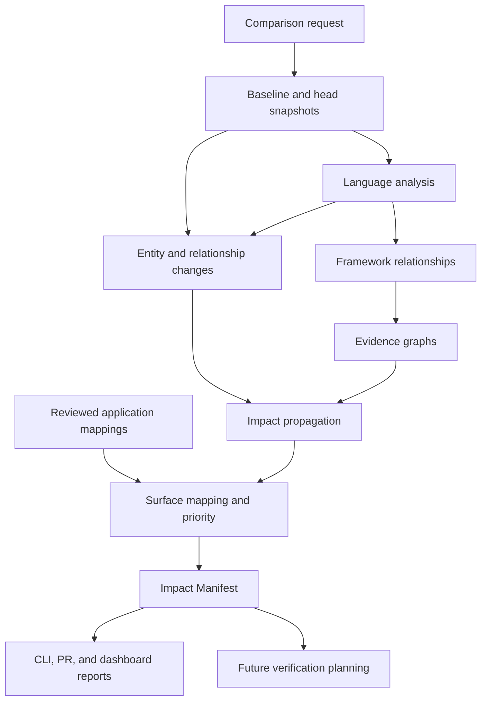
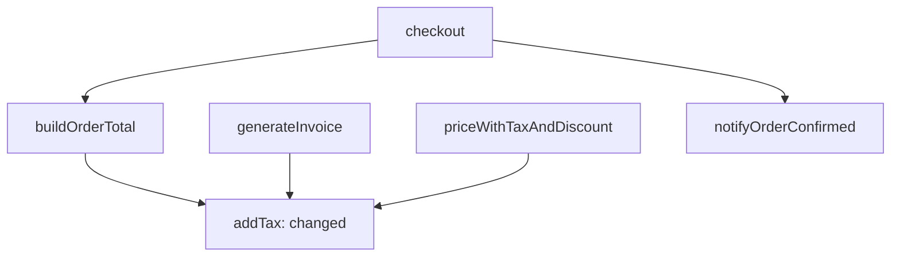

# Graphentra Analyzer — Product, Architecture, and Implementation Plan

**Document version:** 1.0  
**Prepared:** 20 September 2026  
**Product:** Graphentra  
**Primary scope:** The change-impact analyzer  
**Secondary scope:** The backend, APIs, dashboard, and future verification integrations that consume its output  
**Intended repository location:** `docs/GRAPHENTRA_ANALYZER_MASTER_PLAN.md`  
**Audience:** Founders, engineers, QA specialists, product contributors, and coding agents

> Graphentra explains which parts of an application may be affected by a code change, why they deserve attention, and what should be verified. It connects code evidence to application behavior while making its limitations visible.

## 0. Read this first

This is the implementation blueprint for developing the current basic analyzer into a useful change-intelligence product. It gives the analyzer most of the detail. Dashboard infrastructure and Playwright generation are downstream capabilities with explicit contracts and milestones.

The founder confirms that the current implementation analyzes **TypeScript and function changes only**. Previous prototype notes describe named function declarations, resolvable calls, a technical graph, reverse impact traversal, application context, LLM explanations, and GitHub Actions reporting. Those notes establish project context; this document is **not an audit of the current repository**. Before editing code, inspect the actual implementation and reconcile it with the baseline in section 2.

### 0.1 Status vocabulary

| Label | Meaning in this document |
|---|---|
| **Confirmed current scope** | Explicitly described by the founder in the current request |
| **Reported prototype behavior** | Described in earlier project conversations or the prototype workflow; verify in the repository |
| **Proposed default** | A concrete engineering or product decision recommended here; implement through normal review |
| **Planned capability** | Required for a future milestone; not presented as delivered |
| **Research candidate** | A tool or approach requiring a bounded compatibility, licensing, and quality evaluation |
| **Acceptance target** | A proposed release gate or measurement target; not an achieved result |

Unless explicitly marked as current, requirements, APIs, schemas, examples, dates, and commercial numbers describe the proposed product. Code examples communicate contracts or algorithms; they do not imply that corresponding packages or commands already exist.

### 0.2 Decisions an implementing agent must preserve

1. Keep the analyzer usable locally and in CI without a dashboard, database service, or LLM.
2. Separate language semantics, framework semantics, impact propagation, prioritization, and explanation.
3. Store `CALLS` in the real direction: **caller → callee**. Trace impact toward consumers through the reverse index.
4. Analyze both comparison snapshots. Deletions require baseline evidence.
5. Give each changed entity its own source changes. Do not attach a whole file diff as if every edit belongs to every function.
6. Preserve evidence provenance, snapshot identity, and uncertainty in every public result.
7. Use one versioned Impact Manifest for the CLI, PR report, API, dashboard, and future testing tools.
8. Treat language support as a tested set of capabilities. Parsing a language is not equivalent to understanding its application behavior.
9. A reachable dependency means possible impact. It does not prove changed behavior, a defect, or release safety.
10. Keep test generation and execution separate. Generated scripts are unverified until run with valid expectations against the intended build.

### 0.3 Source authority

For product intent, use: the founder's latest instruction, then explicit project decisions, then this proposed plan, then older proposals. For implementation status, executable code and reproducible checks take precedence over all planning documents. Do not invent implementation progress to make these sources agree.

This plan carries forward the earlier project architecture, business playbook, business review, and prototype workflow. It updates the emphasis to the analyzer. It does not authorize implementation of the entire roadmap in one change, publication, customer access, or deployment.

## Contents

1. [Product vision and business problem](#1-product-vision-and-business-problem)
2. [Current prototype and immediate gaps](#2-current-prototype-and-immediate-gaps)
3. [Product scope and boundaries](#3-product-scope-and-boundaries)
4. [Personas and primary workflows](#4-personas-and-primary-workflows)
5. [Terms and conceptual model](#5-terms-and-conceptual-model)
6. [Functional requirements](#6-functional-requirements)
7. [Quality and operational requirements](#7-quality-and-operational-requirements)
8. [Architecture and module boundaries](#8-architecture-and-module-boundaries)
9. [Technology decisions](#9-technology-decisions)
10. [Inputs, revisions, and repository discovery](#10-inputs-revisions-and-repository-discovery)
11. [Semantic entities and relationship extraction](#11-semantic-entities-and-relationship-extraction)
12. [Change detection and classification](#12-change-detection-and-classification)
13. [Impact propagation and noise control](#13-impact-propagation-and-noise-control)
14. [Surfaces, journeys, and application context](#14-surfaces-journeys-and-application-context)
15. [Priority, evidence, and uncertainty](#15-priority-evidence-and-uncertainty)
16. [The Impact Manifest and public contracts](#16-the-impact-manifest-and-public-contracts)
17. [Worked examples](#17-worked-examples)
18. [Language and framework expansion](#18-language-and-framework-expansion)
19. [LLM responsibilities and context packs](#19-llm-responsibilities-and-context-packs)
20. [Incremental analysis and performance](#20-incremental-analysis-and-performance)
21. [Evaluation and analyzer acceptance](#21-evaluation-and-analyzer-acceptance)
22. [CLI, CI, and distribution](#22-cli-ci-and-distribution)
23. [Backend and API plan](#23-backend-and-api-plan)
24. [Dashboard and persona views](#24-dashboard-and-persona-views)
25. [Future Playwright generation and verification](#25-future-playwright-generation-and-verification)
26. [Security and data handling](#26-security-and-data-handling)
27. [Business and go-to-market plan](#27-business-and-go-to-market-plan)
28. [Delivery roadmap and staffing](#28-delivery-roadmap-and-staffing)
29. [Implementation backlog](#29-implementation-backlog)
30. [Repository organization and agent workflow](#30-repository-organization-and-agent-workflow)
31. [Decisions, risks, and open questions](#31-decisions-risks-and-open-questions)
32. [Release definition of done](#32-release-definition-of-done)
33. [Sources and maintenance](#33-sources-and-maintenance)

## 1. Product vision and business problem

### 1.1 The problem we solve

A code review usually explains the intended change. A regression plan must also consider the other behavior that depends on it. That knowledge is scattered across source code, developers' memories, tests, architecture diagrams, and release history.

For example, a token-validation change made for OTP login can also matter to password login, guardian access, and administrative pages. A shipping threshold change can matter to checkout totals and order summaries. A modified response field can affect callers in a different service or language.

Today, teams often choose between investigating these connections manually and repeating a large regression checklist. Graphentra helps them make a focused, explainable decision about where to spend verification effort.

### 1.2 Product promise

For an identified change, Graphentra should answer:

1. What changed, at the smallest useful semantic level?
2. Which supported dependencies connect that change to other code?
3. Which product or system surfaces are reachable through those dependencies?
4. Which surfaces need attention first, and why?
5. Which existing checks or new scenarios would help verify the change?
6. Which conclusions are uncertain, incomplete, stale, or outside support?

The analyzer has independent commercial value before test automation exists. A useful finding may be a previously overlooked flow that ultimately works correctly. Finding a bug is not required to demonstrate value from better regression planning.

### 1.3 Long-term direction

Build a reusable impact-intelligence layer across languages, frameworks, repositories, and application types. Its output should serve human reviewers, CI systems, dashboards, IDE integrations, coding agents, and test planners.

Support web screens, APIs, background jobs, CLI commands, event consumers, libraries, data contracts, configuration, and other observable entrypoints. A product without a browser UI still has meaningful surfaces.

The ambition is broad language and framework support. The engineering promise must remain versioned and specific: **supported language + supported semantic features + supported framework patterns + measured limitations**. No static analyzer should advertise perfect understanding of all programs.

### 1.4 Initial market hypothesis

Start with teams maintaining TypeScript applications that release frequently, share business logic across features, and spend time deciding regression scope. A QA lead or engineering lead is the initial champion; an engineering manager or founder is a likely buyer.

Initially seek three design partners with approved repositories and a reviewer willing to assess actual reports weekly. A reference customer profile is a small or medium B2B software team with incomplete regression automation. This is a prospecting hypothesis, not a validated market boundary.

## 2. Current prototype and immediate gaps

### 2.1 Baseline

| Capability | Current evidence | What an agent should verify |
|---|---|---|
| TypeScript analysis | Confirmed current scope | Accepted extensions, compiler version, project configuration requirements |
| Function-change detection | Confirmed current scope | Named declarations versus other function forms; additions and deletions |
| Named standalone functions | Reported prototype behavior | Discovery rules, nested functions, overloads, duplicates |
| Direct calls and cross-file imports | Reported prototype behavior | TypeChecker-based resolution; alias and unresolved-call handling |
| Technical graph and reverse traversal | Reported prototype behavior | Caller-to-callee direction, cycle handling, path preservation |
| Diff lines mapped to containing functions | Reported prototype behavior | Old/new coordinates, function boundaries, multiple edits in one file |
| Persistent application context | Reported prototype behavior | Loading, validation, freshness, fallback behavior |
| Optional LLM QA explanation | Reported prototype behavior | Evidence constraints, response validation, deterministic fallback |
| GitHub Actions and PR reporting | Reported prototype behavior and integration specification | Actual workflow, comparison mode, sticky comment, permissions |
| Multi-language/framework understanding | Planned | Must not appear as a shipped capability |
| Hosted APIs, multi-persona dashboard, Playwright generation | Planned | Build after the analyzer contract is reliable |

The reported graph uses labels such as `src/tax.ts#addTax`; these are useful prototype identifiers. They need a stronger identity model before methods, overloads, anonymous functions, renames, and multiple projects are supported.

### 2.2 Reported artifacts

| File | Purpose | Persistence rule |
|---|---|---|
| `.graphentra/application-context.json` | Reviewed application terminology and mappings | Persist in the analyzed repository or a versioned configuration store |
| `.graphentra/technical-graph.json` | Technical entities and relationships for a run | Regenerate; retain in CI artifacts or a cache when useful |
| `.graphentra/analysis.json` | Current machine-readable analysis | Regenerate; migrate through an explicit schema strategy |
| `.graphentra/report.md` | Human-readable PR/QA explanation | Regenerate from the manifest and optional validated explanation |

Do not silently overwrite reviewed context with freshly inferred context. A new application-context draft requires an explicit review state.

### 2.3 Immediate technical priorities

1. **Entity-specific diff isolation.** Prior project discussion reported that a whole file diff could contaminate several changed entities. Reproduce this against the current code and fix it if still present.
2. **Baseline and head analysis.** Confirm whether deleted functions, removed calls, and removed routes have baseline evidence. If not, implement two-snapshot analysis before claiming deletion support.
3. **Unsupported-change accounting.** A changed class method, configuration file, or arrow function must appear as a gap while unsupported, rather than disappearing from the report.
4. **Test/production separation.** Tests that call a changed function are verification candidates. They are not automatically product surfaces.
5. **Stable, validated output.** Establish a manifest with exact revisions, tool versions, findings, evidence, and gaps.
6. **Reproducible fixtures.** Convert the existing commerce demo and known defects into automated acceptance cases.

### 2.4 Preserve the useful prototype

Do not rewrite the analyzer simply because this plan names more packages. First put existing behavior behind module boundaries, characterize it with fixtures, and add capabilities incrementally. Preserve the current command and output compatibility until a documented migration is available.

## 3. Product scope and boundaries

### 3.1 Analyzer scope

The analyzer owns source discovery, semantic extraction, change matching, relationship evidence, propagation, surface mapping, prioritization, coverage diagnostics, and verification recommendations.

It emits immutable run artifacts. It may receive reviewed business context and historical observations. It must still produce a useful deterministic report without either an LLM or runtime telemetry.

### 3.2 Adjacent product scope

| Component | Responsibility | Relationship to analyzer |
|---|---|---|
| Backend | Organizations, repositories, jobs, storage, authorization, APIs | Schedules analysis and serves validated results |
| Dashboard | Persona views, reports, evidence, review, history | Presents the same manifest; does not recalculate impact differently |
| Verification planner | Converts recommendations into executable or manual scenarios | Consumes findings, expectations, and application context |
| Playwright generator | Produces browser-test drafts for supported journeys | Requires more than a diff: routes, locators, setup, and expectations |
| Executors | Run approved checks and collect artifacts | Separate trust and execution boundary |
| Release workflow | Records the organization's release decision | Uses evidence; does not delegate release authority to a graph score |

### 3.3 Deferred from the first analyzer release

Defer universal language coverage, complete interprocedural dataflow, whole-program path feasibility, autonomous bug repair, generic security scanning, production testing, automatic release approval, and a full test-management product.

Keep configuration, dependency, schema, and unsupported-source changes visible even before precise analyzers exist. A deferral is a capability limitation, not permission to omit the change inventory.

### 3.4 Definition of a useful early result

A reviewer can select a revision pair, see the changed functions, identify related application areas, inspect why they appear, understand what the analyzer missed or could not resolve, and use the report to prepare a verification checklist.

## 4. Personas and primary workflows

### 4.1 Graphentra personas

| Persona | Main question | Default report view | Typical action |
|---|---|---|---|
| Developer | What does my change depend on or affect? | Changed entities, source evidence, affected callers, candidate tests | Investigate a path, run a check, correct a mapping |
| QA engineer/lead | What deserves verification? | Ranked surfaces, scenarios, roles, data needs, gaps | Review scope and record coverage decisions |
| Engineering lead/CTO | Is our review scope credible? | Critical changes, analysis completeness, unresolved items, trends | Assign owners and request investigation |
| Product/business reviewer | Which workflows may behave differently? | Application language, expected outcomes, affected user groups | Confirm business expectations |
| Release owner | What remains unverified for this candidate? | Revision-bound impact plus available verification evidence | Record disposition according to policy |
| Platform/workspace administrator | Can the system operate within our access and cost constraints? | Integrations, permissions, quotas, retention, job health | Configure repositories and operational policies |

These are views over shared evidence, not separate analyzers or separate AI agents.

### 4.2 Application personas are a different concept

A customer's application may have roles such as Guardian, School Supervisor, Headquarters Admin, or Customer. Store these as application-role mappings attached to surfaces and journeys. Do not confuse them with Graphentra's access roles or dashboard personas.

A QA reviewer can view guardian-specific impact without receiving a guardian's production credentials. Likewise, choosing the developer dashboard must not grant repository administration privileges.

### 4.3 Primary workflows

**PR review:** A change event identifies an immutable comparison, analysis produces findings, a reviewer opens a surface and its evidence, records missing scope or a disposition, and uses the recommended checks.

**Local developer use:** A developer compares revisions or an explicit working-tree snapshot, receives JSON/Markdown, investigates a path, and reruns after editing. No hosted account is needed for local analysis.

**Release review:** A reviewer compares the last deployed revision to the candidate. The engine recalculates the aggregate delta; it does not concatenate all historical PR reports, because changes can overlap or cancel each other.

**Onboarding:** The analyzer profiles a repository, reports supported and unsupported constructs, and produces a technical graph. The customer approves a small set of surface mappings and business terms to make the first useful report.

## 5. Terms and conceptual model

| Term | Definition |
|---|---|
| AST / syntax tree | Structured representation of source syntax; useful for locating declarations and edits |
| Semantic resolution | Connecting a use to the declaration it refers to in a configured project |
| Entity | A source or system object: function, method, component, route, field, key, job, contract, and so on |
| Relationship | A typed, evidenced connection between entities |
| Snapshot | Immutable analysis inputs and extracted facts for one revision/configuration |
| Change | A difference between baseline and head entities or relationships |
| Seed | An entity or connection from which impact propagation starts |
| Blast radius | The supported set of potentially relevant consumers reached from a change |
| Surface | An observable application entrypoint or capability, such as a page, endpoint, command, or job |
| Journey | A sequence of actions, roles, setup, and expected outcomes spanning one or more surfaces |
| Finding | A change-related recommendation concerning a surface or technical entity |
| Evidence | Source locations, resolution results, configured mappings, or scoped observations supporting a claim |
| Gap | Unsupported input, unresolved relationship, missing context, or an exhausted analysis budget |
| Impact Manifest | The public, versioned record of changes, findings, reasons, evidence, and limitations |
| Verification candidate | An existing test or proposed scenario relevant to a finding |
| Expectation / oracle | The source that defines what a check should consider correct |

Keep four statements distinct: **the code changed**, **a consumer is connected**, **behavior may change**, and **an observed assertion failed**. The analyzer can support the first three at different evidence levels. The fourth requires execution evidence.

## 6. Functional requirements

Milestone codes M0–M7 are defined in section 28. Each requirement needs an owner, implementation issue, and acceptance fixture before being marked complete.

| ID | Requirement | First milestone | Acceptance evidence |
|---|---|---|---|
| AN-001 | Accept exact base/head revisions and an explicit comparison mode | M0 | Recorded revisions match the compared trees |
| AN-002 | Inventory every changed path, including unsupported files | M0 | Every input path has an analyzed, excluded, or unsupported disposition |
| AN-003 | Discover project configuration and resolve supported symbols | M0 | Cross-file and alias fixtures resolve to correct declarations |
| AN-004 | Keep baseline/head graphs separate and analyze deletions | M1 | Removed functions retain baseline consumers |
| AN-005 | Map edits to entity-specific old/new spans | M0–M1 | Two edited functions in one file have separate patches |
| AN-006 | Represent additions, removals, edits, moves, and ambiguous matches | M1 | Matching fixtures include recorded match methods |
| AN-007 | Propagate through typed rules with evidence paths | M1 | Multi-branch/cycle fixtures produce expected bounded reachability |
| AN-008 | Record unknowns, truncation, and support coverage | M0–M1 | A deliberately unsupported change cannot yield an unqualified empty-success report |
| AN-009 | Support reviewed mappings from code to application surfaces | M1 | Resolved mappings and orphan mappings are distinguished |
| AN-010 | Classify change dimensions conservatively | M1–M2 | Signature/body/type/config examples carry appropriate categories |
| AN-011 | Separate priority from evidence strength | M1 | Uncertain authorization impact remains visible and urgent |
| AN-012 | Emit a schema-validated manifest and deterministic Markdown | M0–M1 | Invalid references fail validation; LLM is optional |
| AN-013 | Discover existing-test candidates without claiming execution | M2 | Test-only nodes are not product surfaces |
| AN-014 | Add one evaluated frontend and backend framework slice | M2 | Routes/handlers/components map to expected surfaces |
| AN-015 | Join frontend and backend through explicit contract evidence | M2–M3 | Same path on different services is not conflated |
| AN-016 | Maintain reviewed application context with freshness metadata | M1 | Stale or unmatched context is reported |
| AN-017 | Expose a versioned language-adapter protocol | M2 | Adapter conformance fixtures pass |
| AN-018 | Support incremental analysis with full-build equivalence checks | M3 | Cached and fresh outputs agree on defined fixtures |
| AN-019 | Offer a second language at a declared support tier | M5 | Independent corpus passes certification |
| AN-020 | Export verification recommendations suitable for future generators | M2 | Scenarios include scope, setup requirements, and expectation status |
| PL-001 | Schedule jobs and serve reports through authorized APIs | M4 | Retry, cancellation, tenant isolation, and artifact publication checks |
| PL-002 | Show persona views over the same analysis | M4 | QA and developer views reference identical finding IDs |
| VT-001 | Generate reviewed Playwright drafts for a supported journey | M6 | Generated test is tied to approved expectations and exact build |

## 7. Quality and operational requirements

| Requirement | Proposed implementation rule |
|---|---|
| Reproducibility | Same source/configuration/tool inputs produce the same normalized deterministic manifest |
| Traceability | Every deterministic finding has valid evidence and a reproducible propagation/mapping reason |
| Honesty | Unsupported or truncated work is visible at run and affected-scope levels |
| Availability | LLM failure cannot prevent the deterministic report |
| Bounded execution | CPU, memory, file size, recursion, queue time, and graph traversal have enforced budgets |
| Isolation | Repository processing is separated from privileged backend services |
| Portability | Core contracts are language-neutral; CLI is CI-provider-neutral |
| Compatibility | Schemas, adapters, rule packs, and supported compiler/framework combinations are versioned |
| Privacy | Minimize source retention and model payloads; scope all hosted reads to the caller's authorization |
| Operability | Structured diagnostics identify stage, cause, retryability, and affected scope |
| Accessibility | Dashboard works with keyboard navigation and does not encode status by color alone |

**Initial performance target, not a claim:** on a recorded 4-vCPU/8-GB benchmark worker, aim for a cold analysis under five minutes for an agreed fixture around 50,000 lines of supported TypeScript, and a warm PR analysis under one minute for ordinary edits. Record project shape, compiler dependencies, changed entities, graph size, concurrency, and whether dependency preparation is included. Revise these targets after measurement; source line count alone is not a reliable cost predictor.

Report P50/P95 duration, peak memory, time per stage, and the proportion of partial runs. A faster system that silently analyzes less of the input has not met the performance objective.

## 8. Architecture and module boundaries

### 8.1 Logical architecture



The diagram describes modules, not a requirement to deploy a microservice for each node.

### 8.2 Core modules

| Module | Input | Output | Boundary |
|---|---|---|---|
| Change ingestion | Revisions, local snapshot, repository metadata | Resolved comparison and path inventory | No semantic claims |
| Repository profiler | Manifests, configuration, paths | Projects, language/framework candidates, exclusions | Detection is not support certification |
| Language adapter | A configured immutable project | Entities, uses, typed relationships, diagnostics | Owns language semantics |
| Framework adapter | Language facts and framework configuration | Entrypoints, framework relations, surface candidates | Owns framework-specific interpretation |
| Entity matcher | Baseline/head entities | Matched pairs, added/removed entities, ambiguity | Does not rely solely on names or line numbers |
| Change classifier | Matched entities, spans, relationships | Change dimensions and propagation seeds | Conservative about behavioral equivalence |
| Graph store/index | Versioned facts | Forward/reverse adjacency and scoped lookup | Does not assign product priority |
| Impact engine | Seeds, rules, graph views | Reached consumers, evidence, stopped frontiers | Does not invent relationships |
| Surface mapper | Reached entities and reviewed/discovered mappings | Potentially impacted surfaces | A route does not automatically become a full journey |
| Priority engine | Findings, criticality, change categories | Explainable attention tiers | No uncalibrated probability of safety |
| Verification recommender | Findings, tests, expectations | Existing-test candidates and suggested scenarios | Does not execute tests |
| Context assembler | Relevant evidence and context | Bounded, versioned LLM payload | No whole-repository upload by default |
| Reporter | Valid manifest and optional explanation | Markdown, JSON, persona projections | Does not recalculate the graph |

### 8.3 Deployment evolution

**Local/CI phase:** one CLI process orchestrates modules and writes artifacts. Native language adapters may run as child processes. Use in-memory indexes and local files.

**Hosted phase:** one modular API/control plane schedules isolated analysis workers. PostgreSQL stores operational metadata and queryable findings; object storage holds immutable artifacts. The dashboard calls the API. Compiler execution does not run in the web request process.

**Later scale:** add worker pools by ecosystem, customer-hosted runners, additional storage indexes, and more specialized services only when measured load or isolation requirements justify them.

## 9. Technology decisions

### 9.1 Recommended stack

These are proposed defaults. Preserve a suitable existing dependency where changing it offers little value.

| Area | Proposed choice | Reason and limits |
|---|---|---|
| Core analyzer | TypeScript on a pinned supported Node.js runtime | Fits the prototype and team; keeps compiler integration straightforward |
| TypeScript semantics | Pinned TypeScript Compiler API; retain `ts-morph` if already used successfully | Project-aware declarations and references; keep compiler objects behind adapter boundaries |
| Git access | Git CLI through argument arrays or a narrowly scoped wrapper | Reuse revision and diff semantics; never concatenate untrusted shell commands |
| Local graph | Typed records plus `Map`-based adjacency | Simple and fast for per-project analysis |
| Local persistence | Versioned JSON artifacts first; SQLite only when measured access patterns justify it | Avoid a mandatory server dependency |
| Shared contracts | JSON Schema with generated TypeScript types and Ajv validation | Language-neutral worker/API contracts |
| Core verification | Existing runner; Vitest if starting fresh | Fixture, contract, property, and integration checks |
| Future API | Node.js + TypeScript + Fastify | A small modular service with schema-driven boundaries |
| Hosted metadata | PostgreSQL | Repositories, runs, findings, mappings, users, review state |
| Durable jobs | PostgreSQL-backed queue such as pg-boss, subject to compatibility checks | Reuse the database before adding a separate broker |
| Artifacts | S3-compatible object storage | Immutable graph/manifest bundles, logs, later test evidence |
| Dashboard | React + TypeScript; Vite for a standalone app | Familiar frontend stack; ordinary API-driven workspace |
| Graph exploration | Add a graph renderer only after evidence lists work; evaluate Cytoscape.js or React Flow | Exploration is secondary to useful report rows; validate size and accessibility needs |
| Observability | Structured logs and metrics; OpenTelemetry as services multiply | Stage timing, failures, resource use, correlation |
| Future browser tests | Playwright Test in TypeScript | Supports the planned browser-testing integration; independent of backend language |
| Runtime infrastructure | Disposable workers with pinned toolchains | Kubernetes is an option when needed, not a prerequisite for local usefulness |

Fastify provides the API framework, Ajv validates JSON Schema with draft-specific behavior, and pg-boss supplies a PostgreSQL-backed job queue. Choose and pin compatible versions during implementation; retries still require idempotent product operations. [Fastify documentation](https://fastify.dev/docs/latest/), [Ajv schema documentation](https://ajv.js.org/json-schema.html), [pg-boss repository](https://github.com/timgit/pg-boss)

### 9.2 Compiler compatibility

The TypeScript Compiler API guide currently warns that its examples describe TypeScript 6.0 and earlier and that TypeScript 7.1 will have a different API. Preserve the project's working compiler dependency, pin it, and test upgrades as adapter migrations. Record both the analyzer toolchain and the analyzed application's declared compiler range. [TypeScript Compiler API guide](https://github.com/microsoft/TypeScript/wiki/Using-the-Compiler-API)

Do not infer compatibility from matching file extensions. New syntax, module-resolution changes, framework-generated types, and different dependency states can change resolution. Publish the supported combinations and return diagnostics outside that envelope.

### 9.3 Reuse versus product-specific work

Reuse parsers, compilers, Git, schemas, queue libraries, databases, authentication providers, and testing tools. Build the normalization, comparison, propagation, evidence model, application mapping, prioritization, and reviewer workflow that make Graphentra useful.

Tree-sitter is a candidate for broad syntax discovery and fallback extraction: it builds and incrementally updates concrete syntax trees. Our design implication is that it can help locate declarations, but syntax extraction alone does not establish cross-file semantic relationships. [Tree-sitter introduction](https://tree-sitter.github.io/tree-sitter/)

SCIP is a candidate interchange source for definitions and references from existing indexers. Graphentra would still need change matching, framework meaning, impact rules, and surface mapping. Evaluate indexer availability, exact evidence, version support, and licensing before adoption. [SCIP protocol](https://github.com/scip-code/scip)

Do not require a graph database, vector database, multi-agent runtime, or model-provider lock-in for the first useful analyzer. Add one only with a measured problem and a documented migration decision.

## 10. Inputs, revisions, and repository discovery

### 10.1 Comparison modes

| Mode | Baseline | Head | Intended use |
|---|---|---|---|
| `pull_request` | Merge base of the requested target-branch revision and PR head | PR head revision | Work introduced on the PR branch |
| `exact` | Explicit supplied revision | Explicit supplied revision | Arbitrary comparison or release delta |
| `merge_candidate` | Target-branch revision used to create the candidate | Exact merged candidate revision | Behavior of the integration candidate |
| `working_tree` | Explicit revision, normally HEAD | Captured working files and an explicit inclusion policy | Local work, including selected untracked files |
| `staged` | Explicit revision, normally HEAD | Captured index tree | Exactly the staged changes |

Record the requested refs, resolved revisions, comparison mode, and actual baseline. Branch names alone are insufficient because they move. PR-head analysis and merged-candidate analysis are different results.

Git's two-endpoint diff and three-dot diff have different baseline semantics. Resolve the intended baseline explicitly and pass the resulting commits to subsequent stages. Do not use three-dot comparison for an exact release-to-release request. [Git diff documentation](https://git-scm.com/docs/git-diff)

If a shallow checkout lacks the baseline, fetch the required history using the permitted repository integration or return a precise failure. Do not silently compare against `HEAD~1`. If multiple merge bases or an invalid candidate make the comparison ambiguous, require an explicit supported resolution. For an initial commit, use an explicit empty-tree baseline and label the analysis as initial additions.

Working-tree and staged snapshots must record their content hash and captured inputs. They must not pretend to be an ordinary committed revision. An overlay must define how tracked deletions, untracked files, symlinks, and submodules are handled.

### 10.2 Canonical request

The future request model should carry:

- Repository identity, project selection, and a permitted local checkout or repository reference.
- Comparison mode and resolved immutable input revisions or local-snapshot identities.
- Toolchain and adapter versions.
- Configuration, surface-mapping, application-context, and rule-pack versions.
- Include/exclude rules and resource budgets.
- Optional business acceptance criteria or selected requirement references.
- Explanation policy: disabled, local provider, or approved remote provider.
- Caller/job identity and tenant identity when hosted.

Hosted callers must select a previously authorized repository. They must not supply arbitrary server filesystem paths, credential-bearing clone URLs, or executable adapter code.

### 10.3 Repository profiling

1. Inventory tracked files and selected local additions.
2. Identify project roots and workspace/package boundaries.
3. Read supported manifest/configuration formats without executing them.
4. Detect languages, compiler settings, framework dependencies, and likely source/test/generated directories.
5. Produce a support assessment with detected versions and unresolved configuration.
6. Select adapter versions from a trusted registry/configuration.
7. Build a project dependency map for monorepos.
8. Record each excluded path and its reason.

For TypeScript, respect `tsconfig.json`, `extends`, includes/excludes, module resolution, path aliases, JSX settings, package exports, and project references within the tested support envelope. An installed framework dependency is only a detection hint; it does not prove the repository uses a supported pattern.

Avoid indexing `node_modules`, generated bundles, and vendored code as first-party business entities by default. Still allow needed declaration files and dependencies to participate in semantic resolution. Excluding dependencies from first-party reports must not break the compiler's view of the project.

A missing dependency produces unresolved-symbol diagnostics. Do not install or execute customer dependencies implicitly during an ordinary static-analysis pass. Use prepared dependency environments or a separately authorized preparation step when needed.

### 10.4 Snapshot identity

A snapshot includes repository/project identity, source-tree identity, effective compiler configuration, dependency-resolution fingerprint, adapter versions, and all extraction inputs. Derive its ID from a canonical representation of those inputs.

Use separate identities for:

- **Source snapshot:** immutable source and dependency/configuration inputs.
- **Graph extraction:** source snapshot plus language/framework adapter versions and extraction options.
- **Impact analysis:** baseline/head graph identities plus comparison, mapping, classification, and propagation rules.
- **Explanation:** manifest digest plus context, prompt/template, provider, and model versions.

This separation allows a priority-rule update to reuse valid compiler facts, while ensuring a compiler upgrade cannot reuse incompatible extraction results.

### 10.5 Complete input accounting

Every changed file receives a disposition such as `analyzed`, `partial`, `unsupported`, `excluded_by_policy`, `generated`, `binary`, or `unavailable`. Store the reason and affected project.

Examples: an image update is a visual/file-level change; a lockfile update is a dependency/build change; a migration is a data change; an unsupported language is a coverage gap. None of these should be reported as “no changes” merely because no named TypeScript function changed.

## 11. Semantic entities and relationship extraction

### 11.1 Entity kinds

Start with functions and modules. Extend the common model to methods, constructors, variables/constants, properties, types/interfaces, components, templates, routes, endpoints, jobs, commands, events, contracts, fields, data resources, configuration keys, assets, and tests as adapters become available.

Do not require every language to implement every entity kind. Preserve adapter-specific metadata under a namespaced extension field, while keeping shared fields stable.

### 11.2 Identity and coordinates

Use three separate concepts:

| Identity | Purpose |
|---|---|
| `entityId` | Unique within a particular graph snapshot; authoritative for edges |
| `logicalKey` | Best available declaration identity within repository/project/module scope |
| `matchId` | An explicit baseline-to-head correspondence with match method and ambiguity |

A useful logical key includes repository/project, normalized module path, declaration kind, qualified container/name, and overload/disambiguation information. Internal compiler IDs, display names, line numbers, and raw body hashes are insufficient by themselves.

For anonymous functions, use the enclosing declaration, syntactic role, and local structural position as matching hints. Line movement and sibling insertions can destabilize those hints; report uncertain correspondence instead of pretending it is exact.

**Coordinate convention:** the shared model uses zero-based lines, zero-based UTF-8 byte columns, and half-open ranges. File hashes identify the exact bytes. Each adapter must convert its native positions; TypeScript's string offsets and Python's AST offsets must not be mixed without conversion. Human reports may display one-based line numbers. Git hunk coordinates must be converted at the boundary. Python explicitly documents UTF-8 byte column offsets for its AST. [Python AST documentation](https://docs.python.org/3/library/ast.html)

Use repository-relative normalized paths, with a documented case-sensitivity policy. Preserve the source path spelling for display. Test Unicode, CRLF, same-name files, path separators, symlinks, and nested repositories.

### 11.3 Core fact records

The following TypeScript describes the intended shape. JSON Schema is the eventual language-neutral contract; compiler objects never cross this boundary.

```ts
type EvidenceKind =
  | "semantic_resolved"
  | "framework_declared"
  | "contract_declared"
  | "configured_reviewed"
  | "runtime_observed"
  | "heuristic";

interface Position {
  line: number;       // zero-based
  byteColumn: number; // zero-based UTF-8 column
}

interface SourceLocation {
  snapshotId: string;
  path: string;
  fileHash: string;
  start: Position;
  end: Position;      // exclusive
}

interface Entity {
  entityId: string;
  snapshotId: string;
  projectId: string;
  logicalKey: string;
  kind: string;
  qualifiedName: string;
  language: string;
  role: "production" | "test" | "generated" | "external";
  declaration: SourceLocation;
  signatureHash?: string;
  bodyHash?: string;
  extension?: Record<string, unknown>;
}

interface Evidence {
  evidenceId: string;
  kind: EvidenceKind;
  adapterId: string;
  adapterVersion: string;
  method: string;
  locations: SourceLocation[];
  assumptions: string[];
  artifactRefs: string[];
}

interface Relationship {
  relationshipId: string;
  snapshotId: string;
  sourceId: string;
  targetId: string;
  kind: string;
  evidenceIds: string[];
  resolution: "exact" | "candidate";
  extension?: Record<string, unknown>;
}
```

This entity type represents source-backed entities. Synthetic external resources, configured surfaces, and unresolved targets use separate records with explicit provenance; do not fabricate a source location for them. An unresolved call becomes a diagnostic or a bounded candidate set, not an exact edge to a guessed entity.

### 11.4 TypeScript extraction sequence

1. Load the configured project with the supported compiler API.
2. Collect declarations and ranges in a deterministic order.
3. Assign identity without serializing compiler-internal objects.
4. Collect identifier/property uses and call sites.
5. Resolve symbols and aliases using semantic information.
6. Resolve supported direct call targets and record declaration evidence.
7. Distinguish an overload signature, implementation declaration, and possible dispatch targets.
8. Record unresolved calls, parse/type diagnostics, and unsupported constructs.
9. Add supported export/import/type/constant relationships.
10. Emit normalized records; validate references before graph publication.

The compiler's Program, source files, type checker, and builder facilities are useful implementation primitives. Graphentra's normalization and propagation policy remain its own responsibilities. [TypeScript Compiler API guide](https://github.com/microsoft/TypeScript/wiki/Using-the-Compiler-API)

Account for nested functions correctly: a call inside an inner function belongs to that function, not automatically to the outer declaration. A callback passed to an unknown API is not proof that it executes immediately or at all. A property access resolving to a method declaration is not proof of one runtime receiver when dispatch remains dynamic.

### 11.5 Relationship vocabulary and propagation meaning

| Stored relation | Direction | Impact treatment |
|---|---|---|
| `CALLS` | Caller → callee | Reverse toward callers for relevant body/contract changes |
| `READS` | Consumer → variable/property | Reverse toward readers when the value/contract may change |
| `WRITES` | Writer → variable/data resource | Use explicit data-effect rules; do not reverse every write indiscriminately |
| `IMPORTS` | Importing module → imported module | Coarse dependency context; a module import alone is not precise symbol use |
| `REEXPORTS` | Re-exporting module → exported entity | Follow supported export/public-contract rules |
| `TYPE_USES` | Consumer → type | Compile/contract impact; avoid automatic browser recommendations |
| `EXTENDS` / `IMPLEMENTS` | Derived entity → base/interface | Apply dispatch/contract rules with declared limitations |
| `RENDERS` | Parent component/template → child component | Reverse toward rendering consumers; framework conditions remain visible |
| `USES_SERVICE` | Consumer → service/provider | Reverse with provider scope and resolution evidence |
| `BINDS_HANDLER` | Route/endpoint/job → handler | Reverse from handler to observable entrypoint |
| `USES_MIDDLEWARE` | Endpoint/router → middleware/guard | Reverse according to route scope and middleware order |
| `REQUESTS` | Client operation → service operation | Reverse from a contract/endpoint change to clients |
| `PUBLISHES_EVENT` | Publisher → event contract | Explicit rule may connect a changed emitted contract to consumers |
| `CONSUMES_EVENT` | Consumer handler → event contract | Reverse from the event contract to subscribers |
| `USES_CONFIG` | Consumer → config key | Reverse at key level when extraction is supported |
| `USES_ASSET` | Surface/component → asset | Reverse for visual/content scope |
| `TESTS` | Test → entity/surface | Attach verification candidates; do not create production surfaces |

The graph contains facts; a **propagation rule** decides how a particular change uses them. Generic reachability across every edge type creates both noise and incorrect paths.

For example, modifying a function that writes a table does not prove all readers of that table change behavior. Connecting writer changes to readers requires evidence that a relevant field, schema, or emitted value may change, plus a rule that states the uncertainty. Similarly, a modified event producer is not automatically a change to every event it can publish.

### 11.6 Methods, classes, constants, and module initialization

Extend support in this order: arrow/function expressions with stable containers; class/object methods and constructors; exported constants and property reads; type contracts; top-level module effects; framework-specific entities.

Represent a module initializer when top-level executable statements matter. Removing a top-level registration or changing an exported constant outside a function must not be assigned arbitrarily to the nearest function.

Separate imports used only for types from runtime dependencies. Retain side-effect-only imports as module-initialization relationships where supported. For dependency injection, reflection, computed property names, or plugin registration, record candidate/unknown resolution until an adapter or reviewed mapping supplies stronger evidence.

## 12. Change detection and classification

### 12.1 Why two snapshots are essential

The baseline answers what existed before; the head answers what exists now. Both are required for removed declarations, removed references, changing exports, renamed modules, and deleted entrypoints.

Never combine baseline and head edges into one unqualified graph. Such a union can invent a path that never existed in either version. Traverse the snapshots separately, then merge findings through explicit entity/surface correspondences. Every retained path identifies its snapshot.

If a configured project cannot be fully resolved at one revision, record that snapshot's limitations. A strong head graph does not repair missing baseline evidence.

### 12.2 Diff ingestion

Obtain a robust path inventory, including rename/copy hints, and a patch with old/new hunk coordinates. Prefer NUL-delimited path output for machine processing. Disable external diff/text-conversion hooks in worker-controlled invocations. Git rename detection is a similarity hint, not proof of semantic identity.

Maintain both old and new cursors while parsing each hunk:

- Removed lines belong to baseline coordinates.
- Added lines belong to head coordinates.
- Context lines advance both cursors.
- Zero-length ranges represent insertion/deletion boundaries; do not treat them as one changed line.
- Binary files, mode changes, and submodule updates have explicit non-text dispositions.

Convert Git coordinates into the shared range convention before matching source entities. Unit-test the conversion independently of the compiler adapter.

### 12.3 Mapping edits to entities

1. Build a range index for baseline declarations and another for head declarations.
2. Intersect deleted/changed old spans with baseline ranges and inserted/changed new spans with head ranges.
3. Prefer the smallest meaningful owning entity for each span.
4. Keep parent/child context when a change modifies a declaration's signature or container relationship.
5. Use module/config/asset entities for edits outside supported function bodies.
6. Preserve all matches when one edit legitimately affects several declarations.
7. Record unmapped spans as diagnostics and changed-file context.

Do not map comments between declarations to whichever function happens to be next. Declaration-attached annotations, decorators, and compiler directives need explicit ownership rules.

### 12.4 Entity matching across revisions

Apply match strategies in descending evidence order:

1. Same supported declaration identity within the same module/container.
2. File rename plus compatible declaration identity.
3. Supported compiler/export identity and structural correspondence.
4. Unique structural/signature/body similarity as a candidate match.
5. Explicit user-reviewed correspondence where needed.

Enforce one-to-one matches for ordinary entities and represent split/merge transformations separately if supported. Do not match two identical helper functions merely because their bodies hash identically. Keep ambiguity visible; a removal and addition is an acceptable conservative result when matching is not reliable.

An entity's identity strategy may include a signature component that changes during editing. Therefore cross-revision matching cannot depend exclusively on equality of its current serialized ID.

### 12.5 Separate change facts from meaning

Store **change operation** and **change dimensions** independently.

| Operation | Meaning |
|---|---|
| `added` | No matched baseline entity |
| `removed` | No matched head entity |
| `modified` | Matched entity with changed source/structure |
| `moved` | Supported correspondence with changed location/container |
| `renamed` | Supported correspondence with changed name |
| `ambiguous` | Competing or insufficient correspondence |

| Dimension | Deterministic evidence examples | Resulting attention |
|---|---|---|
| `behavior` | Changed expression, branch, return, operation order, or side effect | Related supported consumers |
| `contract` | Parameter/return/export/schema/member changes | Consumers, compatibility, validation checks |
| `data` | Relevant model/field/migration/serialization changes | Readers/writers and data integrity within support |
| `permission` | Guard, policy key, role check, token path | Urgent review of mapped protected surfaces |
| `configuration` | Changed supported configuration key | Known consumers; unresolved-key gap if needed |
| `routing` | Added/removed/changed route, redirect, middleware binding | Entrypoint and navigation/API scope |
| `visual` | Styles, templates, assets, render structure | Mapped display surfaces |
| `text` | User-facing string or localization value | Content, language, and layout checks where relevant |
| `dependency_build` | Lockfile, package, compiler, bundler changes | Compatibility/build review and potentially broad scope |
| `deployment` | Supported environment/deployment configuration | Operational review; scope depends on mapping |
| `unknown` | Changed input without adequate interpretation | Explicit investigation |

Multiple dimensions may apply. A literal changing from `100` to `50` is an observable code fact. Calling it a free-shipping policy change requires contextual evidence that the literal controls that policy. Whether the new threshold is correct requires a business expectation.

### 12.6 Normalization and refactor handling

Use source hashes, signature hashes, and normalized syntax hashes for different purposes. A formatting-only edit may have identical relevant tokens, but comments can contain compiler directives, code-generation instructions, or contract metadata. Do not strip all comments or reorder operations indiscriminately.

If supported normalization proves no relevant token/structural change for the adapter's scope, classify that scope as informational. Otherwise use `refactor_candidate` metadata rather than claiming semantic equivalence. A function move may affect imports, module initialization, framework discovery, or public exports even when its body is unchanged.

### 12.7 Entity-specific change context

Each change record carries:

- Baseline/head entity references where available.
- Operation, dimensions, and classification rule IDs.
- Exact old/new source ranges and relevant source fragments.
- An entity-specific patch or structured before/after representation.
- Related signature, export, call-site, or surrounding-context references.
- Match method, assumptions, and unsupported aspects.

Maintain the whole file diff only as separate context. For a file containing a tax-rate edit and an order-status edit, the tax explanation must not inherit the status edit as its own source change. If context spans both entities, label ownership explicitly.

### 12.8 Seed selection

| Situation | Baseline seeds | Head seeds | Additional handling |
|---|---|---|---|
| Modified body/contract | Old entity | New entity | Compare consumer sets; retain both paths |
| Removed entity | Removed entity and relevant old relationships | Broken/missing references as diagnostics | Find old callers even if head resolution fails |
| Added entity | None for the new declaration | New entity and registration/export changes | Verify directly even if no caller exists |
| Removed relationship | Old caller/registration and edge context | Matched surviving owner if changed | Explain lost behavior or exposure |
| Added relationship | Matched owner when relevant | New caller/registration and edge context | Explain newly reachable behavior |
| Changed global config/schema | Relevant old resource | Relevant new resource | Use key/field-level rules where supported |
| Unmatched/unsupported change | Whatever evidence exists | Whatever evidence exists | Preserve changed-file investigation scope |

## 13. Impact propagation and noise control

### 13.1 Fundamental traversal

For `A CALLS B`, changing `B` may matter to `A`. The stored edge remains `A → B`; impact expansion follows the reverse index from `B` to `A`.

The result should preserve both the **dependency path** used for explanation and the **traversal decisions** that produced it. For example: `Checkout endpoint → checkout → buildOrderTotal → addTax`, with `addTax` identified as the changed seed.

A path proves the supported connection under its recorded assumptions. It does not prove every caller executes the changed branch, receives changed output, or contains a defect.

### 13.2 Traversal state

A state includes:

- Snapshot and changed-seed identity.
- Current entity.
- Active propagation category/profile.
- Evidence class and accumulated assumptions.
- Depth and predecessor/path references.
- Boundary transitions already used by the rule.

A visited set keyed only by entity is insufficient when several seeds or change categories reach the same node. Use finite state keys and retain nondominated evidence alternatives: for example, preserve a semantic path even if a heuristic path reached the entity first.

### 13.3 Algorithm outline

```text
analyze(comparison):
    baseline = extractOrLoad(comparison.baseline)
    head = extractOrLoad(comparison.head)
    changes = compareEntitiesAndRelationships(baseline, head)
    allResults = []

    for snapshot in [baseline, head]:
        seeds = selectSeeds(changes, snapshot)
        result = propagate(snapshot, seeds, versionedRules, budgets)
        allResults.append(result)

    findings = mapToSurfaces(allResults, reviewedMappings)
    findings = mergeByExplicitCorrespondence(findings)
    findings = assignAttention(findings, criticality, versionedPriorityRules)
    candidates = recommendVerification(findings, tests, expectations)
    manifest = assemble(changes, findings, candidates, allDiagnostics)
    validateSchemaAndReferences(manifest)
    return canonicalize(manifest)

propagate(snapshot, seeds, rules, budgets):
    queue = stableOrderedInitialStates(seeds)
    acceptedStates = finiteStateIndex()
    predecessorGraph = boundedEvidenceIndex()
    result = emptyResult()

    while queue is not empty:
        if globalWorkBudgetExceeded():
            recordUnexpandedFrontier(queue, result)
            result.traversalStatus = PARTIAL
            break

        state = queue.pop()
        if dominatedByAcceptedState(state):
            retainMaterialAlternativeEvidence(state, predecessorGraph)
            continue

        accept(state)
        recordReachedEntityAndMappedSurfaces(state, result)

        decisions = rules.transitionsFor(state, snapshot)
        for decision in stableOrder(decisions):
            if decision.isUnsupportedOrUnresolved:
                recordGapAndFrontier(decision, result)
            else if decision.isSemanticBoundary:
                recordExplainedStop(decision, result)
            else if decision.wouldExceedBudget:
                recordTruncation(decision, result)
            else:
                retainPredecessor(decision, predecessorGraph)
                queue.push(decision.nextState)

    return result
```

This is design pseudocode. Implement and test the transition policy separately from queue mechanics. All states and diagnostics must remain bounded, including the frontier representation itself; if a frontier is too large, retain counts, representative entries, and a scoped artifact reference.

### 13.4 Rule structure

A propagation rule defines an ID/version, eligible change dimensions, supported relation kinds, direction, preconditions, resulting state/profile, evidence requirements, and stopping behavior. Keep language/framework-specific extraction outside the generic traversal implementation.

Example: `contract.parameter_removed` can follow supported callers and type consumers, while `body.literal_changed` follows runtime consumers. A `text.translation_value_changed` rule can follow localization-key consumers to display surfaces. Rules must explain why a transition is allowed, not merely assign a number.

### 13.5 Budgets and hubs

Preserve the earlier **depth cap of 6** and **hub review threshold above 20 consumers** as configurable starting hypotheses. They control work and presentation; they do not establish completeness.

| Budget or condition | Proposed behavior |
|---|---|
| Depth limit reached | Record the stopped frontier and mark affected traversal partial |
| Hub above 20 eligible consumers | Summarize fan-out and inspect criticality; continue within budget or surface broad unresolved scope |
| Node/edge/time budget | Stop predictably; retain scope counts and diagnostics |
| Many duplicate paths | Keep reachability complete within scope; show a bounded set of informative witness paths |
| Shared authorization or contract hub | Preserve high-priority review; do not hide it because it is widely used |
| Utility change with weak business relevance | Use explicit category rules and grouping; retain technical evidence |

Set initial work budgets from fixtures and expose them in the manifest. A hardcoded maximum without an accompanying gap record is unacceptable.

### 13.6 Cycles and path explosion

Use iterative traversal with visited states; do not recursively enumerate all paths. Strongly connected components can help summarize mutually recursive regions. A path display can show a cycle summary while preserving the actual witness edges for inspection.

Reachability and path presentation have different limits. Keeping only three displayed paths per finding does not imply incomplete reachability if all eligible states were explored. Conversely, stopping after three callers changes the analyzed scope and must be reported as truncation.

### 13.7 Tests, entrypoints, and terminals

When a test depends on a changed entity, add a test candidate and stop product-impact expansion through that test unless a separate supported rule applies. Test helpers may connect other tests, but they remain in the verification layer.

When a mapped surface is reached, record it. Continue only through valid relationships that can reveal additional surfaces. A terminal node in an incomplete call graph is not automatically a user-facing entrypoint; terminal function names are technical fallback output until mapped.

### 13.8 Negative conclusions

Use precise result wording:

- **No known impacted surface within analyzed scope:** supported traversal found none; show its limits.
- **Changed entity without mapped consumers:** show the direct change and mapping gap.
- **Unsupported changed input:** request investigation.
- **No relevant semantic change in supported scope:** normalization and input accounting justify this narrower statement.

Never convert an empty surface list into “nothing can break.” A newly added function or an externally consumed library API may have no internal callers and still require verification.

## 14. Surfaces, journeys, and application context

### 14.1 Surfaces are the product-facing layer

An entity is a technical object. A surface is something a person or another system can use or observe. Map technical impact to surfaces before asking a QA reviewer to interpret the whole graph.

| Surface kind | Example | Useful verification direction |
|---|---|---|
| UI route/page | Checkout, Guardian Children | Visible outcome, interaction, access, localization |
| API operation | `POST /orders` in the ordering service | Response, validation, side effects, compatibility |
| Background job | Daily invoice generation | Inputs, output records, retries, idempotency |
| CLI command | `import-customers` | Exit status, output, filesystem/data effects |
| Event consumer | `OrderConfirmed` handler | Schema, processing, retries, duplicate handling |
| Public library API | Exported pricing function | Contract compatibility and consumer examples |
| Data contract | Order response schema | Required fields, types, nullability, serialization |
| Operational capability | Scheduled cleanup | Configuration, scheduling, resource effects |

Do not require a browser route for every finding. A useful technical finding can remain unmapped while the report makes that limitation explicit.

### 14.2 Mapping sources

Use framework-declared routes and bindings, supported contracts, reviewed configuration, and scoped runtime observations. LLM or heuristic suggestions may help create mappings, but must remain suggestions until checked or reviewed.

Each mapping records surface ID, entrypoint identity, project/service, application roles, owner, criticality, provenance, revision applicability, and review status. The engine resolves symbolic selectors against each snapshot and reports orphaned or ambiguous mappings.

### 14.3 Proposed reviewed configuration

Keep the existing application-context file compatible during migration. Introduce a structured mapping file only when the new loader and migration exist. This example shows the intended content, not a currently supported configuration format.

```yaml
schemaVersion: "2.0.0-draft"
application:
  id: commerce-demo
  name: Commerce Demo

surfaces:
  - id: checkout
    name: Checkout
    kind: ui_route
    route: /checkout
    applicationRoles: [customer]
    criticality: high
    owner: commerce-team
    entrypoints:
      - project: storefront
        module: src/checkout.ts
        export: checkout
    provenance:
      kind: configured_reviewed
      reviewStatus: approved
      source: repository_configuration

journeys:
  - id: complete-purchase
    name: Complete a purchase
    surfaceIds: [checkout]
    applicationRoles: [customer]
    setupRequirements:
      - Synthetic cart and an authorized test environment
    expectationRefs: [shipping-policy-v2]
```

The string `approved` in a customer PR is not by itself a trusted approval in a hosted policy system. Approval provenance comes from the authorized review/configuration process. Untrusted changes cannot grant themselves elevated trust or suppress critical analysis.

### 14.4 Journey modeling

A journey adds ordering, entry conditions, role, data setup, actions, and expected outcomes to a set of surfaces. Static relationships may establish that several functions serve checkout; they do not establish which buttons to click or which credentials/data make the journey possible.

A journey record should include:

- Stable identity and display name.
- Referenced surfaces and application roles.
- Preconditions and setup/cleanup requirements.
- Step definitions or references to an existing reviewed test.
- Expected outcomes and their sources.
- Supported environment/browser/locale constraints when relevant.
- Ownership, review status, last verified build, and freshness.

Existing tests and reviewed recordings can supply useful journey structure. A runtime observation proves one observed path under its recorded conditions; it does not enumerate every possible path.

### 14.5 Frontend-to-backend links

An HTTP path alone is too weak for automatic matching. Prefer a composite operation identity: service/project, HTTP method, normalized route template, base-URL/configuration binding, contract operation ID, and version.

For GraphQL, use supported schema fields and operations. For events, include broker/domain, topic or event type, and schema version. For cross-repository links, require an explicit repository/version topology or deployment manifest; do not join independently changing branches as if they formed one deployed application.

Evidence priority is contextual: a reviewed explicit mapping or generated-client-to-contract link can be more useful than a string heuristic. Preserve source kinds rather than combining them into an invented percentage.

### 14.6 Application context lifecycle

Application context supplies terminology, business areas, criticality, role descriptions, and known expectations. It is a knowledge source, not the authoritative technical graph.

1. Discover a compact technical inventory.
2. Load repository README/domain documents and existing reviewed context when authorized.
3. Generate optional draft descriptions from bounded evidence.
4. Ask the responsible reviewer to approve material business mappings and expectations through the product workflow.
5. Persist approved context with version, provenance, and scope.
6. Revalidate entity references after changes.
7. Mark stale entries, propose updates, and keep review history.

Separate observed code behavior, intended business policy, and LLM interpretation. If a policy document says the shipping threshold is 100 but code changes it to 50, flag the disagreement instead of silently updating the business policy to match the implementation.

### 14.7 Context caching and retrieval

Store application context in the repository or backend; include only relevant portions in each model request. A model is not assumed to remember a previous request. Provider prompt caching is a cost/performance optimization and never replaces explicit context delivery or versioning.

Start with deterministic retrieval by entity, path, surface, role, and requirement IDs. Evaluate semantic/vector search later only if simple retrieval misses useful context at scale. Customer code and embeddings require the same access and retention controls as other derived artifacts.

## 15. Priority, evidence, and uncertainty

### 15.1 Attention tiers

| Tier | Meaning | Example |
|---|---|---|
| `must_verify` | Supported policy/criticality rule requires focused verification | A mapped authorization contract changes |
| `recommended` | Relevant supported connection justifies regression attention | Shared pricing helper reaches checkout |
| `informational` | Useful context with little additional verification implied under current rules | Supported formatting-only change |
| `needs_investigation` | Evidence or support is insufficient for a reliable scope | Dynamic dispatch to an unknown permission provider |

Also store business criticality and, where necessary, urgency independently. An uncertain authorization issue can be `needs_investigation` with high urgency. It should not be hidden below low-priority exact changes.

### 15.2 Proposed ranking order

1. Apply explicit criticality/permission/public-contract policy floors.
2. Elevate new or removed externally visible behavior for review.
3. Group findings by surface and preserve distinct material reasons.
4. Place high-urgency investigation and must-verify items first; order remaining items by attention tier, approved criticality, relevant change category, evidence quality, and useful proximity.
5. Use stable tie-breakers for reproducibility.

Graph degree or diff size may be supporting signals, but must not dominate the meaning of the change. A one-line guard change can matter more than a large formatting update.

If numeric ranking is later useful, version its factors and publish the explanation. Do not present its value as the probability of a bug or the probability a release is safe unless that claim is separately calibrated and justified.

### 15.3 Evidence labels

| Label | What it establishes | What it does not establish |
|---|---|---|
| Semantic resolved | The supported compiler model resolves a use to a declaration | That the path executes for every input |
| Framework declared | A supported route/provider/template binding exists | All dynamic runtime registrations |
| Contract declared | A schema or explicit operation relationship exists | Runtime conformance on the deployed build |
| Configured reviewed | An authorized owner provided a mapping | That the mapping remains correct forever |
| Runtime observed | A path occurred in a particular run/build/environment | Absence of unobserved paths |
| Heuristic | A pattern suggests a candidate relationship | A confirmed dependency |

Show the full evidence composition for mixed paths. A semantic edge followed by a heuristic service link is a path containing heuristic evidence; it must not be labeled entirely exact.

### 15.4 Coverage model

Report coverage as a structured inventory, not a single confidence score:

- Files discovered, selected, analyzed, partially analyzed, excluded, and unsupported.
- Changed files/spans/entities with successful mapping.
- Projects with loaded configuration and dependency resolution.
- Known supported use sites and unresolved use sites, with a defined denominator.
- Language/framework capabilities enabled and unavailable.
- Surface mappings resolved, ambiguous, stale, or orphaned.
- Traversal completeness and stopped frontiers.
- Report presentation truncation, separately from traversal truncation.

Any resolution-rate metric counts only the explicitly defined candidate set. It cannot measure unknown call sites an unsupported parser never discovered. An uncertainty list is not a substitute for detecting the relevant surface and does not count as a true positive in evaluation.

### 15.5 Distinct states

Keep independent state dimensions:

| Dimension | Suggested values |
|---|---|
| Job lifecycle | queued, running, succeeded, failed, canceled |
| Extraction/analysis completeness | complete_within_scope, partial, unsupported |
| Explanation status | disabled, generated, fallback |
| Verification status | not_run, running, passed, failed, inconclusive, blocked |
| Human disposition | unreviewed, accepted_scope, investigation_requested, risk_accepted |

A succeeded analysis can be partial. An accepted scope is not a passed test. A passing test does not resolve every finding. Preserve these distinctions in the API and dashboard.

## 16. The Impact Manifest and public contracts

### 16.1 Contract ownership

The Impact Manifest is the analyzer's main product API. The CLI reporter, dashboard, PR publisher, and future test planner consume it. They may filter or format it but must not invent additional deterministic impact.

Use independent versioned schemas for the graph snapshot, impact manifest, application context/mappings, adapter messages, and verification plan/result. Do not assume the prototype technical graph's `1.0` version makes a new manifest compatible.

Proposed evolution: define a draft v2 contract, add a converter/compatibility reader where useful, run old/new fixture comparisons, then publish a stable version once required fields and migrations are agreed. Retain `.graphentra/analysis.json` as a compatibility artifact until consumers migrate; use `.graphentra/impact-manifest.json` as the eventual explicit contract filename.

### 16.2 Required manifest sections

| Section | Required content |
|---|---|
| Identity | Schema version, analysis ID, repository ID, creation timestamp |
| Comparison | Mode, requested refs, exact baseline/head identities and snapshot IDs |
| Producer | Analyzer, adapters, compiler, rules, mapping, and context versions/digests |
| Scope | Selected projects, include/exclude policy, declared support capabilities |
| Status | Analysis completeness, explanation state, outcome classification |
| Input inventory | All changed files and their dispositions |
| Changes | Entity correspondences, old/new ranges, operations, dimensions, diff ownership |
| Findings | Changed seeds, affected entity/surface, attention tier, criticality, reasons |
| Evidence | Valid IDs, paths, provenance, locations or immutable artifact references |
| Verification candidates | Existing tests or scenarios with expectation status; default `not_run` |
| Gaps | Diagnostics, unsupported paths, unresolved references, stopped frontiers |
| Metrics | Counts, stage timings, budgets, and coverage denominators |
| Artifacts | Typed artifact references and integrity digests |

Separate deterministic content from nondeterministic metadata. Timestamps, run IDs, durations, and optional model prose do not enter deterministic equivalence comparisons. Compute a canonical core digest from the versioned deterministic fields.

### 16.3 Finding shape

```ts
interface ImpactFinding {
  findingId: string;
  changeIds: string[];
  target:
    | { kind: "surface"; id: string }
    | { kind: "entity"; id: string; snapshotId: string };
  attention: "must_verify" | "recommended" |
    "informational" | "needs_investigation";
  businessCriticality: "critical" | "high" | "normal" | "unknown";
  urgency: "high" | "normal";
  reasonCodes: string[];
  dependencyPathIds: string[];
  directEvidenceIds: string[];
  applicationRoleIds: string[];
  assumptions: string[];
  gapIds: string[];
  verificationCandidateIds: string[];
}

interface DependencyPath {
  pathId: string;
  snapshotId: string;
  seedEntityId: string;
  consumerEntityId: string;
  steps: Array<{
    relationshipId: string;
    traversal: "forward" | "reverse";
    ruleId: string;
  }>;
}
```

A directly changed surface can have direct evidence without a non-empty dependency path. Every finding still needs valid supporting evidence. A path must be contiguous according to its step direction and remain in its declared snapshot. Configured cross-service topology uses an explicit composite snapshot contract; it is not an implicit exception.

### 16.4 Illustrative manifest excerpt

The following is an intentionally abbreviated example, not a complete schema-valid fixture. Identifiers are illustrative; referenced records must exist in the complete artifact bundle. Build complete executable fixtures when implementing the schemas.

```json
{
  "schemaVersion": "2.0.0-draft",
  "analysisId": "analysis-shipping-example",
  "repositoryId": "commerce-demo",
  "comparison": {
    "mode": "exact",
    "baselineSnapshotId": "snapshot-before",
    "headSnapshotId": "snapshot-after"
  },
  "status": {
    "analysis": "complete_within_scope",
    "explanation": "disabled"
  },
  "changes": [
    {
      "changeId": "change-shipping-threshold",
      "operation": "modified",
      "dimensions": ["behavior"],
      "baselineEntityId": "shipping-before",
      "headEntityId": "shipping-after",
      "patchRef": "patch-shipping-only",
      "classificationRuleIds": ["body.numeric-literal-change.v1"]
    }
  ],
  "findings": [
    {
      "findingId": "finding-checkout-shipping",
      "changeIds": ["change-shipping-threshold"],
      "target": {"kind": "surface", "id": "checkout"},
      "attention": "recommended",
      "businessCriticality": "high",
      "urgency": "normal",
      "reasonCodes": ["shared_dependency", "reviewed_surface_mapping"],
      "dependencyPathIds": ["path-checkout-to-shipping-after"],
      "directEvidenceIds": ["mapping-checkout-reviewed"],
      "applicationRoleIds": ["customer"],
      "assumptions": ["Configured checkout mapping remains applicable"],
      "gapIds": [],
      "verificationCandidateIds": ["scenario-shipping-boundary"]
    }
  ],
  "verificationCandidates": [
    {
      "candidateId": "scenario-shipping-boundary",
      "kind": "suggested_scenario",
      "surfaceId": "checkout",
      "expectationRef": "shipping-policy-v2",
      "expectationStatus": "reviewed",
      "verificationStatus": "not_run"
    }
  ]
}
```

### 16.5 Validation requirements

Validate schema shape, enum values, required fields, range order, unique IDs, all cross-references, path continuity, snapshot consistency, and artifact digests. Validation must reject a claimed exact path containing unresolved edges or a finding that references a nonexistent entity.

Choose one JSON Schema draft and validate consistently in every language. Schema validation checks structure; semantic/reference validation requires additional code. Unknown extension fields belong in documented namespaces. Breaking changes require a versioned migration and consumer compatibility checks.

Treat incoming artifacts as untrusted, even if they were uploaded by a customer runner. Limit size, depth, record count, strings, and path contents before expensive processing. Sanitize report rendering and code links.

### 16.6 Deterministic reporting

Generate a plain report from the manifest first. It includes the comparison, changed behavior/technical facts, ranked findings, evidence, candidate checks, coverage, and unresolved work. Optional model explanations can add wording, but cannot remove gaps, alter priorities, change IDs, or introduce new exact paths.

Keep source snippets bounded and commit-linked when authorized. Repeated runs for the same inputs can update one PR report while preserving immutable run history in artifacts or the backend.

## 17. Worked examples

### 17.1 Existing commerce fixture: shared tax function

The prototype workflow describes 11 named business functions and 12 calls. Use that fixture as a starting acceptance oracle, after checking it against the repository:

| Caller | Callees | Edge count |
|---|---|---:|
| `applyPricing` | `calculatePrice`, `applyDiscount` | 2 |
| `applyPlainPricing` | `calculatePrice` | 1 |
| `priceWithTaxAndDiscount` | `calculatePrice`, `applyDiscount`, `addTax` | 3 |
| `buildOrderTotal` | `applyPricing`, `addTax` | 2 |
| `generateInvoice` | `applyPlainPricing`, `addTax` | 2 |
| `checkout` | `buildOrderTotal`, `notifyOrderConfirmed` | 2 |

The other functions are leaf functions in this fixture. `notifyOrderShipped` deliberately has no callers. Top-level demo invocations were outside the prototype's named-function traversal scope.

For an illustrative tax-rate edit inside `addTax`, expected direct consumers are `buildOrderTotal`, `generateInvoice`, and `priceWithTaxAndDiscount`. `checkout` is an indirect consumer through `buildOrderTotal`.



Arrows show stored call direction. `notifyOrderConfirmed` is a sibling dependency of `checkout`, not a consumer of `addTax`; it must not be marked affected simply because both are reachable from `checkout`. A journey involving checkout may still include confirmation checks if a separate product rule justifies them, but that is a recommendation with its own reason, not a fabricated call dependency.

Expected analyzer output:

- One changed `addTax` entity with its own patch.
- Three direct caller relationships and the supported indirect checkout path.
- No `notifyOrderShipped` impact.
- Technical consumer names when no approved surfaces exist.
- Checkout/invoice surfaces only if their mapping evidence is present.
- A visible note that no tests were executed.

### 17.2 Shipping threshold: 100 to 50

Assume a fixture in which a resolved shipping function changes its threshold from 100 to 50, `checkout` calls it, and a reviewed mapping connects checkout to the product surface. Also assume reviewed policy specifies a fee of 5 below the threshold and 0 at or above it.

The analyzer records the literal change, supported call path, mapped checkout surface, and a suggested boundary-check scenario. With no reviewed policy, it can describe what the code appears to do and request confirmation of the expectation; it cannot certify the new rule as correct.

| Subtotal | Baseline fee under the stated policy | New expected fee | Why include it |
|---:|---:|---:|---|
| 49.99 | 5.00 | 5.00 | Immediately below the new boundary |
| 50.00 | 5.00 | 0.00 | Exact new boundary |
| 50.01 | 5.00 | 0.00 | Immediately above the new boundary |
| 99.99 | 5.00 | 0.00 | Previously paid range |
| 100.00 | 0.00 | 0.00 | Previous boundary remains free |

Use integer minor units or the application's decimal-money type in executable fixtures. Confirm whether subtotal is calculated before/after discounts, taxes, shipping exclusions, and currency conversion. Those are expectation/setup questions, not assumptions an LLM should hide.

A future browser test needs a cart that creates the chosen subtotal, known UI locators, an authorized environment, and reviewed assertions. The call graph alone supplies none of those execution details.

### 17.3 Deleting a function or endpoint

Suppose a public `calculateDiscount` function is deleted. The head graph may no longer contain it, and remaining imports may fail to resolve. The analyzer must use the baseline graph to show its callers, label the removal, attach head diagnostics, and recommend compatibility checks.

For a deleted endpoint, preserve its baseline method/path/service identity and known client links. Show the surface as removed; do not map it onto a newly added endpoint just because their names are similar. Migration guidance can be suggested only when a supported correspondence or reviewed contract supplies it.

### 17.4 A completely new module

If a new module is registered as a route, exported as a public API, scheduled as a job, or connected to existing code, analyze those new relationships and recommend checks for its direct surface and affected integration points.

If a new module has no discovered consumers or registration, emit a direct new-code finding and say “No known consumers in the analyzed scope.” This can mean unused code, future code, an external consumer, or unsupported dynamic registration. Do not invent a journey or suppress the module.

### 17.5 Shared authentication in an education portal

An illustrative future Angular/framework-aware report might connect changed token validation to an interceptor, supported API-client consumers, and reviewed Guardian/School Supervisor surfaces. The role names come from application context, not from Graphentra authorization.

Where dependency injection or permission registration is unresolved, retain a high-urgency investigation item. A broad authentication hub warrants review even if it exceeds the default fan-out threshold. The present TypeScript function-only prototype must not claim this full framework analysis already works.

### 17.6 Backend-only software

A change in an invoice worker can reach a scheduled job and an event consumer without reaching a browser page. Output those system surfaces and suggest existing unit/integration/job checks. Playwright is optional and unnecessary for a purely non-UI behavior; use the appropriate test runner or API/contract executor later.

## 18. Language and framework expansion

### 18.1 Expansion principle

Keep orchestration and the shared impact model in TypeScript initially. Use native tooling for languages when it offers stronger semantics. A Python or C# worker can emit the same normalized records as the TypeScript adapter.

Do not rewrite the core in another language solely to add language support. A common protocol allows native adapters without forcing every compiler to run inside Node.js.

### 18.2 Capability levels

| Level | Capability claim | Required proof |
|---|---|---|
| L0: inventory | Recognizes files/configuration | Correct inventory and unsupported-change reporting |
| L1: syntax | Extracts declarations and spans | Parser/version/range fixtures |
| L2: semantics | Resolves supported references across files/projects | Positive, negative, alias, and unresolved-reference fixtures |
| L3: framework | Extracts supported framework bindings | Version-specific routes/providers/templates/handlers fixtures |
| L4: surfaces | Maps supported entrypoints and reviewed business surfaces | Mapping and orphan/ambiguity fixtures |
| L5: evaluated impact | Produces useful scope for a declared envelope | Held-out impact corpus and pilot acceptance gates |

These levels are descriptive dimensions, not an assumption that every language follows an identical path. Publish a matrix per adapter and version. Runtime observation is an additional evidence source, not proof of complete static support.

### 18.3 Language roadmap

The order is a proposed commercial/engineering sequence. Confirm the second language with actual design-partner demand; maintain only one major new ecosystem effort at a time with the initial team.

| Wave | Language/ecosystem | Tooling direction | First supported slice | Main uncertainty |
|---|---|---|---|---|
| Current → next | TypeScript | Pinned compiler-backed adapter | Named functions, then arrows/methods/constants/contracts | Compiler transition, inferred types, dispatch, project loading |
| Next within same adapter family | JavaScript/JSX | Compiler-backed analysis with explicit JS support limits | Imports, direct calls, components in configured projects | Dynamic types, CommonJS patterns, runtime mutation |
| Second-language candidate | Python | Native `ast` plus evaluated semantic/indexer integration | Modules/functions/imports and one API framework | Dynamic imports, decorators, monkey patching, untyped dispatch |
| Alternative second-language candidate | C#/.NET | Roslyn or evaluated SCIP import | Methods, types, calls, one ASP.NET Core route/DI slice | Build context, generated code, reflection, DI resolution |
| Later | Java/JVM | Evaluated JVM indexer or compiler/IDE tooling integration | Methods, contracts, Spring endpoint slice | Build variants, generated code, annotations, proxies |
| Later | Go | `go/packages`, type information, optional SSA analysis | Functions/methods, modules, HTTP handlers | Build tags, interfaces, generated files |
| Later | Rust | Evaluate rust-analyzer/SCIP-derived facts | Functions, traits, modules, public contracts | Macros, conditional compilation, build scripts |
| Later | C/C++ | Evaluate Clang tooling/SCIP import | Translation units, functions, symbols | Build flags, headers, templates, pointers, macros |
| Demand-driven | PHP, Ruby | Evaluate semantic indexers and framework adapters | One Laravel or Rails vertical slice | Dynamic dispatch, conventions, metaprogramming |
| Demand-driven | Kotlin, Swift, Dart, other languages | Native semantic tooling or evaluated indexers | Public methods/contracts and one requested framework | Tool availability, build model, maintenance cost |

Python's AST supports syntax extraction; Go's package loader can supply syntax and type information; Roslyn exposes syntax, symbols, and semantic models. These are building blocks, not complete Graphentra adapters. [Python AST](https://docs.python.org/3/library/ast.html), [Go packages](https://pkg.go.dev/golang.org/x/tools/go/packages), [Roslyn compiler model](https://learn.microsoft.com/en-us/dotnet/csharp/roslyn-sdk/compiler-api-model)

SCIP lists indexers for several target ecosystems and is worth evaluating as an import route. Rust and C/C++ also have native tooling options with their own integration boundaries. [SCIP indexers](https://github.com/scip-code/scip), [rust-analyzer](https://rust-analyzer.github.io/), [Clang tooling choices](https://clang.llvm.org/docs/Tooling.html)

### 18.4 Framework roadmap

Framework support is a separate adapter layer, not a synonym for language support.

| Framework family | Facts to extract | Initial boundaries |
|---|---|---|
| React + supported router | Components, render relationships, hooks/callback context, route bindings | Static/resolvable JSX and a declared router/version |
| Express | Router mounting, methods, handlers, middleware order | Resolvable registrations; dynamic route factories remain gaps |
| Next.js | File conventions, page/layout relationships, route handlers, server/client boundaries | Pin router mode/version and supported conventions |
| Angular | Components/templates, bindings, services, injection, routes, guards, interceptors | Pin compiler version; explicit dynamic-provider/lazy-loading limits |
| NestJS | Controllers, providers, decorators, routes, guards | Resolved metadata and supported DI patterns |
| Vue/Nuxt | Components/templates, composables, route conventions | Add only with tested template/compiler integration |
| Svelte/SvelteKit | Components, reactive constructs, routes and loaders | Separate syntax/framework compilation work |
| FastAPI/Django | URL/operation registration, handlers, dependencies, serializers/models | One framework and bounded conventions per release |
| ASP.NET Core | Controllers/minimal APIs, services, middleware, contracts | Supported registration and build configurations |
| Spring | Controllers, mappings, service/DI relationships | Bound annotation/proxy conventions |
| Go HTTP frameworks | Handler registration, middleware, service bindings | One router library or standard-library pattern first |
| Rails/Laravel | Routes, controllers, models, conventions | Explicit dynamic/convention limitations |

Choose **React plus Express as the default reference slice** because it fits a small web demo. If the first committed pilot is Angular, prioritize Angular in that slot and move React to a later milestone. Do not deliver two frontend frameworks by silently doubling one milestone.

Angular's template context is resolved through Angular and TypeScript tooling, and Next.js routing uses framework-specific file conventions. This supports the architectural choice to keep framework adapters distinct from plain TypeScript parsing. [Angular language service](https://angular.dev/tools/language-service), [Next.js layouts and pages](https://nextjs.org/docs/app/getting-started/layouts-and-pages)

### 18.5 Adapter protocol

Start with versioned JSON over standard input/output for native worker processes, or immutable artifact files referenced by a small JSON envelope for large outputs. Write diagnostics to stderr; keep stdout machine-readable. Avoid starting a network service for each adapter unless deployment needs it.

```ts
interface AdapterCapabilities {
  protocolVersion: string;
  adapterId: string;
  adapterVersion: string;
  languages: string[];
  supportedToolchainRanges: string[];
  entityKinds: string[];
  relationshipKinds: string[];
  frameworkPatterns: string[];
  incrementalSupport: "none" | "file" | "project";
  knownLimitations: string[];
}

interface ExtractionRequest {
  protocolVersion: string;
  requestId: string;
  snapshotId: string;
  projectId: string;
  sourceRoot: string; // worker-local, assigned by the orchestrator
  effectiveConfigRef: string;
  priorExtractionRef?: string;
  budgets: { timeoutMs: number; maxMemoryMb: number };
}

interface ExtractionResult {
  requestId: string;
  snapshotId: string;
  adapterId: string;
  adapterVersion: string;
  status: "complete_within_scope" | "partial" | "unsupported";
  entityArtifactRef: string;
  relationshipArtifactRef: string;
  evidenceArtifactRef: string;
  diagnosticsArtifactRef: string;
  counts: Record<string, number>;
}
```

Validate capabilities at startup, pin toolchains in worker images, and negotiate supported schema versions. Include cancellation, output limits, artifact integrity, timeouts, and nonzero-exit handling in the supervisor. A worker crash must not publish a complete graph.

### 18.6 Adapter certification

Require a maintainer, documented support matrix, source-coordinate tests, deterministic output, unresolved-case behavior, license review, resource limits, supported build/configuration fixtures, and held-out impact evaluation.

A parser-only adapter may ship as L1 if accurately labeled. It must not inherit L5 marketing claims from the TypeScript adapter. Keep unsupported syntax and version upgrades in the visible backlog.

## 19. LLM responsibilities and context packs

### 19.1 Appropriate model tasks

Use an LLM to explain supported evidence in application language, summarize related changes, propose scenario descriptions, suggest context mappings, identify missing information, and help users investigate unresolved areas.

The model must not determine authoritative graph edges, rewrite evidence, silently approve business expectations, remove gaps, change the comparison, or certify a release. LLM output is a derived explanation/proposal layer.

### 19.2 Context-pack contents

Build a bounded pack containing:

- Request, comparison, and schema identifiers.
- Each changed entity's own before/after source and patch.
- Relevant signature/export/relationship changes.
- Direct consumers and selected material evidence paths.
- Mapped surfaces, application roles, and criticality with provenance.
- Relevant reviewed terminology and requirements.
- Existing-test candidates and known expectation sources.
- Gaps, stopped frontiers, support limits, and explicit unanswered questions.
- Allowed IDs and output constraints.

Do not send the entire repository by default. Prioritize critical paths and entity-specific evidence, then summarize additional branches with counts and retrievable IDs. A truncated payload must say what was omitted so the model cannot claim complete application knowledge.

### 19.3 Output contract

Request structured output with a summary, finding explanations referencing existing IDs, suggested scenarios, missing-information questions, and labeled hypotheses. Validate schema and referential integrity. Reject invented entity/path/test IDs and unsupported claims of execution.

Deterministic checks can validate IDs and structure; they cannot prove every natural-language sentence is faithful. Use constrained templates for high-stakes status statements, automated claim checks where practical, and a reviewed evaluation set for explanation quality.

### 19.4 Failure and fallback behavior

If the provider times out, returns invalid JSON, references invented entities, exceeds cost limits, or is disabled, keep the deterministic manifest and generate the ordinary report. Set explanation status to `fallback` with a bounded diagnostic.

Model output must never be necessary for change detection or evidence-path construction. Avoid uncontrolled retry loops; use an explicit per-analysis model budget and a small retry allowance for transient failures.

### 19.5 Business expectations

Store the source of an expected result: approved acceptance criterion, reviewed contract, existing trusted test, domain invariant, baseline observation, or inferred behavior. These sources have different authority.

A baseline observation describes what used to happen. An inferred expectation describes what the code appears to do. Neither automatically defines the intended new behavior. When no authoritative expectation exists, suggest an exploratory check and ask for review through the product workflow.

### 19.6 Provider independence and evaluation

Keep a provider interface with model identity, latency, input/output usage, privacy mode, and prompt version. Select a model using task-specific evaluation: explanation faithfulness, correct use of uncertainty, scenario usefulness, cost, and response time. Do not choose only by a general leaderboard or assume a model's advertised reasoning substitutes for technical evidence.

Treat repository text, comments, and retrieved documents as untrusted data. They cannot instruct the explanation service to reveal secrets, bypass policy, execute tools, or alter deterministic findings. Keep credentials and privileged actions outside the model context.

## 20. Incremental analysis and performance

### 20.1 Correctness before caching

Make full two-snapshot analysis correct on bounded repositories first. Measure parsing, semantic resolution, graph construction, comparison, traversal, serialization, and optional explanation separately. Optimize the slow stage rather than guessing that traversal is the bottleneck.

For simple graph reachability, one fixed rule state can approach linear work in the visited nodes and edges. Multiple seeds, propagation profiles, evidence alternatives, and compiler work add cost. Do not promise whole-analysis linear complexity or enumerate every possible path.

### 20.2 Cache layers

| Cache | Key includes | Invalidate when |
|---|---|---|
| Source blobs | Repository scope and content hash | Bytes differ or retention policy removes them |
| Syntax facts | Blob, parser/version, syntax settings | Parser/settings/source change |
| Semantic project extraction | Project graph, source, resolution/dependencies, toolchain/adapters | A relevant semantic input changes |
| Graph indexes | Graph extraction digest and index format | Facts or index format change |
| Impact result | Baseline/head graphs, mappings, rules, budgets | Any impact input changes |
| Explanation | Manifest digest, relevant context, prompt, provider/model | Any explanation input changes |

Keep tenant/repository access boundaries in cache lookup and authorization. Do not share private source-derived artifacts across customers simply because hashes happen to match.

### 20.3 Invalidation rules

Reanalyze the changed files and the semantic dependents required by the compiler/framework model. Changes to exports, inferred return types, module resolution, path aliases, package versions, declaration files, framework configuration, and generated types can affect unchanged source files.

Use compiler-supported incremental facilities where available, but verify emitted Graphentra facts, not only compiler diagnostics. “No compile errors changed” does not prove that relationship extraction is unchanged.

Maintain file/entity-to-fact ownership so stale entities and edges are removed. A renamed file must not leave duplicate old edges in the head snapshot. Configuration changes may require project-wide invalidation. A rule/mapping change can rerun impact without reparsing if extraction inputs remain valid.

### 20.4 Incremental parity

For every supported invalidation class, compare a warm incremental result to a cold extraction of the same final source snapshot. Canonical deterministic fields must agree. Include additions, deletions, renames, dependency/configuration changes, and framework registration changes.

Use periodic sampled cold rebuilds in later production to detect drift. On parity failure, invalidate the affected cache and report the defect. Never serve a cached result whose source or tool version cannot be established.

### 20.5 Bounded resource design

Process projects with bounded parallelism, stream large artifact serialization, and release compiler state after use. Use per-project memory limits, worker deadlines, maximum file sizes, parser-depth limits where possible, cancellation checkpoints, and backpressure.

Start with compressed artifact bundles and in-memory graph indexes. Introduce persistent graph queries when users need repeated exploration across runs. Adopt a specialized graph database only after benchmarks show the current approach cannot meet a concrete workload.

## 21. Evaluation and analyzer acceptance

### 21.1 What correctness means

Evaluate separately:

1. Source and configuration inventory.
2. Declaration discovery and range accuracy.
3. Symbol/reference resolution.
4. Baseline/head entity matching.
5. Change attribution and classification.
6. Propagation and evidence-path validity.
7. Surface mapping.
8. Recommendation usefulness and completeness.
9. Explanation faithfulness.
10. Operational reproducibility, cost, and failure behavior.

A compiler graph test cannot establish that QA scope is useful. A convincing demo cannot establish semantic correctness on unseen repositories.

### 21.2 Required fixture matrix

| Fixture | Expected assertion |
|---|---|
| Existing commerce call graph | The documented 11 functions and 12 relationships, after fixture reconciliation |
| Two functions edited in one file | Separate owned patches and explanations |
| Cross-file alias and re-export | Correct declaration target or explicit support gap |
| Same function name in two modules | No identity collision or cross-contamination |
| Nested function/callback | Call ownership and unresolved execution context are correct |
| Arrow function/method while unsupported | Changed-file/entity gap remains visible |
| Arrow function/method after support | Correct declaration, call, and diff mapping |
| Deleted function and surviving caller | Baseline path plus head unresolved-reference diagnostic |
| Deleted call/registration | Relationship removal is represented |
| Added unused function | Direct new-code finding without invented consumers |
| Added registered route | New surface with direct verification recommendation |
| Function/file rename and movement | Supported correspondence or conservative added/removed records |
| Duplicate bodies | Similarity alone does not merge identities |
| Type-only change | Compile/contract candidates; no unjustified browser regression |
| Top-level constant/config edit | Supported key/value consumers or explicit coarse gap |
| Directive comment/ASI-sensitive edit | No false semantic-equivalence claim |
| Test-only consumers | Tests listed separately from product surfaces |
| Cycle and diamond graph | Termination plus expected consumers and valid witness paths |
| Depth/hub budget exceeded | Partial scope, frontier, and critical-review preservation |
| Same HTTP path in two services | No cross-service conflation |
| Unicode and CRLF | Ranges and patches identify the intended bytes |
| Missing dependency or unsupported compiler syntax | Partial/support diagnostic; no confident text-matched replacement |
| Unsupported changed language or binary | Complete input accounting |
| Cached versus cold extraction | Canonical deterministic facts agree |
| Different input enumeration order | Same canonical findings and reasons |
| LLM invalid IDs/timeout | Deterministic artifact remains available |
| Interrupted/failed worker | No falsely complete artifact publication |

### 21.3 Useful property checks

Use properties for meaningful invariants rather than tests that duplicate implementation:

- Every relationship references entities/resources in its declared scope.
- Every path is contiguous and snapshot-consistent.
- Every changed path has a disposition.
- Removing a graph edge removes unsupported witness paths after rebuilding.
- Adding an independent unrelated component does not change existing findings except inventory counts.
- Under identical rules and no exhausted budget, extending an explored graph cannot silently remove already supported reachability; priority and presentation remain separately testable.
- Reordering input files does not change canonical output.
- Cache reuse and full extraction agree for the same inputs.

### 21.4 Gold corpus and labels

Build synthetic fixtures first, then collect approved historical changes from at least two independent repositories. Have a developer and QA reviewer label relevant surfaces and expected gaps before seeing Graphentra's recommendations where feasible. Record disagreements and adjudication, rather than treating one person's opinion as perfect ground truth.

A proposed pilot corpus is 40 historical changes with 10 held out from rule tuning, followed by prospective shadow-mode reports. Split by change family or repository when necessary to avoid nearly identical fixtures leaking into both tuning and evaluation.

Include negative cases, new modules, deletions, framework changes, and unsupported inputs. Do not select only shared-helper changes that the prototype already handles well.

### 21.5 Metrics and proposed gates

| Metric | Definition | Initial target |
|---|---|---|
| Supported-scope surface recall | Correctly recommended relevant surfaces / all labeled relevant supported surfaces | At least 90% in the pilot corpus |
| Surface precision | Correct relevant recommendations / all recommendations in the evaluated set | At least 70% in the pilot corpus |
| Critical silent misses | Critical labeled scope absent without a meaningful supported finding/gap | Zero unresolved in release acceptance cases |
| Input accounting | Changed paths with a recorded disposition / changed paths | 100% |
| Evidence validity | Findings whose evidence references/path checks pass | 100% structural/reference validity |
| Deterministic reproducibility | Identical normalized core output for identical inputs | 100% in the supported fixture suite |
| Planning-time improvement | Median comparable planning time against baseline workflow | At least 25% in the pilot hypothesis |
| Onboarding effort | Time and manual steps to the first useful report | Aim for a useful assisted report within 60 minutes |

These are proposed release targets, not product performance claims. Publish counts and denominators, per-repository results, support coverage, and sample limitations. A small corpus cannot justify a universal accuracy claim.

Report unsupported relevant surfaces separately so excluding them from supported-scope recall cannot hide poor whole-repository coverage. A generic “some dynamic behavior is unknown” message does not count as finding a particular affected surface.

### 21.6 Model evaluation

Use a fixed pack of evidence-rich and ambiguous changes. Score unsupported claims, omitted gaps, incorrect expectations, scenario relevance, and readability. Include a case with a misleading function name and another with unrelated edits in one file.

Do not evaluate generated tests by pass rate alone: a test with no meaningful assertions passes easily. For a later generator, use approved expectations and seeded wrong implementations to confirm the assertion can detect the intended violation.

## 22. CLI, CI, and distribution

### 22.1 CLI design

Maintain the existing entrypoint during migration. Proposed future commands:

| Command | Purpose |
|---|---|
| `doctor` | Inspect toolchain/configuration and report support gaps |
| `index` | Produce a versioned extraction for a selected snapshot |
| `analyze` | Compare inputs and write a manifest/report |
| `explain` | Render or optionally explain an existing validated manifest |
| `validate` | Check an artifact's schema, references, and integrity |

Suggested analysis options include `--base`, `--head`, `--comparison`, `--project`, `--config`, `--output-dir`, `--report`, `--no-llm`, and explicit traversal/resource budgets. Proposed options are not an assertion that these flags exist today.

Machine-readable JSON should go to a designated artifact or clean stdout; progress/diagnostics go to stderr. Never intermingle terminal decorations with JSON output.

### 22.2 Exit behavior

Preserve advisory behavior initially:

- Exit `0` when the analyzer successfully produces a valid result, including high-priority findings or a clearly labeled partial analysis.
- Exit `1` for invalid input or analyzer failure that prevents the requested valid result.
- If a future policy gate is added, give it a separate opt-in result/exit code and distinguish “policy requires review” from “analyzer failed.”

CI consumers must inspect completeness and findings, not treat exit `0` as “safe to ship.” LLM fallback alone is not an analyzer failure.

### 22.3 GitHub Actions workflow

1. Receive a PR or manual comparison event.
2. Resolve and record the exact input commits and comparison mode.
3. Check out the analyzed application and a pinned analyzer release/revision separately.
4. Prepare the supported toolchain without implicitly trusting customer install scripts.
5. Run analysis in the application's source context.
6. Validate and upload the manifest/report artifacts.
7. Publish or update one bounded PR report through the integration layer.
8. Keep a link to the full artifact and coverage gaps when the comment is truncated.

The analyzer does not need a public deployment for CI use. The Action can run a checked-out analyzer, packaged CLI, or pinned container image. Keep GitHub API/comment logic outside the semantic engine.

Use a stable comment marker such as `<!-- graphentra-impact -->`, verify the publisher identity, and update the appropriate existing comment. Record the analyzed head revision so an older completed job cannot overwrite a newer report. Keep revision-specific artifacts even when the visible comment changes.

### 22.4 PR security and permissions

Use minimum permissions for repository reading and a narrowly scoped publisher for checks/comments. Fork PR analysis should run without elevated secrets; use artifact-only output when necessary. Do not check out or execute untrusted PR content in a privileged `pull_request_target` or equivalent publisher context. Treat uploaded artifacts as untrusted data. [GitHub Actions secure use](https://docs.github.com/en/actions/reference/security/secure-use)

Pin third-party actions and analyzer inputs according to the repository's supply-chain policy. Dependency preparation, build scripts, and framework config evaluation require a suitable isolated environment. Ordinary source analysis must not execute arbitrary repository configuration.

### 22.5 Distribution roadmap

Start with the existing repository/CLI. Add a reproducible package or container after the contract stabilizes, then a maintained CI wrapper and GitHub App if the hosted workflow needs it. Publish supported toolchains and example configurations with every release.

Later integrations can include GitLab, Azure DevOps, IDEs, and a read-only agent/MCP interface over authorized analysis results. Reuse the same API and authorization checks. No consumer integration should become a second implementation of impact logic.

## 23. Backend and API plan

### 23.1 Backend responsibility

The backend turns a CLI capability into a shared product. It manages organizations, repository connections, analysis requests, job state, immutable reports, mappings, reviews, quotas, and authorized access. It calls the analyzer through a worker contract; it does not contain a separate version of the compiler/impact engine.

Start with one modular Fastify application and a separate analysis-worker process. Keep authentication, repository integration, scheduling, artifacts, reporting, mappings, and review as modules. Split services only for measured scaling, isolation, or ownership needs.

### 23.2 Minimum hosted data model

| Record/table | Main fields and purpose |
|---|---|
| `organizations` | Tenant identity, display name, plan/policy references |
| `users` / `memberships` | External identity subject, organization membership, access role |
| `repository_connections` | Organization, provider, installation/credential reference, repository identity, allowed scope |
| `projects` | Repository-local project root, detected ecosystem, selected adapter policy |
| `snapshots` | Repository/project, source identity, extraction-input digest, state, artifact references |
| `analysis_requests` | Comparison, effective input versions, requester, idempotency key, lifecycle |
| `analysis_attempts` | Worker attempt, lease/fencing token, stage, duration, failure diagnostics |
| `analyses` | Immutable completed analysis identity, status, manifest digest, producer/input versions |
| `findings` | Analysis, target surface/entity, attention, criticality, reason summary; a query projection |
| `surfaces` / `mapping_versions` | Stable business identities, versioned mappings, owner/review metadata |
| `context_versions` / `expectations` | Reviewed terminology and expected-behavior sources |
| `reviews` | Finding/analysis, actor, disposition, reason, timestamp; separate from immutable findings |
| `feedback` | Missing/irrelevant scope, mapping correction, evidence and adjudication state |
| `artifacts` | Object key, digest, media type, size, scope, retention and publication state |
| `integration_events` | Provider event ID, authenticated delivery metadata, deduplication status |
| `audit_events` | Sensitive configuration/access/publication operations |
| `usage_records` | Analysis units, CPU/memory time, model usage, storage, optional future execution |

Keep large raw graphs in immutable object artifacts initially. Add queryable `entities`, `relationships`, and `evidence` projections when interactive graph exploration needs them. The manifest/artifact bundle remains authoritative; derived database rows must be rebuildable and match its version/digest.

### 23.3 Database integrity and access

Every customer-owned record carries organization scope. Use foreign keys and uniqueness constraints that preserve repository/snapshot scope; a relationship must not reference an entity from another snapshot or tenant. Tenant ownership must be enforced by the service and database design, not by dashboard filters. PostgreSQL provides the needed relational constraints. [PostgreSQL constraints](https://www.postgresql.org/docs/current/ddl-constraints.html)

Index actual access paths. Examples include analyses by organization/repository/time, findings by organization/analysis/attention, and reverse relationships by organization/repository/snapshot/target. Use the analogous source index for outgoing evidence queries. Validate column order and selectivity with realistic query plans; excessive indexes increase writes and storage. [PostgreSQL multicolumn indexes](https://www.postgresql.org/docs/current/indexes-multicolumn.html)

Use bounded connection pools, cursor pagination, migrations with rollback planning, and tested backups. Prefer additive schema changes followed by backfill/consumer migration before removing fields. Partitioning and specialized graph storage are later measured decisions.

### 23.4 Job lifecycle and publication

1. Authenticate the caller or provider webhook and authorize the repository.
2. Resolve refs and construct the immutable effective input set.
3. Store the request and enqueue work transactionally, or use an outbox if the chosen queue cannot share the transaction.
4. Lease the job to a worker; enforce per-tenant/project concurrency and budgets.
5. Prepare the isolated source/toolchain snapshot.
6. Run extraction, comparison, propagation, validation, and reporting.
7. Upload artifacts under a temporary/unpublished identity and verify digests.
8. Commit the completed analysis and artifact references atomically in metadata.
9. Update the current report pointer only if the expected head/input revision is still current.
10. Publish integration output through an idempotent publisher and clean temporary artifacts.

Assume a job may run more than once. Idempotency must cover database writes, artifact publication, and external comments, regardless of queue delivery semantics. Use an effective-input digest for deduplication and a request-specific idempotency key; distinguish rerunning the same work from deliberately reanalyzing with a new adapter or mapping.

Use worker leases and fencing tokens so an expired/replaced worker cannot publish after a newer attempt. Cancellation must stop expensive work and prevent a canceled attempt from becoming the current result. Bound retries, classify transient versus deterministic failures, and keep attempt history.

### 23.5 Proposed API surface

These are future endpoints. Publish an OpenAPI contract and generated client types when implemented.

| Method and path | Purpose |
|---|---|
| `POST /v1/repositories` | Register an authorized repository connection |
| `GET /v1/repositories` | List accessible repositories and support state |
| `GET /v1/repositories/{id}/capabilities` | Report detected and supported project capabilities |
| `POST /v1/repositories/{id}/analyses` | Create an immutable comparison request; return `202` and a job ID |
| `GET /v1/analysis-jobs/{id}` | Read stage, progress, errors, and eventual analysis ID |
| `POST /v1/analysis-jobs/{id}/cancel` | Request cancellation with proper ownership checks |
| `GET /v1/analyses/{id}` | Read summary, versions, coverage, and statuses |
| `GET /v1/analyses/{id}/manifest` | Retrieve the authorized versioned manifest |
| `GET /v1/analyses/{id}/findings` | Filter/paginate findings by surface, role, attention, and category |
| `GET /v1/analyses/{id}/evidence/{evidenceId}` | Inspect bounded source/relationship evidence |
| `GET /v1/analyses/{id}/gaps` | Inspect unsupported and incomplete scope |
| `GET /v1/analyses/{id}/export` | Export JSON/Markdown from the same manifest |
| `GET /v1/repositories/{id}/surfaces` | Inspect current reviewed mappings |
| `POST /v1/repositories/{id}/mapping-versions` | Propose or publish a mapping version under access policy |
| `POST /v1/analyses/{id}/reviews` | Record human disposition without changing analysis facts |
| `POST /v1/analyses/{id}/feedback` | Submit a supported correction or missing-scope report |
| `POST /v1/integrations/github/events` | Authenticate, deduplicate, and normalize provider events |

Later endpoints can expose verification-plan generation and execution. Do not include them in the initial API merely to display nonfunctional dashboard buttons.

### 23.6 API behavior

An analysis request references an authorized repository, comparison mode, revisions, and permitted configuration versions. The server resolves the effective policy; callers cannot supply arbitrary local paths or weaken worker controls.

Return stable error codes, a human message, request ID, retryability, and relevant field details. Distinguish unauthorized access, missing resources, incompatible inputs, rate limits, and analyzer failure. Scope resource lookup before returning data, including artifact downloads.

Use idempotency keys for job creation and external event IDs for webhook deduplication. Use optimistic concurrency/ETags for mutable mappings and review configuration. Page large collections and cap graph-expansion requests. Start with job polling; add server-sent events when live progress materially improves the experience.

### 23.7 Access roles

| Access role | Intended permissions |
|---|---|
| Viewer | Read authorized repositories and reports |
| Reviewer | Viewer plus review/feedback actions |
| Maintainer | Reviewer plus permitted repository/mapping configuration |
| Administrator | Organization membership, integration, retention, and policy management |

Use a supported identity provider/OIDC integration rather than inventing password storage. A persona selection changes presentation; access roles govern authority. Enforce both API authorization and scoped artifact access.

## 24. Dashboard and persona views

### 24.1 First useful dashboard

Build five product areas:

1. **Repository overview:** recent analyses, supported capabilities, onboarding gaps, current mappings.
2. **Analysis report:** change summary, ranked surfaces, completeness, unresolved scope, comparison identity.
3. **Finding detail:** why it appears, source evidence, dependency path, application roles, candidate checks, review actions.
4. **Surface/context catalog:** business names, mappings, ownership, expectations, freshness.
5. **History and operations:** prior reports, review status, job failures, usage, integration state appropriate to access role.

The report list is the primary experience. The graph is an investigation tool opened from a finding. Avoid making a reviewer navigate thousands of nodes before learning what needs attention.

### 24.2 Persona projection

The QA view emphasizes surfaces, scenarios, data/setup, and gaps. The developer view emphasizes changed entities, contracts, source paths, and existing-test candidates. The engineering/product view emphasizes critical business scope and unresolved questions. All views retain the same analysis/finding IDs and coverage status.

Support application-role filtering, such as Customer or Guardian, only where mappings justify it. “No findings for this role” must include whether role mapping is complete enough to support that conclusion.

### 24.3 Report row requirements

Each row shows a meaningful surface/entity name, attention tier, change category, a short reason, evidence source, application roles when known, and whether the item has been reviewed or verified. Clicking opens the exact supporting evidence.

Keep technical details behind an evidence panel when they do not help the default persona. Never hide coverage or stale-build warnings behind that panel; those affect the meaning of the report itself.

### 24.4 Required states and interactions

Handle empty repositories, no relevant supported changes, unsupported changes, partial analysis, missing mappings, model fallback, queued/running jobs, cancellation, failed analysis, and stale comparison results.

Allow filters, search, export, copyable finding links, review notes, and correction feedback. Preserve selection when switching personas. Use accessible text labels with color, keyboard support, and a responsive layout.

Do not show “Verified” unless actual verification evidence is attached to the same relevant build/plan. Manual checks should be labeled as reviewer-reported with actor/time/scope. A graph-derived recommendation begins as unverified.

### 24.5 History and feedback

Compare trends only when support/rule versions and denominators are understood. Fewer findings after an adapter failure is not an improvement. A larger graph after adding a framework adapter is not necessarily growing product risk.

Feedback categories include irrelevant scope, missing surface, incorrect mapping, wrong expectation, poor explanation, and stale evidence. Keep original findings immutable, store the feedback separately, and promote accepted corrections into versioned mappings, rules, or fixtures. Do not automatically train away a critical finding because one user dismissed it.

## 25. Future Playwright generation and verification

### 25.1 Relationship to the analyzer

Playwright generation consumes the Impact Manifest. It does not replace impact analysis and is not a requirement for a useful first product. The analyzer identifies relevant scope; a planner and generator supply an executable browser scenario when sufficient context exists.

Prefer reusing an appropriate existing test, then adapting a reviewed journey, then generating a new scenario. A changed backend helper may be best verified with a unit/API test, even if a browser journey also uses it.

### 25.2 Inputs required for browser generation

- Relevant finding, surface, and change IDs.
- Exact candidate build/deployment identity.
- Authorized test environment and application role.
- Reviewed journey or discoverable page structure.
- Stable locators or an approved locator-discovery step.
- Synthetic test data, setup, cleanup, and necessary authentication fixtures.
- Expected outcomes with provenance.
- Execution limits and policy applicable to the target environment.

If an input is missing, generate a scenario outline with a blocker. Do not invent selectors, users, endpoint paths, or business expectations and present the result as runnable.

### 25.3 Pipeline and contract

1. Select high-value findings and the appropriate test layer.
2. Match existing tests/journeys and reviewed expectations.
3. Create a versioned verification-plan draft.
4. Generate a test patch or standalone test artifact where inputs suffice.
5. Validate syntax/types, supported APIs, assertion presence, and policy constraints.
6. Review according to an explicit policy or previously granted authorization.
7. Execute in an authorized disposable/controlled environment.
8. Attach results and evidence to the plan and exact tested build.

The plan includes `planId`, `planVersion`, `analysisId`, `manifestDigest`, `findingIds`, `candidateBuildId`, `scenarioIds`, `expectationRefs`, `setupRequirements`, `environmentPolicyRef`, and `approvalState`. The result records actual build/environment, runner/browser versions, assertions, status, logs/artifacts, and execution timing.

### 25.4 Generated test quality

Use resilient locators, explicit assertions, and controlled test data. Playwright recommends user-facing attributes and explicit locator contracts, with built-in waiting/retry behavior. Its generator can help discover locators; it does not turn a code diff into a complete business test by itself. [Playwright best practices](https://playwright.dev/docs/best-practices)

For the shipping example, establish the approved policy and cart setup first, then assert fees at the boundary. Include a deliberately wrong implementation in evaluation so a self-confirming or assertion-free test cannot be mistaken for useful coverage.

Do not silently weaken an assertion to make a generated test pass. Keep retries, flaky outcomes, blocked setup, and inconclusive observations distinct from a verified pass.

### 25.5 Evidence and scope

Screenshots, traces, videos, and network observations help explain a run. A video alone is not proof of correct behavior; the relevant assertion and expectation must be identified. Results become stale when the candidate build, relevant configuration, data assumptions, or expectation changes.

Browser execution, API testing, pytest-based jobs, contract checks, and other runners can share a verification-result envelope. Playwright support does not imply support for desktop/mobile-native applications or every non-UI workload.

## 26. Security and data handling

These requirements address the actual repository-processing and hosted-product design. Implement the controls needed for the deployed phase; enterprise certifications are not a prerequisite for a local prototype.

### 26.1 Repository processing

Treat source, manifests, compiler inputs, parser outputs, and build metadata as untrusted. Restrict worker filesystem access, resource use, outbound network, and available credentials. Protect against path traversal, symlink escapes, oversized files, malicious archives, and parser crashes.

Static analysis should not require running application code. Some future language/indexer tooling may invoke build systems, macros, or code generation; declare that behavior and route it through a suitable isolated preparation/analysis mode. Do not execute such steps merely because a repository file requests them.

### 26.2 Hosted isolation

Keep analysis workers separate from privileged API/database services. Use short-lived repository access and least privilege. A shared ordinary container alone is not a sufficient boundary for arbitrary hostile customer build execution; choose the worker isolation appropriate to the actual workload.

Treat customer runner artifacts as untrusted uploads, validate them, and enforce tenant/snapshot references. Do not let an uploaded manifest specify arbitrary backend URLs or source paths to fetch.

### 26.3 Source and model privacy

Offer local/CI-only analysis first. For hosted use, disclose which code/derived artifacts leave the customer environment and how long they are retained. Do not send source to an external model without the applicable workspace policy.

Minimize snippets and redact detected secrets, while acknowledging that automated redaction is not perfect. Credentials stay in a secret store and never appear in logs, manifests, URLs, or model prompts. Source snippets, graph names, traces, and embeddings can all contain confidential information.

### 26.4 Policy provenance

Separate customer source/configuration from trusted organization policy. A PR that changes exclusion rules, criticality, or a surface mapping should appear as a configuration change. It cannot silently disable mandatory checks or grant itself reviewed status.

Record which policy/configuration versions were used. Historical analysis remains immutable when a mapping changes; a new analysis or explicitly versioned reprojection supplies the new view.

### 26.5 Operational data lifecycle

Define retention by artifact type, support deletion/export, encrypt transport and stored sensitive data, and test backups/restoration. Revoke access when a repository connection is removed. Signed download links should be short-lived and available only after authorization.

Audit membership/integration/policy changes and access to sensitive source artifacts where appropriate. Keep operational telemetry aggregate by default and do not reuse private customer code for model training or public benchmarks without separate authorization.

## 27. Business and go-to-market plan

### 27.1 The first offer

Sell better change review and regression planning. The first paid capability should produce a useful, explainable report for a defined supported repository without requiring generated tests or a large platform rollout.

**Proposed positioning:** “Graphentra connects each code change to the application areas that deserve verification, with traceable reasons and visible gaps.”

The buyer is paying for reduced investigation/coordination and better review scope. The technical graph is the underlying asset, not the entire customer outcome.

### 27.2 Customer discovery

Interview 10–12 QA/engineering leads about their last real release or PR. Ask how they selected regression scope, which dependencies were difficult to explain, what they nearly missed, how long planning took, and who owns the budget.

Do not ask only whether they like the idea. Seek a recent repository example, a named champion, permission for a bounded pilot, and a concrete discussion of paid continuation.

Initial design-partner criteria:

- A supported TypeScript project and enough shared code to make indirect impact useful.
- A recurring regression-planning task with measurable effort.
- A QA/developer reviewer who can assess findings weekly.
- A permitted local/CI or hosted analysis route.
- Willingness to record missing and irrelevant scope, not just successful demos.

Do not make the first customer dependent on universal language support. Use demand to select the next adapter once the core loop is validated.

### 27.3 Pilot design

Offer a bounded 14-day assisted pilot for one approved repository, up to 20 selected PR reports, mapping of five important surfaces, two review sessions, and a comparison against the existing planning workflow.

First use historical changes, then prospective shadow-mode reports. Record onboarding effort, recommendation quality, planning time, model/compute cost, and review frequency. End with a buyer/champion decision about continuation.

The earlier project review proposed a **USD 300 pilot** and **USD 200/month continuation for one repository with up to 100 analyses**. Retain these only as starting interview hypotheses, subject to measured costs and willingness to pay. They are not current customer commitments or market-price facts.

### 27.4 Packaging

| Package concept | Included value | Gate before selling |
|---|---|---|
| Assisted pilot | Bounded reports, initial mappings, evidence review | Reports can be produced and explained reliably |
| Analyzer workspace | Repositories, analysis allowance, reports, shared review/history | Repeatable onboarding and useful supported-scope results |
| Additional repositories/usage | Explicit extra analysis capacity | Metering and cost controls work |
| Customer-hosted runner | Source stays in permitted environment; authorized result ingestion | Operable runner updates, identity, support, and artifact validation |
| Verification add-on | Reviewed generation/execution and evidence | Independent execution quality and cost gates pass |

Define an analysis unit precisely: an accepted effective comparison processed under stated repository/project/resource limits. Worker retries should not accidentally double-bill. Decide how customer-requested reruns with changed configuration count. Publish allowances and overage behavior before charging.

Avoid unlimited usage and broad enterprise support promises before measuring cost. Multi-language support is an expansion opportunity, but each maintained adapter adds engineering and support obligations.

### 27.5 Economics to measure

Track variable compute, dependency preparation, model usage, storage, egress, direct support, onboarding, and integration maintenance. Keep analyzer cost separate from future browser/runtime execution cost.

Use these planning equations:

```text
monthly analysis cost = analysis count × measured average variable cost
customer value estimate = planning hours released × customer's assumed hourly cost
contribution before fixed costs = subscription revenue − direct delivery/support costs
```

Illustration only: 40 PRs/month × 15 minutes less planning equals 10 hours of released capacity. At an assumed USD 35/hour, that is USD 350 in time value. It is not guaranteed payroll savings or proven incident prevention.

If a USD 200 subscription has USD 60 of measured direct monthly delivery/support costs, it contributes USD 140 before fixed engineering, sales, taxes, and other overhead. Those inputs are hypothetical. Use actual cohort data before changing prices or promising margins.

### 27.6 Distribution

Use founder-led conversations, existing engineering/QA contacts, meetups, and targeted demonstrations. Show one small source change, an important indirect surface, its evidence path, and a clear unknown. Publish educational content about concrete regression-planning problems and link to a design-partner application.

The landing page should distinguish the working prototype from planned capabilities. Use actual reports only with permission and appropriately removed sensitive code. Treat waitlist signups as leads, not validated revenue.

Track the funnel: qualified conversation → approved pilot → first useful report → weekly review use → paid continuation → retained customer. Investigate where users stop rather than optimizing traffic alone.

### 27.7 Competition and defensibility

Compare against the customer's real alternatives: developer explanations, existing tests/coverage-based test selection, code-review tools, architecture/impact tools, and spreadsheets. This document does not claim a fresh vendor benchmark or unique market ownership.

Evaluate identical changes for usefulness, missing scope, unnecessary recommendations, explanation quality, setup effort, and cost. If the customer's existing tool solves the task adequately, seek a narrower unmet need or integration.

Build defensibility through evaluated adapters, useful framework rules, reviewed customer mappings, reliable evidence contracts, feedback-derived fixtures, and low-friction adoption. The number of graph nodes or presence of an LLM is not defensibility by itself.

### 27.8 Licensing and commercial decisions

Decide deliberately whether the analyzer core is private, source-available, or open source, and which collaboration/hosted features are paid. Do not assume every dependency permits the intended redistribution or hosted use. Review selected licenses before packaging adapters.

Keep JSON/Markdown export available in the product design so customers can review and retain their reports. Earn recurring use through useful workflow and maintained quality, rather than making the evidence inaccessible.

## 28. Delivery roadmap and staffing

### 28.1 Planning assumptions

The project has been organized around an impact-analysis workstream and a testing/execution workstream, with a small founding team. This roadmap assumes roughly two full-time engineering equivalents plus founder-led customer discovery. Actual capacity is not verified here.

If contributors work part-time, convert estimates into person-weeks and recalculate calendar duration. A five-day sprint can improve the prototype; it cannot deliver reliable multi-language impact analysis, a secure hosted platform, and autonomous browser testing.

The following estimates are planning ranges, not committed dates. Re-estimate after M0 and after the first external repository. The next milestone starts only when its dependencies and acceptance gate are clear.

### 28.2 Milestones

| Milestone | Scope | Dependencies | Indicative focused effort/window | Exit gate |
|---|---|---|---|---|
| **M0: reconcile and stabilize** | Audit prototype; preserve demo; fix entity-diff contamination; input accounting; deterministic fallback | Repository access and existing fixture | 3–5 working days | Current behavior documented; baseline fixtures pass; no unsupported-change silence |
| **M1: dependable TypeScript core** | Two snapshots; deletions; identity/matching; typed traversal; reviewed mappings; draft manifest | M0 | 3–5 weeks | Deletion/multi-change/cycle/gap fixtures pass; useful local report |
| **M2: application-aware slice** | Arrows/methods/constants; one frontend and backend framework slice; test candidates; adapter protocol | M1 | 3–5 weeks | Supported changes reach evidence-backed surfaces; framework limits published |
| **M3: pilot quality** | External corpus, precision/recall review, performance, cache parity, onboarding | M1; M2 where pilot needs frameworks | 2–4 weeks, with customer feedback | Pilot gates met or scope reduced with explicit rationale |
| **M4: hosted collaboration** | API, jobs, tenant access, report dashboard, mappings/review, retention | Stable M1 contract; quality gate from M3 before broad rollout | 4–6 weeks; selected work can overlap M2/M3 | Authorized end-to-end report and failure/retry/cancellation flows work |
| **M5: second language** | One demand-selected language/framework slice and conformance corpus | Stable adapter contract; committed customer demand | 4–8 weeks per first vertical slice | Published capability matrix and held-out impact results |
| **M6: reviewed test generation** | One Playwright journey, expectation provenance, generation validation, scoped execution evidence | M2/M4 contracts, approved test environment | 4–6 weeks for bounded pilot | A generated test detects a seeded wrong implementation and reports exact build evidence |
| **M7: expansion** | Additional adapters, cross-repository topology, customer-hosted operations, broader verification | Customer value and operating evidence | Ongoing; estimate per capability | Each addition passes its own quality, cost, and support gate |

M5 and M6 do not block an analyzer-only paid pilot. Do not add the rows as a single guaranteed delivery date; some work can overlap, and customer feedback may change the supported slice.

### 28.3 First two weeks

| Period | Concrete outcome |
|---|---|
| Days 1–2 | Read current code, run commerce fixture, record compiler/version/CLI support, identify missing or stale assumptions |
| Days 3–4 | Reproduce/fix function-diff contamination; distinguish unsupported and test-only changes; add meaningful regression fixtures |
| Day 5 | Produce a stable baseline report and short implementation-status checklist |
| Days 6–8 | Add explicit baseline/head extraction and deletion fixtures; implement range conversion and comparison metadata |
| Days 9–10 | Introduce draft manifest validation and reviewed surface mappings; demonstrate one deletion and one shared-function impact with honest gaps |

These are sprint objectives contingent on the repository state. Reduce scope before reducing evidence quality. Maintain a working CLI throughout.

### 28.4 Ownership

| Workstream | Primary responsibility | Review partner |
|---|---|---|
| Impact engine | Compiler integration, matching, graph, propagation, manifests | Another engineer and QA on fixture meaning |
| Framework/language adapters | Ecosystem semantics and support matrix | Engine owner plus framework user |
| Platform/dashboard | API, jobs, access, storage, persona views | Engine owner for contract consistency |
| Verification | Existing-test matching, plan schema, later Playwright generation/execution | QA/expectation owner |
| Product/customer discovery | Interviews, pilot scope, pricing, acceptance measures | Engineering/QA for feasibility |
| Research/operations contributor | Interview notes, fixture labeling coordination, documentation, onboarding checklist | Technical reviewer for any code/semantic claims |

With two engineers, these are responsibilities rather than separate staffed departments. Keep one owner for the engine and let the other build fixtures/integration/consumer work against the agreed contract. Avoid starting several language implementations simultaneously.

## 29. Implementation backlog

Each issue should state its input/output contract, supported envelope, failure behavior, acceptance fixture, and documentation change. Priority is execution order, not a promise that every item belongs in the next sprint.

| ID | Priority | Deliverable | Dependencies | Acceptance |
|---|---|---|---|---|
| ENG-001 | P0 | Actual implementation inventory and fixture reconciliation | None | Documented compiler, CLI, graph, supported syntax, known defects |
| ENG-002 | P0 | Entity-specific patch ownership | ENG-001 | Independent tax/status edits cannot contaminate each other's context |
| ENG-003 | P0 | Changed-input accounting and structured diagnostics | ENG-001 | Every changed path has a disposition |
| ENG-004 | P0 | Explicit comparison modes and resolved input identity | ENG-001 | PR/exact/local comparisons use correct trees |
| ENG-005 | P0 | Baseline/head extraction and deletion handling | ENG-004 | Removed entity retains baseline consumers and valid evidence |
| ENG-006 | P0 | Snapshot-scoped identities and correspondence | ENG-005 | Duplicate names, renames, and ambiguity fixtures pass |
| ENG-007 | P0 | Manifest schema and semantic validator | ENG-002–006 | Invalid references/path mixing rejected; deterministic report generated |
| ENG-008 | P0 | Bounded typed traversal and frontier reporting | ENG-005–007 | Cycles, multiple seeds, hubs, and depth limits are correct |
| ENG-009 | P1 | Reviewed surface/context loading and migration | ENG-007 | Mapping resolves per snapshot; stale/orphaned entries visible |
| ENG-010 | P1 | Conservative change taxonomy and attention rules | ENG-007–009 | Contract/permission/type/text cases show justified categories |
| ENG-011 | P1 | Arrow/method/constant support | ENG-006–008 | New syntax fixtures and unsupported variants are documented |
| ENG-012 | P1 | First framework vertical slice | ENG-009–011 | Handler/component changes reach the expected surfaces |
| ENG-013 | P1 | Existing-test candidates | ENG-007, ENG-011 | Candidate evidence retained; no automatic execution claim |
| ENG-014 | P1 | Adapter protocol and conformance harness | ENG-007 | Worker failure, version mismatch, limits, and valid artifact flows pass |
| ENG-015 | P1 | Grounded optional explanation and fallback | ENG-002, ENG-007, ENG-009 | No invented IDs; gaps survive; model failure produces a report |
| ENG-016 | P1 | Safe CI wrapper and sticky report | ENG-004, ENG-007 | Correct revision and artifact; old job cannot replace current report |
| ENG-017 | P1 | External evaluation corpus and benchmark | ENG-008–013 | Held-out quality/coverage/resource metrics recorded |
| ENG-018 | P2 | Incremental extraction and parity checks | ENG-017 identifies need | Warm/cold results agree across invalidation classes |
| API-001 | P2 | Authorized asynchronous analysis API | Stable ENG-007, ENG-014 | Idempotency, isolation, cancellation, atomic publication |
| UI-001 | P2 | Repository/report/finding views | API-001 | Persona views share finding IDs and preserve gaps |
| API-002 | P2 | Versioned mapping/review/feedback APIs | API-001, ENG-009 | Optimistic concurrency and immutable analysis history |
| BIZ-001 | P0 alongside engineering | Qualified customer interviews | None | Named pain, champion, and pilot decision |
| BIZ-002 | P1 | Bounded design-partner pilot | M1 quality for agreed scope | Measured usefulness, cost, setup, and continuation decision |
| LANG-001 | P3 | Second-language spike and decision | ENG-014, customer demand | Build/buy choice, license, limitations, and representative extraction |
| LANG-002 | P3 | Second-language supported slice | LANG-001 | Independent impact acceptance gate |
| TEST-001 | P3 | Verification-plan/expectation contract | ENG-013, stable manifest | Scope, build, setup, and expectation provenance validated |
| TEST-002 | P3 | Bounded Playwright generation pilot | TEST-001, environment/locator inputs | Useful assertions, negative control, reviewed evidence |

P0 business discovery can proceed while P0 engine work runs. A customer insight may reprioritize framework work, but must not bypass the core correctness gates.

## 30. Repository organization and agent workflow

### 30.1 Suggested eventual layout

Use the existing structure until moving code provides a clear boundary. The following is a target organization, not a command to create every package immediately.

| Path | Responsibility |
|---|---|
| `apps/cli/` | Local/CI command orchestration |
| `apps/api/` | Future hosted API and control plane |
| `apps/dashboard/` | Future persona/report UI |
| `workers/analyzer/` | Isolated hosted analysis entrypoint |
| `packages/contracts/` | Versioned schemas and generated types |
| `packages/core/` | Comparison, change records, propagation, priority |
| `packages/git/` | Source snapshots and diff ingestion |
| `packages/graph/` | Normalized graph and indexes |
| `packages/adapter-typescript/` | Compiler-backed extraction |
| `packages/framework-react/` | Future supported React/router semantics |
| `packages/framework-express/` | Future supported Express semantics |
| `packages/context/` | Reviewed mappings and bounded context assembly |
| `packages/reporting/` | Deterministic reports and persona projections |
| `packages/llm/` | Optional provider interface and output validation |
| `adapters/python/` | Future native language worker |
| `fixtures/` | Small repositories, before/after revisions, expected records |
| `benchmarks/` | Performance corpus, manifests, recorded environments |
| `docs/adr/` | Architecture decision records |
| `docs/support/` | Language/framework/version capability matrices |
| `docs/schemas/` | Public contract and migration documentation |

Retain the current package manager and lockfile unless a workspace migration is justified. Do not make directory reorganization a prerequisite for fixing a correctness bug.

### 30.2 Agent startup procedure

1. Read this document and applicable repository instructions.
2. Inspect the actual repository, current branch/worktree, package scripts, dependency versions, and existing tests.
3. Read the implementation-status/support matrix and relevant ADRs if present.
4. Identify the specific backlog item and its dependencies; do not implement an unrelated future milestone.
5. Run the smallest relevant existing fixture/check to establish behavior.
6. State material discrepancies between this plan and the code, then update the task scope using current project instructions.
7. Implement a focused change with the required evidence/contract behavior.
8. Verify the changed risk using meaningful fixtures; do not add tests that merely mirror the implementation.
9. Update support claims, schemas/migrations, and known limitations where behavior changed.
10. Report what changed, how it was verified, and any remaining limitation.

### 30.3 Non-negotiable implementation rules

- Do not replace semantic resolution with matching function names while claiming equivalent support.
- Do not create graph edges, source locations, routes, application roles, or business expectations from model imagination.
- Do not mix old/new graph edges into a path without an explicit versioned topology model.
- Do not silently suppress unsupported changes, parser errors, hubs, or exhausted budgets.
- Do not classify an empty finding list as release safety.
- Do not couple the CLI core to hosted credentials, billing, or a model provider.
- Do not execute customer repository scripts as an implicit part of static parsing.
- Do not change an expectation or weaken a generated assertion to make a test pass without a reviewed requirement change.
- Do not claim a capability is implemented until the corresponding checks and support documentation agree.

### 30.4 Reusable implementation-task template

```markdown
Task: [backlog ID and concrete outcome]

Context:
- Relevant sections of GRAPHENTRA_ANALYZER_MASTER_PLAN.md
- Actual current implementation and supported envelope

Inputs and outputs:
- Explicit input types and examples
- Output schema/version and compatibility expectations

Required behavior:
- Supported positive cases
- Unsupported/ambiguous cases and diagnostics
- Evidence and snapshot requirements

Acceptance:
- Named fixtures and expected results
- Relevant operational/security checks for this change

Scope boundary:
- Dependencies already satisfied
- Future capabilities intentionally left for later issues

Completion report:
- Files/behavior changed
- Checks performed and result
- Support/documentation changes
- Remaining limitations
```

### 30.5 Documentation discipline

Maintain one current implementation-status file and a tested support matrix. Link capabilities to fixtures and releases. Record significant decisions in ADRs with context, decision, alternatives, consequences, and revisit criteria.

Update this master plan when product direction or cross-module contracts change. Routine implementation details belong in code/module docs. Keep examples labeled and avoid copying outdated screenshots or hypothetical support tables into marketing claims.

## 31. Decisions, risks, and open questions

### 31.1 Proposed defaults to record

| Decision | Proposed default | Revisit when |
|---|---|---|
| Analyzer implementation language | Preserve TypeScript core | A measured bottleneck or ecosystem constraint justifies another component language |
| Semantic strategy | Compiler-backed adapters; syntax fallback explicitly weaker | Indexer evaluation offers equivalent evidence with lower cost |
| Graph storage | In-memory/local artifacts, then relational projections | Real query/scale requirements justify specialized storage |
| AI dependency | Optional explanation/proposal layer | A new evaluated task needs model assistance without weakening evidence |
| First frontend framework | React reference slice; Angular if committed pilot requires it | Design-partner stack is known |
| Second language | Demand-selected Python or C# candidate | Paying/committed customer need and feasible adapter spike |
| Hosted API/UI | Fastify + PostgreSQL + React | Existing suitable code or deployment constraints justify another choice |
| Business offer | Bounded analyzer-only pilot | Measured customer value and cost support expansion |
| Test automation | Separate reviewed plan/generation/execution stages | Evaluation supports more policy-governed autonomy |

### 31.2 Main risks and responses

| Risk | Consequence | Response and closure evidence |
|---|---|---|
| Graph is technically correct but irrelevant to QA | Users ignore reports | Pilot labeling and workflow-time comparisons; improve surface rules |
| Missing dependencies create false reassurance | Important scope omitted | Input accounting, explicit gaps, held-out negative cases |
| Broad shared-code impact overwhelms reviewers | Report fatigue | Grouping, meaningful tiers, clear evidence, honest broad-scope handling |
| Dynamic behavior exceeds static support | Incomplete scope | Reviewed mappings and optional scoped observations |
| Multi-language expansion outruns maintainers | Shallow, unreliable support | One evaluated ecosystem slice at a time |
| Compiler/framework updates break extraction | Wrong or failed results | Pinned versions, compatibility fixtures, adapter migration policy |
| Stale context or build identity | Incorrect interpretation/verification | Versioned mappings, exact snapshots, freshness checks |
| LLM invents behavior or expectations | Misleading guidance | Bounded packs, ID validation, constrained status text, evaluation |
| Hosted analysis executes hostile inputs | Data/system exposure | Suitable worker isolation and trusted policy boundaries |
| Platform work delays useful analyzer | Long path to customer feedback | Local/CI pilot first; stable contract before broad UI |
| Pilot requires constant bespoke engineering | Poor margins and scalability | Measure setup/support, convert recurring patterns into adapters, narrow offer |
| No willingness to pay | Technically strong but weak business | Paid continuation decision before broad expansion |

### 31.3 Questions to resolve through repository inspection and pilots

- Which compiler and wrapper versions does the current code actually use?
- Are deletions, aliases, and entity-level patch ownership already implemented correctly?
- Which framework is required by the first committed design partner?
- Which application surfaces can owners map quickly and reliably?
- What repository size/configuration should the first support envelope cover?
- Will customers permit remote snippets/LLM processing, or prefer local/CI-only analysis?
- Which buyer owns the budget, and what recurring workflow improvement is valuable enough to pay for?
- Which second language has real demand and a maintainable semantic tooling path?
- Which existing tests/expectations can support the first future Playwright journey?
- What licensing/deployment model fits the chosen distribution strategy?

These questions do not block the currently scoped analyzer stabilization. Resolve them at the milestone where they change a concrete choice.

## 32. Release definition of done

### 32.1 Analyzer release

- [ ] Current supported syntax, compiler/framework versions, and exclusions are documented.
- [ ] Every changed path is accounted for.
- [ ] Baseline/head comparison and deleted-code evidence pass the supported fixtures.
- [ ] Entity-specific patches and correspondence are correct for the declared scope.
- [ ] Stored relationships, paths, and snapshot references validate.
- [ ] Cycles, hubs, budgets, and unresolved references have tested behavior.
- [ ] Mappings and application context have provenance and freshness handling.
- [ ] Findings separate evidence strength, attention, and verification state.
- [ ] The manifest and deterministic report work without an LLM.
- [ ] Relevant held-out quality and resource measurements are recorded with denominators.
- [ ] CI artifacts and reports identify the exact analyzed revision.
- [ ] Migration/compatibility notes match any changed public contract.

### 32.2 Hosted release

- [ ] Authorized API and artifact access are tested across tenant boundaries.
- [ ] Idempotency, retries, stale-worker fencing, cancellation, and publication are tested.
- [ ] Dashboard personas show the same findings and preserve partial/stale states.
- [ ] Mapping/review changes are versioned without rewriting historical facts.
- [ ] Retention, backups, monitoring, quotas, and support procedures exist for the offered service.
- [ ] Pricing and feature claims match measured capability and operating limits.

### 32.3 Future generation release

- [ ] Plans identify findings, exact candidate build, setup, and expectations.
- [ ] Missing locators/data/expectations cause visible blockers.
- [ ] Generated scripts have meaningful assertions and a negative-control evaluation.
- [ ] Execution follows applicable environment policy and records actual evidence.
- [ ] Generated, executed, passed, failed, and inconclusive states remain distinct.

## 33. Sources and maintenance

### 33.1 Project context used

This document draws on relevant sections of the following existing project materials, together with the founder's current request and subsequent prototype discussions:

- `Graphentra_Analyzer_Prototype_Workflow.md`: reported named-function scope, commerce fixture, graph direction, context/report artifacts, CLI/CI workflow.
- `Graphentra_Business_and_Technical_Playbook(1).md`: independent analyzer value, evidence rules, snapshot discipline, shared manifest, business/pilot hypotheses.
- `Impact_Analysis_Engine_Reference_Architecture(1).md`: adapter strategy, semantic graph, surfaces, propagation, and long-term ecosystem direction.
- `01-Graphentra-Business-Review-and-Gaps.md`: pilot evaluation, commercial assumptions, support honesty, expectation provenance, and delivery constraints.

These are contextual sources, not dependencies required to read this plan. The current repository was not inspected while preparing this document. No historical plan or example is treated as proof that a feature is shipped.

### 33.2 Technical reference guide

Official sources were consulted on 20 September 2026 and linked near the relevant design decisions. The architecture and roadmap are Graphentra proposals, not vendor-prescribed designs. Recheck compatibility when implementing.

| Topic | Primary reference |
|---|---|
| TypeScript semantic API and compatibility | [TypeScript Compiler API](https://github.com/microsoft/TypeScript/wiki/Using-the-Compiler-API) |
| Git comparison semantics | [Git diff](https://git-scm.com/docs/git-diff) |
| Incremental syntax parsing | [Tree-sitter](https://tree-sitter.github.io/tree-sitter/) |
| Cross-language code-navigation interchange | [SCIP](https://github.com/scip-code/scip) |
| Python syntax/ranges | [Python AST](https://docs.python.org/3/library/ast.html) |
| Go syntax/type loading | [Go packages](https://pkg.go.dev/golang.org/x/tools/go/packages) |
| .NET syntax/symbol/semantic model | [Roslyn model](https://learn.microsoft.com/en-us/dotnet/csharp/roslyn-sdk/compiler-api-model) |
| Rust tooling candidate | [rust-analyzer](https://rust-analyzer.github.io/) |
| C/C++ tooling choices | [Clang tooling](https://clang.llvm.org/docs/Tooling.html) |
| Angular template semantics | [Angular language service](https://angular.dev/tools/language-service) |
| Next.js route conventions | [Next.js layouts and pages](https://nextjs.org/docs/app/getting-started/layouts-and-pages) |
| API framework | [Fastify](https://fastify.dev/docs/latest/) |
| Schema validation | [Ajv](https://ajv.js.org/json-schema.html) |
| PostgreSQL-backed queue | [pg-boss](https://github.com/timgit/pg-boss) |
| Relational integrity | [PostgreSQL constraints](https://www.postgresql.org/docs/current/ddl-constraints.html) |
| Query/index design | [PostgreSQL multicolumn indexes](https://www.postgresql.org/docs/current/indexes-multicolumn.html) |
| CI security | [GitHub Actions secure use](https://docs.github.com/en/actions/reference/security/secure-use) |
| Browser-test quality | [Playwright best practices](https://playwright.dev/docs/best-practices) |

### 33.3 Maintenance rule

Review this plan after each major milestone or explicit product-direction change. Update implementation status using repository evidence, re-estimate the next milestone using actual capacity, and preserve the distinction between delivered behavior, proposed design, and long-term ambition.

The immediate implementation objective is M0 followed by M1: a trustworthy TypeScript impact analyzer with exact comparison identity, entity-owned changes, baseline evidence, useful mapped scope, and an honest validated report.
