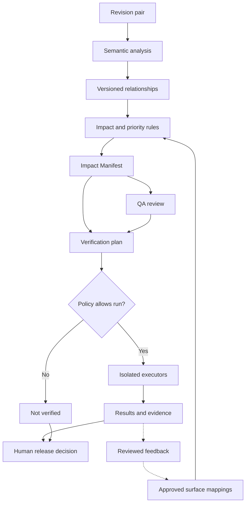

# Graphentra: Business and Technical Playbook

**Brand and intended domain:** Graphentra · Graphentra.com  
**Prepared:** 5 September 2026  
**Audience:** Founder, impact-analysis team, verification team, and future product, QA, and operations colleagues  
**Status:** Proposed operating and engineering plan, grounded in the seven supplied project documents. Product capabilities, support levels, prices, and timelines below are plans or hypotheses unless explicitly identified as established context. This document does not certify the current implementation.

> **Graphentra helps software teams understand which application areas a code change may affect, decide what deserves verification, and collect evidence from focused checks.**

The company has acquired Graphentra.com, according to the founder. The product is being developed by two teams: one builds change-impact intelligence; the other builds isolated automated verification. Earlier documents call the project “Vibe Testing.” This playbook uses Graphentra as the current brand while preserving those documents as sources.

## Contents

1. [The business in plain language](#1-the-business-in-plain-language)
2. [Positioning, customers, and commercial model](#2-positioning-customers-and-commercial-model)
3. [What the existing documents establish](#3-what-the-existing-documents-establish)
4. [Product scope and the first useful release](#4-product-scope-and-the-first-useful-release)
5. [Architecture and recommended technologies](#5-architecture-and-recommended-technologies)
6. [Team A: the impact-analysis engine](#6-team-a-the-impact-analysis-engine)
7. [The contract between the teams](#7-the-contract-between-the-teams)
8. [Team B: verification and execution](#8-team-b-verification-and-execution)
9. [Isolation, security, and customer data](#9-isolation-security-and-customer-data)
10. [Evidence, states, and release decisions](#10-evidence-states-and-release-decisions)
11. [The role of AI](#11-the-role-of-ai)
12. [Challenges and practical solutions](#12-challenges-and-practical-solutions)
13. [How to ship faster](#13-how-to-ship-faster)
14. [Delivery roadmap and team ownership](#14-delivery-roadmap-and-team-ownership)
15. [Evaluation and acceptance gates](#15-evaluation-and-acceptance-gates)
16. [Operations, cost, and growth](#16-operations-cost-and-growth)
17. [Marketing page and launch plan](#17-marketing-page-and-launch-plan)
18. [Decisions to record](#18-decisions-to-record)
19. [Glossary](#19-glossary)
20. [Sources and further reading](#20-sources-and-further-reading)

## 1. The business in plain language

### 1.1 The problem

A ticket says what a developer intends to change. The code determines how far that change can reach.

Consider an education portal. A developer updates token validation while fixing OTP login. The same validation code also supports password login and a guardian’s access to their children’s information. QA follows the ticket, checks OTP, and may overlook the guardian flow. Alternatively, QA repeats a large regression checklist to compensate for uncertainty.

Both responses have a cost: missed areas create release risk, and unnecessary checks consume time. Developers also spend time repeatedly explaining dependencies that are difficult to hold in memory.

Graphentra turns that uncertainty into a focused, explainable verification scope. This value exists before automated testing is available and before a defect is found. Finding an important related flow is useful even when the flow ultimately passes verification. This is central to the Phase 1 business idea [P6, sections 3, 19, and 22].

### 1.2 The complete product loop

1. A pull request or selected pair of revisions arrives.
2. The impact engine identifies changed semantic entities, such as functions, methods, components, or API contracts.
3. It follows supported relationships to application areas that may be affected.
4. It produces a prioritized scope, reasons, evidence paths, and unresolved questions.
5. A person or an approved policy chooses a verification plan.
6. The execution layer runs appropriate checks in an authorized environment.
7. Results record observed behavior, assertions, artifacts, the code version, and environmental limits.
8. QA and release owners decide how to proceed.

The first paid product can cover steps 1–4 plus human review. The second team extends the same loop with steps 5–7. Release authority remains an explicit organizational responsibility.

### 1.3 The promise and its limits

**Promise:** “See which application areas may need attention after a code change, understand why, and verify the important behavior with evidence.”

An impact recommendation means that a supported connection justifies attention. It does not establish that the change altered behavior, that the behavior is incorrect, or that a bug exists. A passing check proves only the assertion exercised under the recorded conditions.

Graphentra should distinguish among a strong dependency, a plausible dependency, an unsupported path, an unexecuted check, and an observed failure. A missing finding must never become a claim that an application is safe.

### 1.4 What customers are really buying

| Customer job | Deliverable | Business value to validate |
|---|---|---|
| Decide what to check after a change | Focused application-area list with reasons | Less planning and coordination time |
| Discover indirect risk | Traceable dependency paths | Fewer relevant flows omitted from the plan |
| Execute agreed verification | Selected existing tests and approved scenarios | Less repetitive manual work |
| Review release readiness | Version-bound results and outstanding gaps | A clearer, defensible decision |
| Preserve application knowledge | Approved mappings, journeys, and evidence history | Less dependence on one person’s memory |

These are outcomes to measure in pilots, not marketing statistics that have already been achieved.

## 2. Positioning, customers, and commercial model

### 2.1 Position the company broadly; begin with a specific buyer

**Category:** Change intelligence with focused verification.

**Initial use case:** PR and release regression planning for teams working on TypeScript applications with shared frontend or backend logic and incomplete automated coverage.

**Initial champion:** A QA lead, engineering lead, or senior developer who currently decides what else needs testing.

**Likely budget owner:** An engineering manager, head of engineering, or founder who pays for delivery time and release problems.

The broader architecture can serve developers, QA, product managers, and release owners. The first workflow should still solve one buyer’s recurring problem. One shared data model can support several views; building separate products for each role would multiply the early workload [P2, pp. 1–3].

### 2.2 Initial customer hypothesis

Seek three design partners with:

- A web application in the first supported stack.
- Frequent code changes and meaningful reuse of services, components, or APIs.
- A team that performs regression planning manually or combines manual and automated checks.
- An identifiable person willing to review recommendations weekly.
- Permission to analyze a repository and use an appropriate test environment.
- A repeatable release process against which results can be compared.

Avoid making the first pilot depend on supporting five languages, production credentials, complex enterprise procurement, or a complete rewrite of the customer’s deployment system. Revisit those customers after the core loop works.

### 2.3 How to explain Graphentra

**One sentence:** Graphentra connects code changes to the application areas that need attention and the evidence needed to verify them.

**Thirty seconds:** A small code change can affect much more than its ticket describes. Graphentra follows the relevant dependencies, explains which screens and APIs deserve verification, and provides a focused plan. Its execution layer is being built to run approved checks in isolation and return evidence tied to the tested version.

**Two-minute demonstration:** Change shared token validation. Reveal OTP login, password login, and guardian access. Open one dependency path. Show an unresolved dynamic permission mapping. Execute a small approved plan against a disposable application. Show a successful login assertion, a guardian-access failure, and a clear unverified item. Explain that the tool identifies attention areas first and establishes behavior through checks second.

### 2.4 Differentiation to earn

The defensible asset is the combination of accurate change-to-surface mapping, explainable prioritization, reliable execution integration, and useful customer-specific evidence history. A graph visualization or an LLM chat box alone is easy to reproduce.

Graphentra can differentiate through a low-friction setup, useful output without pre-existing tests, explicit uncertainty, and an execution-neutral contract. These are proposed strategic advantages, not findings from a fresh competitor benchmark. Do not claim superior accuracy or lower cost than established vendors without comparable evidence.

### 2.5 Revenue model

Start with a workspace subscription for change intelligence, scoped by active repositories and a transparent analysis allowance. When execution becomes reliable, charge for a defined included execution allowance and additional compute use. Keep manual review useful without requiring execution credits.

| Offering | Initial packaging hypothesis | What must be true before selling it |
|---|---|---|
| Assisted pilot | Fixed, time-limited engagement with one repository and named success criteria | The team can produce and explain reports consistently |
| Change Intelligence | Workspace subscription with an explicit repository and analysis allowance | Repeatable onboarding, useful scope, visible support limits |
| Verification | Add-on with included run minutes and explicit additional-use limits | Dependable isolation, evidence, accounting, cancellation, cleanup |
| Customer-hosted execution | Later paid deployment option | An operable broker, scoped identity, update path, and support model |

Do not promise unlimited browser agents, unlimited repositories, or unlimited private environments before measuring costs. An analysis job and a 30-minute browser run are different cost units.

**Price discovery hypothesis:** Test willingness to pay around a modest team-tool budget, for example USD 100–300 per workspace per month for the first narrow product. A USD 500+ package should correspond to demonstrated value, usage, and support needs. These numbers are proposed interview anchors, not market prices, validated willingness to pay, or revenue forecasts.

An illustrative value calculation: 20 PRs per month × 20 minutes of planning saved equals about 6.7 hours. At an assumed loaded cost of USD 40 per hour, that is about USD 267 of planning time. This alone would not justify a USD 500 subscription. Additional verified execution savings or avoided coordination would have to make the case. Substitute each customer’s measured inputs and avoid monetizing hypothetical prevented incidents as guaranteed savings.

### 2.6 Getting the first customers

1. Interview 8–10 relevant QA and engineering leads about their last actual regression-planning exercise.
2. Ask them to walk through a recent PR, the intended change, the checks selected, and an area they nearly missed.
3. Offer a bounded pilot on an approved repository. Agree what information can leave their environment.
4. Review 10–20 historical changes before observing upcoming changes in shadow mode.
5. Track usefulness, missed scope, planning time, and onboarding effort together.
6. Ask for a paid continuation when the agreed benefit is visible.
7. Seek permission before using names, logos, quotes, screenshots, or results in marketing.

The founder owns these conversations. Engineers should join selected evidence reviews to understand why apparently correct dependency paths are sometimes irrelevant to the user’s testing decision.

## 3. What the existing documents establish

### 3.1 Source hierarchy

The latest explicit founder instructions take precedence: the domain is Graphentra.com, and two teams are working in parallel. The detailed reference architecture supplies the technical direction. The product decisions document contains open questions; blank decision fields must not be treated as approvals. Earlier vision decks describe the destination, not delivered functionality.

| Topic | What appears in the source material | Working recommendation here |
|---|---|---|
| Primary audience | Early documents emphasize QA; the full-stack vision includes Developer Guard and QA Assurance | Start with QA/engineering regression planning; keep the company’s positioning broad |
| Mapping | The earlier MVP proposes folder/file mappings; the reference architecture prioritizes semantic evidence | Use symbol relationships as primary evidence and approved mappings as a practical supplement |
| Risk scoring | The MVP proposes a simple multiplicative score | Use explicit rules and attention tiers; calibrate any later numeric ranking |
| User states | Earlier decks use Clean, Dirty, Verified, and At Risk | Separate analysis, execution, verification, and human disposition states |
| Isolation | Backend vision favors Kubernetes namespaces | Keep an environment interface now; use an appropriate disposable pilot worker first unless the team already operates suitable Kubernetes infrastructure |
| Development sequence | The architecture warns against starting with autonomous execution | Let Team B build execution against fixtures while Team A proves impact; integrate through a shared contract |
| Multi-language support | Broad long-term target | Separate adapters now, certify one ecosystem at a time |
| AI autonomy | Long-term agentic planning, execution, and remediation | Begin with deterministic evidence and approved scenarios; introduce autonomy only after evaluation |

The lighter pilot isolation recommendation is an intentional proposed adjustment to [P1, pp. 8–10] and [P2, M3]. It preserves the isolation goal while reducing infrastructure work for the initial team. It does not authorize running hostile customer code in an ordinary shared container.

### 3.2 Durable product principles

- Mapping and prioritization are separate operations.
- Semantic symbol identity is more reliable than a name or directory match.
- Application surfaces are generic: screens, endpoints, commands, jobs, and other observable behaviors.
- The impact manifest is an independent product contract.
- Unknowns and incomplete analysis stay visible.
- Every conclusion and verification result belongs to a specific revision and environment.
- AI operates over bounded evidence and cannot grant itself authority.
- QA and product owners provide expected business behavior that code alone cannot establish.

## 4. Product scope and the first useful release

### 4.1 Recommended first supported slice

Use one TypeScript application with a React frontend and a small Express backend for the reference fixture. If the first committed pilot is Angular, select an Angular adapter in place of React; do not quietly add a second framework to the same milestone.

The first integrated demonstration should include:

- One repository and a pinned base/target revision pair.
- Exact cross-file function references and reverse consumers.
- One route/component mapping and one backend endpoint mapping.
- An explicit frontend-to-endpoint mapping when automatic matching is uncertain.
- An impact report with three relevant surfaces and one honest unknown.
- A small approved verification plan with known expected outcomes.
- One existing browser test and one API check.
- A disposable candidate environment with synthetic data.
- Results that include pass, assertion failure, and not-verified cases.
- Evidence artifacts and confirmed environment teardown.

### 4.2 Minimum useful Phase 1 product

An engineer or QA reviewer can select a change, see a ranked list of surfaces, inspect why each appears, record a review, and export an impact manifest. A full dependency graph is an optional investigation view, not the primary work surface.

The report must still be useful when there is no automated test suite. In that case, recommendations become a human verification checklist. The product must clearly distinguish an approved manually completed check from a machine-executed assertion.

### 4.3 Explicitly deferred

Defer general multi-language analysis, universal framework discovery, automatic business-rule inference, autonomous code repair, unrestricted browser exploration, full test management, production verification, cross-service event labs, performance baselines, enterprise access features, and automatic release approval.

Recognize unsupported changes in the input inventory and surface them as gaps. Deferring analysis does not justify silently ignoring a dependency upgrade, migration, or permission configuration change.

### 4.4 Support is a capability statement

For each adapter, publish whether it can parse files, resolve symbols, find cross-file references, understand framework routes, map surfaces, classify changes, and produce evaluated impact recommendations. “Can parse Python” and “can accurately map a Python change to user journeys” are very different claims.

Do not label any adapter certified until it passes its representative fixture suite. The illustrative support table in [P7, section 78] is a design example, not evidence that Graphentra already supports those languages.

## 5. Architecture and recommended technologies

### 5.1 Logical architecture



These are logical responsibilities. They do not require a separate microservice or LLM agent for every box.

### 5.2 Physical MVP shape

Start with a modular Node.js control-plane application, a separate analysis worker process, and a separate execution worker/broker. Use one managed PostgreSQL database for metadata and object storage for artifacts. Isolation of customer code is a real process or infrastructure boundary; the remaining modules can live together.

The marketing page is an independent static website. It does not need the application backend, a database, or an LLM connection. The product dashboard and execution system are separate future deliverables.

### 5.3 Technology decisions

| Layer | Recommended starting point | Why and boundary |
|---|---|---|
| Marketing | Static HTML, CSS, and small JavaScript | Fast delivery and minimal operating cost; no fake live product backend |
| Product workspace | React + TypeScript using the team’s familiar tooling | Lists, evidence details, plan review, and run status; reuse a working stack |
| Control-plane API | Node.js + TypeScript, with Fastify if no framework exists | One typed domain model and a small API; avoid replacing an existing suitable backend |
| Semantic adapter | Pinned TypeScript Compiler API with project-aware loading | Resolve declarations and references; AST extraction alone is insufficient |
| Language boundary | Versioned JSON output from isolated language workers | Allows Python, Roslyn, or other native analyzers later without forcing them into Node |
| Framework layer | One frontend adapter and one backend adapter | Routes, rendering, dependency injection, and endpoints need framework knowledge |
| In-memory graph | Forward and reverse adjacency maps | Straightforward traversal and per-analysis locality |
| Durable graph | PostgreSQL entities, edges, snapshots, and evidence tables | Reuse the application database until workload measurements justify a graph database |
| Job delivery | Existing managed queue or a maintained PostgreSQL-backed job library | Durable jobs, leases, retries, and idempotency; do not invent a workflow platform |
| Shared contracts | JSON Schema with generated types; Ajv on the TypeScript side | Validate language-neutral messages and prevent two teams from drifting |
| Browser checks | Playwright Test in TypeScript if that matches the existing work | Reuse current effort and native browser-testing capabilities |
| Python tests | pytest adapter, with the Playwright pytest plugin if Python is the chosen browser stack | pytest organizes and runs tests; Playwright drives browsers |
| API checks | Existing runner’s HTTP client plus explicit assertions | APIs can be checked from TypeScript or Python; server language does not dictate test language |
| Disposable dependencies | Docker Compose or Testcontainers inside an appropriate disposable worker | Seeded database and service lifecycle; not a hostile-code security boundary by itself |
| Artifacts | Object storage with access controls and retention | Traces, logs, screenshots, request/response evidence, reports |
| Observability | Structured logs, run correlation IDs, metrics; OpenTelemetry when needed | Trace a failed run through scheduling, provisioning, execution, and cleanup |

Fastify’s documentation describes its plugin model and TypeScript support. Ajv documents JSON Schema support with draft-specific behavior; choose one schema draft for the shared contract and test that both language validators enforce it consistently. [Fastify](https://fastify.dev/docs/latest/), [Ajv](https://ajv.js.org/json-schema.html)

### 5.4 A current TypeScript compatibility issue

The official Compiler API guide currently describes TypeScript 6.0 and earlier and warns that TypeScript 7.1 will have a different API. Do not depend on an unpinned “latest” compiler package. Keep the team’s working, API-compatible version pinned, record it in every analysis, and evaluate new syntax and compiler versions on fixtures before enabling them. Treat a major API transition as an adapter migration. [TypeScript Compiler API guide](https://github.com/microsoft/TypeScript/wiki/Using-the-Compiler-API)

The analyzer’s compiler version is not automatically the same as the application’s declared compiler version. Define and publish supported combinations. Unsupported syntax, missing dependencies, or unresolved project configuration should make the analysis partial rather than silently degrading into confident text matching.

### 5.5 What to reuse and what to build

**Reuse:** Git revision/diff machinery, mature compiler APIs, existing native tests, Playwright, pytest, JSON Schema validators, container tooling, managed storage, queue libraries, and standard telemetry.

**Build as the product’s core:** Changed-entity matching, evidence-bearing normalized relationships, framework-to-surface mapping, propagation rules, prioritization, a trustworthy manifest, evidence normalization, and a useful reviewer experience.

Before adopting a third-party analysis platform as the core, perform a bounded technical and commercial spike: can it expose symbol-level evidence, base/target snapshots, deletions, reusable outputs, acceptable data handling, and a viable redistribution model? Check the actual license and contract. Keep exports behind an adapter. This document does not claim a new review of CAST, Graphify, or any other vendor.

## 6. Team A: the impact-analysis engine

### 6.1 Input and snapshot discipline

Each request identifies the tenant, repository, comparison mode, exact base revision, exact target revision, mapping version, rule version, and analyzer versions. Resolve branch names to immutable revisions when accepting the job.

For PR review, a useful default is merge-base-to-head. Record that choice explicitly. Release analysis may compare two deployment revisions instead. A PR branch’s result must not be mistaken for the result of a different merged candidate.

Keep both baseline and target graphs. Deleted functions and removed API fields still have consumers in the baseline graph. An engine that examines only the target snapshot can lose the very dependency it must explain.

### 6.2 Processing pipeline

1. **Profile the repository.** Detect project roots, language configuration, framework hints, package boundaries, generated output, and excluded directories.
2. **Load the semantic project.** Respect compiler options, path aliases, module resolution, and project references within the adapter’s supported scope.
3. **Index declarations and uses.** Give each entity a revision-scoped identity and resolve imports, aliases, methods, and calls where the semantic engine can prove them.
4. **Extract relationships.** Record caller-to-callee edges, rendering, route bindings, and other supported relationships with source locations and provenance.
5. **Compare revisions.** Match old/new entities and map changed hunks to the smallest meaningful enclosing entity. Account for insertions, deletions, moves, and renamed files.
6. **Classify the change.** Record observable dimensions, such as changed body, signature, contract, permission configuration, or route. Do not claim semantic equivalence merely because an edit looks like a refactor.
7. **Traverse dependents.** Follow relevant reverse usage edges, keeping evidence paths and explicit reasons when traversal stops.
8. **Map to surfaces.** Convert reached entities into named routes, endpoints, or approved journeys.
9. **Prioritize.** Apply hard attention rules, then rank remaining recommendations. Deduplicate surfaces without discarding distinct important evidence.
10. **Find verification candidates.** Attach supported existing-test references and scenario suggestions with expectation provenance.
11. **Emit a validated manifest.** Include gaps, coverage of analysis, versions, truncations, and machine-readable reasons.

### 6.3 Symbol identity and entity matching

Do not use a display name such as `validate()` as a global identifier. Two files may declare that name, and a class may contain overloaded methods. Compiler-internal symbol objects are also not durable identifiers across processes or revisions.

Use repository/project identity, normalized module path, qualified declaration identity, symbol kind, and a disambiguator. Store a separate location and content fingerprint. Revision-scoped IDs are authoritative; old-to-new matching is a separate relation with a recorded match method and ambiguity status. If a move or rename cannot be matched confidently, represent a deletion and addition plus an uncertainty item.

### 6.4 Recommended graph representation

| Record | Important fields |
|---|---|
| Snapshot | Tenant, repository, revision, analyzer versions, configuration hash, completeness |
| Entity | Snapshot ID, entity ID, kind, qualified name, file, range, metadata |
| Edge | Snapshot ID, source ID, target ID, relation kind, evidence class, provenance ID |
| Provenance | Source revision, file/range, adapter/version, resolution method, observed/configured status |
| Surface | Stable business ID, display name, kind, entrypoint references, owner-approved criticality |
| Mapping | Surface ID, entrypoint, source, mapping revision, approval metadata |
| Analysis | Revision pair, changed entities, rule decisions, stopped paths, manifest reference |

Store `CALLS` as **caller → callee**. Build the reverse index by callee for impact traversal. Keep an impact path’s traversal direction explicit instead of silently redefining the underlying edge.

For relational lookup, start with indexes shaped around actual equality filters, such as `(tenant_id, repository_id, snapshot_id, target_id)` for reverse edges and the analogous `source_id` index for outgoing edges. Tenant and snapshot constraints must accompany both node and edge queries. Measure query plans before adding further indexes; multicolumn index usefulness depends on the query and column ordering. [PostgreSQL multicolumn indexes](https://www.postgresql.org/docs/current/indexes-multicolumn.html)

### 6.5 Traversal, branching, and noise

Traverse from a changed dependency toward its consumers. If a function has several callers, inspect all relevant branches. Reaching one consumer does not imply that it is the only affected surface.

Use a visited structure to handle cycles, but retain enough state to preserve a stronger path or a materially different change category. A naive “visited entity once” rule can suppress useful evidence if different seeds reach the same node under different propagation rules.

| Rule | Proposed pilot behavior |
|---|---|
| Exact runtime call | Propagate as strong dependency evidence |
| Import without use of the changed symbol | Supporting context, not sufficient on its own for a precise impact claim |
| Type-only use | Route toward compile/contract verification when appropriate; do not automatically request browser regression |
| Test consumer | Attach a test candidate; do not turn it into a product surface |
| Shared authentication or permission logic | Preserve critical related surfaces and require review even when broad |
| Dynamic/reflection path | Mark unresolved; request mapping, runtime evidence, or manual review |
| Duplicate paths | Present the clearest strong path; retain alternatives for investigation |
| Reached surface | Record it; continue only where supported relationships can reveal additional independent surfaces |
| Depth or work budget exhausted | Mark traversal partial and report the affected frontier |

The earlier depth cap of six and hub threshold around twenty are tuning hypotheses, not proofs of completeness. Use them as resource controls. A common formatter may justify selective handling; a widely used authorization guard must not be hidden because it is a hub. When the budget prevents a full result, expose broad scope or manual review instead of a deceptively small green report.

### 6.6 Change taxonomy and priority

The first product-facing categories can be Contract, Behavior, Data, Permission, Configuration, Routing, Visual, and Text. Keep Dependency/Build, Deployment, and Unknown as explicit technical categories [P7, sections 23–24]. One change can have more than one category.

Use attention tiers such as **Must verify**, **Recommended**, **Informational**, and **Needs investigation**. Keep business criticality separate from evidence strength. A critical permission surface reached through uncertain evidence may need investigation with high urgency; uncertainty should not mechanically lower it into irrelevance.

Do not multiply arbitrary confidence numbers and display the result as a probability of safety. Prefer labels such as exact semantic, framework declared, approved mapping, runtime observed, and heuristic. These describe evidence provenance, not the chance a bug exists.

### 6.7 From code to journeys

A route is an entrypoint. A journey is a sequence of actions with roles, data, and expected outcomes. A static call graph alone does not prove the complete journey.

Start with a small reviewed mapping configuration. Link a guardian journey to its UI route and backend endpoints, its role, its important data setup, and its known checks. Mark automatic suggestions as suggestions until supported. Use observed browser/network traces later to enrich mappings; an unobserved path is still possible.

For frontend-to-backend matching, prefer explicit service identity, HTTP method, route template, schema/operation identifier, and version. A string match on `/users` is inadequate when several services expose that path.

### 6.8 Incremental analysis

First make full analysis correct on a small fixture. Cache immutable snapshots and add incremental updates after measuring their need. Invalidation must include affected semantic dependents, changed exports, aliases, compiler configuration, contracts, and framework configuration. “Only parse changed files” is not a sufficient invalidation algorithm.

Cache keys should include tenant, repository, revision, adapter versions, configuration and mapping hashes, dependency resolution state, and rule version where relevant. A compiler or rule upgrade should not reuse incompatible analysis. Periodic full rebuild comparisons can detect incremental drift.

## 7. The contract between the teams

### 7.1 Ownership

**Team A owns WHAT deserves verification, WHY it was selected, and the EVIDENCE supporting the connection. Team B owns HOW approved checks run, WHERE they run, and WHAT execution evidence returns.**

Team B must not need to reconstruct the dependency graph. Team A must not encode arbitrary browser clicks or shell commands into impact output. A shared planner translates attention into executable scenarios; Team B should initially own its implementation, with both teams reviewing the contract and QA/product owners supplying expected behavior.

Use four independent, versioned messages:

| Message | Owner | Meaning |
|---|---|---|
| `ImpactManifest` | Team A | Analysis findings, scope, reasons, evidence, and suggested verification |
| `VerificationPlan` | Planner / Team B | Exact selected scenarios, approved runner references, preconditions, expectations, and required capabilities |
| `ExecutionGrant` | Trusted control plane | Authority for a particular plan, environment, action scope, budget, and expiry |
| `VerificationResult` | Team B | Actual attempts, assertions, artifacts, environment identity, and cleanup |

An impact manifest is an input to planning. It is never a permission grant.

### 7.2 Required manifest fields

| Field | Required meaning |
|---|---|
| `schemaVersion` | Semantic version of the contract |
| `analysisId` | Immutable identifier for this analysis |
| `tenantId`, `repository.id` | Isolation and source identity |
| `repository.baseRevision`, `targetRevision` | Full immutable object IDs; do not assume every future SCM uses SHA-1 |
| `comparisonMode` | Such as `merge_base_to_head` or `deployment_to_candidate` |
| `analysisStatus` | `complete`, `partial`, or `failed`; complete means within declared scope |
| `capabilities` | Analyzed and unsupported categories/framework features |
| `analyzers`, `ruleVersion`, `mappingVersion` | Reproduction and invalidation inputs |
| `changes` | Changed entities, kinds, categories, and before/after source evidence |
| `impacts` | Surface identity, priority, evidence class, reasons, paths, and verification suggestions |
| `unknowns`, `truncations` | Explicit unresolved scope and exhausted budgets |
| `generatedAt` | Timestamp for audit; revision identity remains the freshness anchor |

### 7.3 Example Impact Manifest

This is a proposed v1 integration fixture. IDs, hashes, paths, and versions are synthetic. It deliberately contains one impact and one unknown to keep the contract readable; the three-surface demo uses the same structure repeatedly.

```json
{
  "schemaVersion": "1.0.0",
  "analysisId": "analysis-demo-482",
  "tenantId": "tenant-demo",
  "generatedAt": "2026-09-05T10:00:00Z",
  "repository": {
    "id": "repo-demo-portal",
    "baseRevision": "aaaaaaaaaaaaaaaaaaaaaaaaaaaaaaaaaaaaaaaa",
    "targetRevision": "bbbbbbbbbbbbbbbbbbbbbbbbbbbbbbbbbbbbbbbb"
  },
  "comparisonMode": "merge_base_to_head",
  "analysisStatus": "partial",
  "ruleVersion": "pilot-rules-1",
  "mappingVersion": "demo-map-1",
  "analyzers": [
    { "name": "typescript-semantic", "version": "pilot-1" },
    { "name": "express-routes", "version": "pilot-1" }
  ],
  "capabilities": {
    "analyzed": ["typescript-calls", "express-static-routes", "approved-surfaces"],
    "unsupported": ["runtime-permission-loader"]
  },
  "changes": [
    {
      "id": "change-token-validation",
      "entityId": "entity:auth/validateToken",
      "changeKind": "modified",
      "categories": ["behavior", "permission"],
      "before": {
        "revision": "aaaaaaaaaaaaaaaaaaaaaaaaaaaaaaaaaaaaaaaa",
        "file": "src/auth/token.ts",
        "startLine": 20,
        "endLine": 34
      },
      "after": {
        "revision": "bbbbbbbbbbbbbbbbbbbbbbbbbbbbbbbbbbbbbbbb",
        "file": "src/auth/token.ts",
        "startLine": 20,
        "endLine": 36
      }
    }
  ],
  "impacts": [
    {
      "id": "impact-guardian-access",
      "changeIds": ["change-token-validation"],
      "surface": {
        "id": "surface:guardian-access",
        "kind": "web_journey",
        "name": "Guardian access",
        "criticality": "high"
      },
      "attention": "must_verify",
      "evidenceClass": "semantic_and_approved_mapping",
      "reason": "Guardian access uses session middleware that calls the changed validator.",
      "ruleIds": ["permission-change", "critical-surface"],
      "paths": [
        {
          "id": "path-guardian-1",
          "snapshotRevision": "bbbbbbbbbbbbbbbbbbbbbbbbbbbbbbbbbbbbbbbb",
          "steps": [
            {
              "edgeId": "edge-session-validator",
              "from": "entity:auth/sessionMiddleware",
              "to": "entity:auth/validateToken",
              "relation": "CALLS",
              "traversal": "reverse",
              "evidenceClass": "exact_semantic",
              "provenance": {
                "analyzer": "typescript-semantic@pilot-1",
                "file": "src/auth/session.ts",
                "startLine": 18,
                "endLine": 18
              }
            },
            {
              "edgeId": "edge-guardian-middleware",
              "from": "endpoint:GET:/guardian/children",
              "to": "entity:auth/sessionMiddleware",
              "relation": "USES_MIDDLEWARE",
              "traversal": "reverse",
              "evidenceClass": "framework_declared",
              "provenance": {
                "analyzer": "express-routes@pilot-1",
                "file": "src/routes/guardian.ts",
                "startLine": 12,
                "endLine": 12
              }
            },
            {
              "edgeId": "edge-guardian-surface",
              "from": "surface:guardian-access",
              "to": "endpoint:GET:/guardian/children",
              "relation": "USES_ENDPOINT",
              "traversal": "reverse",
              "evidenceClass": "approved_mapping",
              "provenance": {
                "mappingVersion": "demo-map-1",
                "mappingKey": "guardian-access.entrypoints"
              }
            }
          ]
        }
      ],
      "verification": {
        "existingTests": [
          {
            "runner": "playwright-test",
            "testRef": "test:guardian-valid-session",
            "discoveryRevision": "bbbbbbbbbbbbbbbbbbbbbbbbbbbbbbbbbbbbbbbb"
          }
        ],
        "suggestedChecks": [
          {
            "id": "check-guardian-valid-session",
            "intent": "Confirm a valid guardian session can access the seeded child record.",
            "expectationRef": "acceptance:guardian-access:v1",
            "expectationStatus": "approved",
            "requiredCapabilities": ["browser", "isolated-app", "seeded-guardian"]
          }
        ]
      }
    }
  ],
  "unknowns": [
    {
      "id": "unknown-runtime-permissions",
      "kind": "dynamic_dependency",
      "file": "src/auth/permission-loader.ts",
      "reason": "Consumer selection depends on runtime configuration.",
      "nextAction": "Review a versioned permission mapping or capture an approved trace."
    }
  ],
  "truncations": []
}
```

### 7.4 Planning and execution authority

The planner resolves `testRef` against a registry discovered for the target revision. It checks that required fixtures, expected outcomes, runner capabilities, and data are present. A suggestion without an approved expectation can support exploration but must not become a verified business claim.

The `VerificationPlan` stores the manifest ID and digest, target artifact/revision, selected check IDs, expectation references, runner IDs and versions, data setup reference, action categories, deadlines, and evidence requirements. Bind the plan’s content hash to its approval record.

The broker then issues an `ExecutionGrant` tied to the plan hash, tenant, approved environment ID, exact artifact, allowed actions, cost/time limits, expiry, and a nonce. Authenticate the worker and grant; use a signature or an equivalently authenticated broker protocol. Workers cannot substitute a different plan or expand permissions.

The impact engine cannot supply an arbitrary target URL, Docker configuration, shell command, or secret and have it automatically executed. A trusted environment profile and runner registry resolve those details. Private network access may be allowed for a named customer environment; it is never inferred from an untrusted manifest URL.

### 7.5 Shared integration semantics

- **Canonical schema:** Maintain one JSON Schema source, with TypeScript/Python bindings generated or validated from it. Specify accepted extension fields and reject unknown executable policy fields.
- **Versioning:** Add optional fields compatibly; use a major version for changed meaning or required fields. Never silently reinterpret an unsupported major version.
- **Idempotency:** Key a requested run by tenant, target artifact, plan hash, environment profile, and caller idempotency key. A queue redelivery must not create a second environment or repeat a state-changing action accidentally.
- **Attempts:** Keep logical job IDs separate from attempt IDs. Preserve each attempt’s result rather than overwriting an initial failure with a retry pass.
- **Capability mismatch:** Record unsupported/not verified; do not silently drop requested checks or switch to a weaker runner.
- **Staleness:** A new target revision or edited plan requires a new analysis/approval binding. A previously approved run is not approval for new content.
- **Delivery:** Expect at-least-once delivery. Use durable events, leases, heartbeats, deduplication, and a replayable event log.
- **Cancellation:** Cancel queued work, signal active work, revoke the grant where feasible, and still perform cleanup. Confirm cancellation rather than assuming a lost connection stopped execution.
- **Timeout:** Mark the run timed out, preserve evidence already collected, and attempt teardown. Incomplete work remains unverified.

### 7.6 Small initial API surface

| Operation | Purpose |
|---|---|
| `POST /v1/analyses` | Request analysis for an immutable revision pair; return a job ID |
| `GET /v1/analyses/{id}` | Return status and the validated manifest when ready |
| `POST /v1/plans` | Create a reviewable plan from a manifest and selected checks |
| `POST /v1/plans/{id}/approvals` | Bind an authorized reviewer/policy to the exact plan hash |
| `POST /v1/runs` | Request execution of an approved plan with an idempotency key |
| `POST /v1/runs/{id}/cancel` | Request cancellation without bypassing cleanup |
| `GET /v1/runs/{id}` | Return execution, verification, evidence, and cleanup states |

These routes are proposed interfaces, not endpoints implemented by the marketing page. Authorization applies to every lookup and write. Return HTTP 202 for queued operations and structured errors for invalid schema, stale plan, unsupported capability, and expired authorization.

### 7.7 How the two teams work without blocking

On day one, both teams agree on the contract shape and commit fixtures. Team A can return fixture execution results through its UI while it develops analysis. Team B consumes synthetic manifests and runs real fixture tests while the analyzer is unfinished. Replace mocks at the boundary, not by rewriting either team’s internals.

Required fixtures include: complete analysis, partial analysis, deleted symbol, no findings within scope, unsupported language, missing test, assertion failure, environment failure, timeout, cancellation, stale revision, and cleanup failure. Validate them in both languages before merging a schema change.

## 8. Team B: verification and execution

### 8.1 Pytest and Playwright have different jobs

Pytest is a Python test framework and runner. Playwright controls browsers and provides browser-testing tools; Playwright Test is its TypeScript/JavaScript test runner. The Python Playwright integration can run through pytest. Neither pytest nor a browser context provisions a full isolated application environment. [pytest invocation](https://docs.pytest.org/en/stable/how-to/usage.html), [Playwright introduction](https://playwright.dev/docs/intro), [Playwright pytest plugin](https://playwright.dev/python/docs/test-runners)

Because part of the team is already working with Playwright, keep that implementation language unless there is a concrete reason to change it. If the team has working TypeScript browser tests, add a pytest runner adapter for Python tests rather than rewriting the browser system. If the existing execution code is Python, pytest plus the Playwright plugin is a coherent starting point.

| Need | Practical executor |
|---|---|
| Existing TypeScript browser test | Playwright Test |
| Existing Python test | pytest |
| Browser test written in Python | Playwright pytest plugin |
| REST behavior | An HTTP client within the selected runner plus assertions |
| Existing unit/component test | Native project test runner adapter |
| API schema compatibility | A dedicated schema-diff/contract adapter, added when needed |
| Database postcondition | Scoped query/assertion adapter inside disposable test data |
| Event workflow | Correlated producer/consumer assertion adapter, later milestone |

An HTTP 200 alone is not sufficient verification. Check the response/body, permissions, relevant state, and the business expectation for the scenario. A screenshot alone does not establish correctness either.

### 8.2 Prefer existing tests first

Discover tests and their stable references for the target revision. Existing tests encode expectations that the team can review and are easier to rerun than an improvised agent journey. Selection can use approved mappings, framework metadata, and revision-specific coverage evidence.

For pytest, its documented invocation supports individual node IDs, marker selection, and collection-only operation. Reports can be emitted as JUnit XML. Build adapters around documented selection and reporting instead of scraping a human terminal display. Collection imports code and can execute hooks, so it belongs in the execution sandbox. [pytest invocation](https://docs.pytest.org/en/stable/how-to/usage.html), [pytest output](https://docs.pytest.org/en/stable/how-to/output.html)

### 8.3 Execution lifecycle

1. Validate the manifest, plan, authority, target artifact, and capabilities.
2. Lease an appropriately isolated worker for the tenant and trust level.
3. Prepare the exact candidate build. If it is built during the run, treat installation and build hooks as untrusted execution.
4. Start dependencies, seed synthetic data, and perform application-level readiness checks.
5. Run the chosen tests with a fixed runner/browser version and bounded resource use.
6. Record assertions, errors, traces, relevant responses, and environment identity.
7. Classify each result without hiding unresolved work.
8. Upload redacted artifacts and verify the artifact references are usable.
9. Tear down dependencies, data volumes, network resources, and worker leases.
10. Report cleanup separately and retain evidence under the agreed policy.

A running process or open port is insufficient readiness. Confirm that the service can reach its required dependencies and that seeded identities exist before testing behavior.

### 8.4 Browser isolation is only one layer

Use a fresh browser context for each test to separate session state. Application users, databases, queues, external services, and shared backend state need their own isolation or reset strategy. Playwright’s nonpersistent browser contexts isolate browser sessions; they do not isolate the entire system under test. [Playwright BrowserContext](https://playwright.dev/docs/api/class-browsercontext)

### 8.5 Expected behavior must have a source

Store an expectation reference for each assertion: an approved acceptance criterion, reviewed test, contract, invariant, or approved scenario. Baseline behavior can reveal a difference but does not prove that either baseline or candidate is correct.

If an agent invents an expected outcome from the same changed code it is testing, both can share the same mistake. Treat such generated checks as proposals. A human or a trusted specification should establish the meaningful expected behavior.

## 9. Isolation, security, and customer data

### 9.1 Separate the three boundaries

| Boundary | Initial policy |
|---|---|
| Repository analysis | Read code and configuration; no commits or source modifications |
| Shared customer environment | Outside initial execution scope, or narrowly approved actions with known side effects |
| Disposable verification environment | Approved mutations using synthetic data, scoped credentials, and teardown |

“Read-only” cannot be inferred from an HTTP method. A poorly designed GET endpoint can mutate state. Use an approved action policy and environment boundary rather than a method-name shortcut.

### 9.2 Practical isolation progression

| Stage | Suggested setup | Limits and reason to upgrade |
|---|---|---|
| Team-owned demo | Fresh disposable VM/CI job with containers for the fixture app and database | Only controlled fixtures; keep real credentials and production connectivity out |
| Trusted customer pilot | Customer-owned ephemeral worker or separately isolated worker per run/tenant | Explicit trust model, egress policy, identities, artifact control, and cleanup required |
| Hosted untrusted execution | VM/microVM isolation or a sandboxed container runtime with validated compatibility | Ordinary shared containers and namespaces alone are insufficient for hostile workloads |
| Growing integration labs | Kubernetes jobs/namespaces with network policy, quotas, identities, and a cleanup controller | Useful when concurrency and customer infrastructure justify operations cost |
| Cluster-scoped or performance work | Separate clusters, virtual control planes, or dedicated capacity as required | Select by the actual threat model and fidelity requirements |

Docker’s security documentation identifies daemon access, configuration, namespaces, capabilities, and resource controls as relevant security considerations. Do not expose the host Docker socket to a test workload or run it privileged. Containers share important host infrastructure and require a deliberate security design. [Docker security](https://docs.docker.com/engine/security/)

Kubernetes documentation discusses distinct multi-tenancy models, additional network/storage controls, and stronger isolation where workloads are mutually untrusted. A namespace or virtual control plane alone should not be advertised as complete host isolation. gVisor provides an application-kernel sandbox with compatibility and workload considerations that must be evaluated. [Kubernetes multi-tenancy](https://kubernetes.io/docs/concepts/security/multi-tenancy/), [gVisor](https://gvisor.dev/docs/)

### 9.3 Minimum controls for execution

- Workers cannot reach control-plane credentials, unrelated tenants, or cloud metadata endpoints.
- Network destinations come from an approved environment profile, with redirects and DNS resolution covered by enforcement.
- Credentials are short-lived and scoped to the run. The executor receives no general repository-write or cluster-admin identity.
- Repository scripts, test files, dependency hooks, and agent-generated code are treated as untrusted executable input.
- Apply CPU, memory, disk, process-count, elapsed-time, and artifact-size budgets.
- Restrict mounts and filesystem access; run without unnecessary privileges.
- Use fresh data and explicit external-service substitutes for payments, messaging, and email.
- Keep an independent TTL cleanup controller in addition to normal teardown.
- Redact secrets and personal data from logs, network evidence, screenshots, and traces where feasible; restrict artifact access even after redaction.
- Record who approved each action scope and the exact plan it authorized.

These controls are directly relevant to Graphentra’s core activity of running customer code. They should become implementation requirements, not marketing claims until verified.

### 9.4 Dependencies and environment fidelity

Testcontainers can help manage disposable dependencies from tests. The environment broker should own host-level provisioning; test code should not receive unrestricted access to a shared provisioning host. [Testcontainers for Node.js](https://node.testcontainers.org/)

Record the difference between the sandbox and the real deployment: mock email provider, stubbed payment service, database version, feature flags, locale, role, and dependency versions. A mock validates behavior against the mock’s assumptions, not the external provider’s real behavior.

For the first portal fixture, use a seeded guardian account and child record, a local test email/OTP mechanism, and a disposable database. Avoid real phone numbers or production account records. Store seed version and clock/time assumptions for reproducibility.

### 9.5 Customer trust and retention

Document whether code is analyzed on Graphentra infrastructure or customer infrastructure, which snippets may reach an LLM provider, which artifacts leave the environment, who can access them, and how long each class is retained. Support deletion that covers metadata, artifacts, caches, and queued jobs according to the product’s actual retention design.

Tenant isolation must exist in authorization and storage access, not just naming conventions. A signed artifact link should be short-lived and bound to an authorized resource. Do not include source-code excerpts, tokens, or personal records in general telemetry.

## 10. Evidence, states, and release decisions

### 10.1 Use separate state dimensions

| Dimension | Suggested states | Meaning |
|---|---|---|
| Analysis | Queued, Running, Complete, Partial, Failed | Whether requested analysis finished within declared scope |
| Attention | Must verify, Recommended, Informational, Needs investigation | Where reviewers should spend effort |
| Execution | Queued, Provisioning, Running, Completed, Failed, Timed out, Cancelled | Lifecycle of the run |
| Check outcome | Passed, Assertion failed, Error, Skipped, Unsupported, Not run | What the executor actually observed |
| Surface verification | Verified, At risk, Not verified | Aggregation of required checks for this scope and revision |
| Cleanup | Pending, Succeeded, Failed | Whether disposable resources were removed |
| Human disposition | Open, Reviewed, Accepted risk, Ignored for this change | A reviewer’s action, separate from evidence |

Avoid using “Clean” as shorthand for unknown or untested. If the interface retains “No known impact,” qualify it with the analyzed revision and support scope.

### 10.2 Result classification

- **Verified:** All required checks for the recorded scope completed successfully, required evidence exists, and build/environment identity matches the plan.
- **At risk:** A required assertion failed or the approved decision policy identifies an observed blocking condition. Report the observation without automatically declaring its root cause.
- **Not verified:** A required check was unsupported, skipped, blocked, timed out, cancelled, lacked an expectation, or could not obtain adequate evidence.

A completed runner process can contain failed checks. A valid passed check can coexist with failed cleanup. Do not compress these facts into one green status.

Distinguish likely product regression, pre-existing failure, test issue, flaky behavior, and environment failure as triage classifications with evidence and uncertainty. If a matched baseline run fails in the same way, that is useful evidence of a pre-existing failure; it is not an automatic justification to ignore it.

### 10.3 Example Verification Result

The following synthetic example contains a failed guardian assertion and successful teardown. Its test attempt is complete, while the surface remains at risk.

```json
{
  "schemaVersion": "1.0.0",
  "tenantId": "tenant-demo",
  "analysisId": "analysis-demo-482",
  "planId": "plan-demo-482-1",
  "runId": "run-demo-482-1",
  "attemptId": "attempt-1",
  "targetRevision": "bbbbbbbbbbbbbbbbbbbbbbbbbbbbbbbbbbbbbbbb",
  "executionStatus": "completed",
  "startedAt": "2026-09-05T10:10:00Z",
  "finishedAt": "2026-09-05T10:11:00Z",
  "environment": {
    "id": "env-demo-482-1",
    "profileVersion": "portal-fixture-1",
    "artifactId": "artifact-demo-candidate-b",
    "dataSeedVersion": "guardian-seed-1",
    "runner": "playwright-test",
    "runnerVersion": "fixture-pinned",
    "browserVersion": "fixture-pinned",
    "externalServices": "stubbed-email"
  },
  "checks": [
    {
      "checkId": "check-guardian-valid-session",
      "surfaceId": "surface:guardian-access",
      "outcome": "assertion_failed",
      "expectationRef": "acceptance:guardian-access:v1",
      "expected": "The seeded guardian can retrieve the linked child record.",
      "observed": "GET /guardian/children returned HTTP 403 after login.",
      "triage": "unclassified_failure",
      "artifacts": [
        { "id": "artifact:trace-1", "kind": "browser_trace" },
        { "id": "artifact:response-1", "kind": "redacted_http_response" }
      ]
    }
  ],
  "surfaceResults": [
    { "surfaceId": "surface:guardian-access", "status": "at_risk" }
  ],
  "remainingGaps": ["unknown-runtime-permissions"],
  "cleanup": { "status": "succeeded", "evidenceRef": "cleanup:env-demo-482-1" }
}
```

The production artifact registry should also store integrity digests, content type, size, retention, and access scope. A convenient URL is a retrieval mechanism; it is not the artifact’s durable identity. Use actual pinned runner/browser versions in production, never the fixture labels shown above.

### 10.4 Release aggregation and freshness

Verification belongs to a tuple: repository revision or deployment artifact, environment/configuration, data seed, scenario and expectation versions, and policy scope. Changing a relevant element invalidates or requires review of earlier evidence.

For releases containing several PRs, union attention areas but do not assume that separate PR passes verify their combined build. Analyze and verify the actual candidate revision, especially where changes interact. Preserve a reviewer’s accepted-risk decision separately from verification and require reconsideration when its scope changes.

Begin with advisory reporting. Add required CI gates only after the team has measured misses, noise, partial-analysis behavior, and operational reliability. A high-risk unsupported scope should request review or remain not verified under the customer’s policy, rather than receiving a successful check by default.

## 11. The role of AI

### 11.1 Deterministic core, bounded assistance

| Responsibility | Default owner |
|---|---|
| Parse syntax and resolve symbol identity | Compiler/language adapter |
| Compute changed entities and graph traversal | Deterministic engine |
| Explain why a surface was selected | Evidence template, optionally rewritten by an LLM |
| Suggest human-friendly names and groupings | LLM proposal with mapping review |
| Enrich scenarios and edge cases | LLM proposal grounded in approved expectations |
| Perform browser/API actions | Approved tools and runner adapters |
| Determine assertion pass/fail | Explicit checks over observations |
| Explain or triage a failure | Structured evidence plus optional LLM assistance |
| Grant permission or approve release | Authorized human or explicit organizational policy |

The first useful analyzer and first integrated fixture do not require an LLM. This reduces cost and makes failures easier to diagnose. Add natural-language assistance after the evidence contract is reliable.

### 11.2 Agent use of code intelligence

An agent may call narrow tools such as “resolve symbol,” “list callers,” or “show the evidence path.” The tool result remains the authoritative evidence. A model’s guess about a relationship must retain an inferred label and must not silently enter the exact semantic graph.

Send the changed entity, bounded relevant code, resolved path, approved surface mapping, and expectation references. Do not send the whole repository by default. Enforce tenant-specific data policies before any provider call and record prompt/model versions for reproducibility where permitted.

Repository comments, web content, logs, and test output are untrusted data. Instructions inside them cannot change the agent’s permissions or redirect artifact uploads. Use bounded tool schemas, capability checks, and budget limits outside the model.

### 11.3 Earn autonomy in steps

First explain existing evidence. Then propose scenarios. Next execute previously approved scenarios under fixed policies. Only later allow constrained exploration or remediation with dedicated evaluation. Keep newly generated assertions and proposed patches reviewable.

Do not introduce several autonomous agents just to match the specialist boxes in the vision decks. Separate responsibilities in code and logs first; add agent orchestration only when it improves a measured task.

## 12. Challenges and practical solutions

“Optimal” depends on team capability, customer environment, and measured workload. The choices below prioritize a trustworthy narrow release with a small team.

| Challenge | What can go wrong | Best starting response | When to expand |
|---|---|---|---|
| False negatives | A relevant surface never appears | Labeled fixtures, baseline and target graphs, explicit gaps, criticality rules | Add framework/runtime evidence for observed misses |
| Too many recommendations | The entire application appears dirty | Changed-symbol granularity, edge rules, surface grouping, reviewable prioritization | Calibrate rules using customer labels |
| Deep branches and cycles | Excessive traversal or missed alternative paths | Reverse adjacency, visited state, retained evidence alternatives, explicit work limits | Optimize measured hot paths or compress strongly connected components |
| Generic hubs | Logger or shared HTTP client floods scope | Category-aware rules and changed-member analysis; retain security-critical broad impact | Add property/argument-sensitive reasoning where it yields value |
| Dynamic loading/reflection | Static analysis cannot prove consumers | Explicit unknown plus approved mappings or targeted runtime evidence | Build ecosystem-specific resolution patterns |
| Renames and deleted code | Target-only analysis loses old consumers | Compare old/new entities and traverse relevant baseline relationships | Improve entity matching with evaluated fingerprints |
| Compiler upgrades | API or resolution behavior changes | Pin versions, record compatibility, run adapter fixtures before upgrade | Separate migration for major compiler API changes |
| Framework diversity | Parsing works but routes/journeys do not | Certify one framework adapter and document limits | Add the next adapter when a pilot needs it |
| Cross-stack calls | Similar URL strings produce false matches | Service identity, methods, route templates, contracts, approved links | Add traces and contract-generated identifiers |
| Cross-repository versions | Analysis links incompatible deployed versions | Record a deployment version vector across services | Add a release/deployment inventory adapter |
| Non-code changes | Config, dependencies, or migrations disappear | Inventory and mark unsupported/high-interest scope | Add key/schema-specific adapters by customer demand |
| Stale caches | Old edges produce misleading reports | Versioned keys and dependency-aware invalidation | Compare incremental output against full snapshots |
| Missing business expectations | Generated tests only confirm themselves | Reviewed tests, contracts, or approved acceptance criteria | Customer-owned reusable journey library |
| No existing tests | Execution team has nothing reliable to select | Preserve manual verification value; create a few approved scenarios | Assist generation after expectation quality is measured |
| Flaky tests | A retry conceals instability | Preserve every attempt, control data/time, classify flakiness separately | Quarantine policy with owner and expiry |
| Environment failures | Infra problems look like product bugs | Readiness checks, environment fingerprint, separate error outcome | Reusable environment profiles and better telemetry |
| Expensive environments | Queue and infrastructure dominate run time | Reuse immutable images, provision only needed services, cap concurrency | Kubernetes pooling or customer-hosted runners when justified |
| Unsafe execution | Customer code reaches secrets or other tenants | Strong trust boundary, scoped credentials, denied egress, resource controls | Validated multi-tenant execution architecture |
| Cleanup failures | Orphan resources leak cost or data | Finally-stage cleanup plus independent TTL sweeper and alerts | Reconciliation controller with a resource inventory |
| Artifact leakage | Traces or screenshots expose customer data | Synthetic data, redaction, authorization, retention, audit | Customer-managed keys/location when required |
| Duplicate events | Tests or writes run twice | Durable delivery IDs, idempotency, attempt records, leases | Transactional outbox when multiple write steps need atomicity |
| Conflicting schema changes | Teams integrate late and break each other | Canonical schema, fixtures in both languages, version policy | Adapter compatibility testing across supported versions |
| Low willingness to pay | Impressive demo does not solve a paid problem | Paid pilot criteria and measured time/value | Broaden only after repeatable retention |
| Customer-specific work | Every onboarding becomes a custom project | Track setup hours and support patterns; standardize repeated mappings | A configuration UI once common patterns are clear |
| Vendor dependency | Cost, terms, or APIs constrain the product | Provider interfaces, exportable artifacts, version pinning, bounded adoption spike | Replace a provider only when an observed limit justifies it |

## 13. How to ship faster

### 13.1 Build a thin complete workflow

The highest-value first milestone is a real change producing a valid manifest, followed by one real isolated check with evidence. A sophisticated graph engine with no usable output, or an impressive browser agent with no meaningful scope, leaves the customer’s workflow incomplete.

Use the shared authentication fixture as the integration anchor. Keep one deliberately unrelated screen to test noise control and one dynamic mapping to test honesty. The demonstration should show actual supported analysis, not a hardcoded graph presented as live computation.

### 13.2 Speed decisions

| Do now | Reason |
|---|---|
| Freeze a small v1 contract and fixture set | Enables both teams to work without waiting |
| Pick one reference application and one pilot | Limits setup and framework ambiguity |
| Reuse existing Playwright work | Avoids a test-language rewrite |
| Keep the graph in memory and PostgreSQL | Avoids a new operational database before need is proven |
| Use approved surface mappings | Provides business names and journeys immediately |
| Run known tests before generating new ones | Establishes reliable execution and evidence first |
| Use a familiar disposable environment | Makes the first run concrete without a platform buildout |
| Make partial results a supported product state | Enables honest delivery while coverage grows |
| Ship advisory reports | Supports learning before enforcing release gates |
| Measure onboarding and report usefulness | Prevents engineering effort from drifting away from customer value |

### 13.3 Work to postpone

Do not build a universal parser, a proprietary test runner, a custom scheduler, a graph query language, a general-purpose sandbox orchestrator, a full issue tracker, or a large multi-agent system for the first release. Do not replace working libraries merely to create a uniform language stack.

Some infrastructure cannot be deferred: immutable revision identity, basic authorization, durable jobs, execution trust boundaries, meaningful assertions, and cleanup. Removing those would make the demo easier while making the product harder to trust.

### 13.4 A good definition of a weekly increment

Every week should end with something that crosses the team boundary: a new supported change fixture producing a manifest and a corresponding check result; a stale-result rejection visible to a reviewer; or a timeout that still cleans up correctly.

Record a short demo, limitations, and next-week criteria. Avoid measuring progress primarily by parser node counts, graph-edge totals, or the number of tools an agent can call.

## 14. Delivery roadmap and team ownership

The following six-week sequence is an estimate for a focused pilot, not a delivery commitment. Adjust it after inspecting the actual code and available team hours. Existing work should be reused rather than rebuilt to match the order below.

### 14.1 First three working days

| Day | Team A | Team B | Founder/shared outcome |
|---|---|---|---|
| 1 | Agree entity, surface, and evidence fields; produce one fixture manifest | Validate the fixture and propose plan/result schemas | Select one pilot stack, fixture application, and measurable user problem |
| 2 | Generate real cross-file dependencies and a changed-entity result | Run one approved browser/API scenario in a disposable fixture environment | Approve expectation sources and attention terminology |
| 3 | Emit the manifest from a real revision pair | Consume it and return normalized evidence and cleanup status | Show the entire loop; record gaps without hiding them |

### 14.2 Six-week pilot plan

| Stage | Team A: impact intelligence | Team B: verification | Joint exit gate |
|---|---|---|---|
| Week 1: shared foundation | Revision pair, project loading, symbols, initial edges, manifest output | Fixture consumer, runner adapter, candidate environment, basic evidence | A real changed function leads to one real check and a version-bound result |
| Week 2: useful scope | Reverse traversal, branches/cycles, route/surface mapping, source reasons | Existing-test discovery, scenario registry, seeded data, failure classification | Shared-auth fixture yields expected surfaces and an unrelated surface stays outside recommended scope |
| Week 3: trustworthy integration | Baseline deletions, partial analysis, hard attention rules, supported-category inventory | Approval binding, budgets, cancellation, cleanup reconciliation | Missing capability and stale target are rejected or reported as unverified; cancelled runs clean up |
| Week 4: historical pilot | Analyze labeled customer changes, refine mappings and ranking | Run approved relevant scenarios where environment support exists | Reviewers can judge utility, misses, and noise against agreed labels |
| Week 5: live shadow use | PR integration, durable jobs, freshness and incremental cache work if needed | Stable provisioning, retry policy, artifact access and retention | Real upcoming changes produce advisory reports without disrupting customer CI |
| Week 6: paid pilot decision | Fix the most important supported-scope misses | Fix the main causes of unverified or unreliable runs | Customer and founder review measured benefit, support effort, cost, and continuation willingness |

### 14.3 Longer-term roadmap

1. **Reliable change intelligence:** Supported semantic paths and useful manual verification scope.
2. **Focused execution:** Existing native tests, Playwright, API assertions, and evidence.
3. **Disposable backend labs:** Writable data, controlled external substitutes, migrations, and event postconditions.
4. **Distributed assurance:** Cross-service contracts, traces, asynchronous workflows, and deployment version vectors.
5. **Advanced checks:** Security matrices, performance, resilience, and mutation testing where customer value warrants them.
6. **Controlled remediation:** Reviewable patches and explicitly scoped repository/pipeline changes.
7. **Policy-governed autonomy:** Automatic runs for evaluated scenarios, with clear exceptions and human release authority.

This preserves the milestone progression in [P2] without treating every technology listed there as first-release scope.

### 14.4 Responsibility map

| Area | Accountable owner | Required collaboration |
|---|---|---|
| Positioning, pilot selection, pricing | Founder | QA champions and engineering |
| Semantic analysis, graph, diff, priorities | Team A | QA/product for meaningful scope |
| Canonical manifest contract | Team A with a named shared contract owner | Team B review before semantic changes |
| Plans, runners, environments, evidence | Team B | Team A and expectation owner |
| Expected behavior and criticality | Customer QA/product owner | Engineers translate into assertions |
| Authorization and execution policy | Named control-plane owner | Both teams |
| Integration fixture and weekly gate | One rotating integration owner | Both teams |
| Customer research and labels | Founder or trained research/operations colleague | QA/domain reviewer validates technical labels |

Hold one short daily boundary check for schema changes and blockers, one weekly integration demo, and one weekly customer-evidence review. The nontechnical colleague can collect interview notes, track missing information, prepare approved scenario descriptions, and manage pilot feedback; they should not be made responsible for judging semantic correctness without technical review.

## 15. Evaluation and acceptance gates

### 15.1 Evaluate the right question

Parser correctness is necessary but insufficient. Ask whether the system surfaced the application areas that deserved verification, explained them accurately, and kept the list useful.

| Metric | Definition and caution |
|---|---|
| Recall of relevant surfaces | Relevant surfaces recommended ÷ all relevant surfaces in the reviewed ground truth |
| Precision of recommendations | Useful recommended surfaces ÷ all recommended surfaces |
| Critical misses | Count and nature of important relevant surfaces omitted or wrongly suppressed |
| Recommendation size | Number of surfaces and checks per change, alongside their usefulness |
| Explanation acceptance | Reviewer can follow the supplied evidence and agrees it supports attention |
| Unknown coverage | Known unsupported/truncated situations appear explicitly |
| Planning time | Time from opening a change to an agreed verification scope |
| Execution reliability | Runs reaching meaningful outcomes, separated from environment/test failures |
| Evidence completeness | Required artifacts and identities present for each result |
| Cost per useful result | Analysis, model, execution, artifact, and support costs for useful outputs |

Handle zero denominators explicitly. A change with no labeled impact should test false positives, not produce a misleading 100% recall number. Report supported-scope metrics and the amount of unsupported code separately.

### 15.2 Proposed pilot targets

These are initial acceptance proposals, not achieved performance or statistical guarantees:

- Every supported fixture produces the expected evidence path and declared unknowns.
- No known critical fixture is silently omitted or cleared by a depth/hub limit.
- Every reported automated pass has its required assertions, artifacts, and target identity.
- All timeout/cancellation fixtures reach a cleanup outcome, with independent reconciliation for failures.
- Historical pilot review initially aims for at least 90% relevant-surface recall and 70% recommendation precision, while reporting counts and sample size.
- On a defined small pilot repository, aim for a cached analysis p95 under two minutes, then revise against measurements and customer tolerance.
- Aim for a material reduction in planning time, such as 25%, using a comparable baseline and acknowledging reviewer learning effects.

Small samples cannot substantiate broad accuracy claims. Averages can hide a critical miss. Review each important miss individually, keep a held-out set of changes, and separate customer-specific mapping improvements from general analyzer improvements.

### 15.3 Meaningful fixture families

Use fixtures for direct/indirect calls, aliasing and re-exports, identical symbol names, methods and inheritance, callbacks, cycles, shared hubs, deleted symbols, moved files, route changes, type-only edits, formatting-only edits, changed public contracts, dynamic configuration, frontend/backend bridges, absent dependencies, and compiler-version incompatibility.

Execution fixtures should cover passing assertions, intentional product failure, pre-existing failure, unavailable service, invalid data seed, missing expectation, skipped check, retry instability, stale artifact, duplicate delivery, budget exhaustion, cancellation, artifact upload failure, and failed cleanup.

These tests protect real product promises and trust boundaries. Do not spend early effort on tests that merely assert that a UI label equals the string hardcoded in the component.

## 16. Operations, cost, and growth

### 16.1 Reliable job handling

Accept source-control events quickly, validate their authenticity, deduplicate deliveries, and queue analysis. A worker should not hold the webhook request open while cloning or analyzing a repository. GitHub documents webhook secrets, prompt acknowledgements, asynchronous processing, and delivery identifiers. [GitHub webhook best practices](https://docs.github.com/en/webhooks/using-webhooks/best-practices-for-using-webhooks)

Jobs need leases, heartbeats, bounded retries, a dead-letter path, and safe resumption. Cancel or supersede older PR analysis when a new head arrives, while preserving its historical record. Use an outbox or equivalent transaction boundary if accepting a request and enqueuing it must not diverge.

### 16.2 Cost model

Track each run’s cost components separately:

`cost per run = analysis compute + model usage + environment startup/runtime + artifact storage/egress + allocated operational support`

The important business number is gross margin after direct delivery costs, not just an inexpensive model call. Customer-specific setup and repeated troubleshooting can dominate a small pilot’s cost.

Use content-addressed immutable images, cache approved dependencies within the proper tenant/trust boundary, provision only necessary services, set maximum run duration, and cap concurrency per workspace. Start with on-demand disposable environments. Warm pools become useful only after measured startup delays justify their ongoing cost and reset complexity.

Measure cold indexing, incremental indexing, queue wait, application readiness, actual test runtime, artifact upload, and cleanup independently. Optimizing AST traversal will not help when most delay comes from building the customer application.

### 16.3 When to introduce larger infrastructure

| Expansion | Evidence that should justify it |
|---|---|
| Dedicated graph database | Relational/in-memory query performance fails measured requirements after appropriate indexing |
| Kubernetes execution fleet | Concurrency, customer environment requirements, or resource scheduling warrant a platform operator’s burden |
| Additional language adapter | Paying or committed customers need it and representative fixtures exist |
| Cross-repository mapping | The pilot’s meaningful impact crosses independently deployed services |
| Runtime tracing | Concrete static-analysis gaps can be addressed with an acceptable instrumentation burden |
| Autonomous exploration | Approved fixed scenarios are reliable and bounded exploratory evaluation shows additional value |
| Enterprise deployment | Customer demand can fund identity, retention, audit, support, and operational requirements |

## 17. Marketing page and launch plan

### 17.1 Page delivered with this playbook

The landing page uses the Graphentra brand and a charcoal/lime visual identity. Its main story is a small change with wider connections. It includes:

- A product-specific hero and a clear development-stage label.
- An interactive shared-authentication example with selectable surfaces.
- Separate impact and illustrative verification views.
- The two capabilities: change intelligence and focused execution.
- A four-step explanation of the workflow.
- Principles covering traceable evidence, human control, and visible unknowns.
- Benefits for QA, developers, and release teams.
- FAQs describing initial scope and planned technologies.

All displayed PRs, results, and evidence in the page are examples. The page is a marketing deliverable, not the implemented analysis or testing system. It does not claim existing customers, certified integrations, measured savings, or general availability.

### 17.2 Conversion and launch readiness

The current CTA explores the product concept. Before a public acquisition campaign, the founder should supply a verified contact email, booking link, or approved lead-capture destination. Then use a clear “Discuss a pilot” or “Request early access” action. Do not invent a working `hello@` address or tell visitors a form was submitted when no backend exists.

The initial hosted version is for private review. Connecting Graphentra.com and making the page public are separate launch steps; domain ownership alone does not configure hosting or DNS. Retain the private concept stage until the founder chooses a public audience and contact flow.

Keep this internal business/technical playbook separate from public website assets. It contains pricing hypotheses, operational choices, and open decisions that customers do not need in the marketing flow.

### 17.3 Messaging to preserve

Use “may be affected,” “recommended attention,” “evidence from the tested build,” and “not verified” where those are the accurate states. Avoid “find every bug,” “guaranteed safe release,” “all languages supported,” or “fully autonomous QA” while the product is at this stage.

After pilots, replace generic benefit language with permissioned, measured examples: the number of previously overlooked relevant flows, time to a reviewed scope, and evidence quality. State the scope and sample behind a claim.

## 18. Decisions to record

These proposed defaults allow engineering to proceed with the reference fixture. They are not claims that the open questions in the product decisions document have already been approved.

| Decision | Proposed default | Owner |
|---|---|---|
| Brand | Graphentra; Graphentra.com | Founder — explicitly confirmed in this conversation |
| First customer workflow | PR regression planning for QA and engineering | Founder |
| First reference stack | TypeScript, React, Express; adjust to one committed pilot | Team A + founder |
| Existing verification language | Preserve the team’s existing Playwright implementation | Team B |
| Schema contract owner | One named owner; both teams review semantic changes | Both teams |
| Publicly claimed support | Only fixture-evaluated capabilities | Team A + founder |
| Attention tiers | Must verify, Recommended, Informational, Needs investigation | QA/product + Team A |
| Meaning of verified | Passed required assertions for an exact scope/version with evidence | QA/product + Team B |
| Isolation pilot | Disposable worker with synthetic data and explicit trust limits | Team B |
| Shared/production environments | Outside first execution scope | Founder + customer |
| Release gating | Advisory until pilot reliability is established | Customer release owner |
| Pricing | Paid pilot followed by validated workspace pricing | Founder |
| Public launch CTA | Verified contact/booking destination to be supplied | Founder |
| Public domain connection | Connect DNS and choose audience after review | Founder |

The most important early agreement is the unit of value: an understandable and defensible answer to “what should we verify after this change?” Both teams should optimize for that customer outcome.

## 19. Glossary

| Term | Plain-language meaning |
|---|---|
| Pull request / PR | A proposed code change submitted for review |
| Revision / commit | A recorded version of the source code |
| Merge base | The shared ancestor used to compare branches |
| AST | The parser’s structured representation of source code |
| Symbol | The semantic identity of a declaration, beyond its spelling |
| Reference | A use of that declaration elsewhere |
| Dependency graph | Entities and the relationships through which they use each other |
| Reverse traversal | Starting from a dependency and finding the things that rely on it |
| Blast radius | The possible reach of a change through relevant relationships |
| Application surface | An observable area to verify: a screen, endpoint, command, job, or flow |
| Journey | A sequence of user or system actions with context and expectations |
| Provenance | Where a fact came from and how it was established |
| Manifest | A structured handoff describing analysis and verification needs |
| Adapter | A module translating one language, framework, or runner into a common contract |
| Assertion | A specific comparison between expected and observed behavior |
| Oracle | The source of the expected answer for a test |
| Fixture | Controlled code, data, or setup used to exercise a scenario reproducibly |
| Ephemeral environment | A temporary environment created for a run and removed afterward |
| Idempotency | Handling the same request again without duplicating its intended effect |
| Evidence bundle | The recorded assertions, observations, artifacts, and identities supporting a result |
| Unknown | A gap in what the analysis can establish |
| Not verified | A required behavior has not been adequately checked |
| Shadow mode | Producing advisory results without controlling the customer’s release process |

## 20. Sources and further reading

### Project sources

All seven files supplied for this task were inspected. They describe a developing product; diagrams, support tables, example results, and milestones are not proof of implementation.

| ID | Supplied file | How it informed this playbook |
|---|---|---|
| P1 | `Vibe_Testing_Backend_Product_Vision.pdf` | Backend scope, deterministic execution, evidence, isolation tiers, and permission boundaries; especially pp. 2, 5, 8–10 |
| P2 | `Vibe_Testing_Full_Stack_Phases_and_Milestones.pdf` | Shared developer/QA core, M0–M7 progression, execution governance, and staged certification |
| P3 | `vibe-testing-product-vision (1).pdf` | Browser workflow, human control, approved planning, and evidence-driven outcomes |
| P4 | `change-impact-analysis-mvp-plan (1).pdf` | Original regression-planning wedge, early mapping approach, manual workflow, and initial MVP scope |
| P5 | `Change_Impact_Analysis_Product_Decisions(1).docx` | Product promise, granularity, meaningful impact, prioritization, freshness, and explicitly open decisions |
| P6 | `Phase_1_Change_Impact_Analysis_Business_Idea(2).txt` | Standalone Phase 1 value, mapping versus prioritization, target users, uncertainty, and release scope |
| P7 | `Impact_Analysis_Engine_Reference_Architecture(1).md` | Semantic adapters, relationship provenance, reverse propagation, generic surfaces, manifests, versioning, and accuracy; especially sections 13–14, 20–29, 33–46, 57–65, 75–85, and 94–115 |

### Official technical references

Technical recommendations were checked against official documentation on 5 September 2026. They are design choices for Graphentra, not claims that one stack is universally optimal. Use the inline source links next to the specific supported facts when implementing. Pin dependencies and revisit version-specific guidance before adoption.

The linked references cover the TypeScript Compiler API, Playwright and its pytest integration, pytest invocation and reports, Fastify, Ajv, PostgreSQL indexing, GitHub webhook handling, Docker security, Kubernetes multi-tenancy, gVisor, and Testcontainers. The remaining architecture, prioritization, commercial hypotheses, and sequencing are proposed synthesis of the project sources and the two-team constraints.
